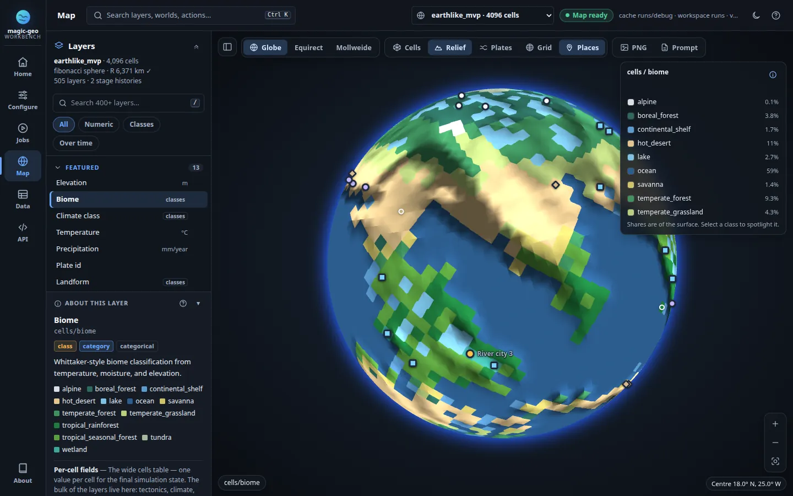

# magic-geo

**Procedural planets, simulated from plate to biome.**

magic-geo is an open-source, causal planet generator. A C++20 engine builds a
spherical mesh, then simulates:

- plate tectonics, relief and isostasy
- a twelve-month seasonal energy-balance climate
- rivers, lakes and groundwater
- erosion, ice and permafrost
- soils, biomes and ecosystems
- resources, settlements, routes, borders, cultures and history

A Python layer handles configuration, validation, enrichment and file output.
You can drive it from a **local web workbench**, the **CLI** or **Python**. All
three run the same pipeline and write the same world format (JSON or binary
`.mgeo`).



- **Configure → generate → explore.** Start from a profile or edit the YAML,
  run generation as a background job, then explore about 500 layers on a globe,
  equirectangular or Mollweide map, and browse every record in tables.
- **Reproducible.** The same seed and configuration produce the same planet.
  Configurations are validated against a versioned JSON Schema.
- **Honest outputs.** Unavailable estimates stay unavailable instead of turning
  into zeros. Budgets carry their residuals, and unresolved physics is labelled
  as unresolved.
- **Local.** The browser UI is self-hosted and never uploads worlds or
  configurations.

## Documentation

| I want to… | Read |
|---|---|
| Generate my first planet | [Quickstart](docs/wiki/03-quickstart.md) · [Web workbench guide](docs/debug_ui_guide.md) |
| Install, build or deploy | [Installation and build](docs/wiki/02-installation-and-build.md) · [Docker deployment](docs/docker_deployment.md) · [Runtime storage](docs/runtime_storage.md) |
| Look up an option, command or field | [Configuration reference](docs/wiki/05-configuration-reference.md) · [CLI reference](docs/wiki/06-cli-reference.md) · [World schema](docs/wiki/10-world-schema.md) · [REST API & jobs](docs/wiki/15-web-workbench.md) · [Layer reference](docs/layers_reference.md) |
| Understand how it works | [Overview](docs/wiki/01-overview.md) · [Architecture](docs/wiki/04-architecture.md) · [Glossary](docs/wiki/21-glossary.md) · [Full wiki index](docs/wiki/README.md) |

The running workbench also serves a product overview at `/landing.html`.

## Quick Start

Prerequisites: Python 3.11+, CMake 3.20+, and a C++20 compiler. OpenMP is
used when found; a CUDA 12.8+ toolkit additionally enables the GPU backend,
otherwise the build falls back to the CPU core with a CUDA runtime stub.

```bash
python -m pip install -e .   # Python CLI + library (editable)
cmake -S . -B build          # configure the C++ simulation core
cmake --build build          # stages libmagic_geo_native.so into src/magic_geo/
magic-geo backend            # verify the native core loads (prints backend info)
magic-geo generate --config configs/earthlike_seed.yaml --output runs/earthlike/world.json --summary runs/earthlike/summary.md --cells-csv runs/earthlike/cells.csv
magic-geo generate --geo-only --config configs/earthlike_seed.yaml --output runs/earthlike/geo-world.json
magic-geo render --world runs/earthlike/world.json --output runs/earthlike/world.svg --projection mollweide --labels
```

For a smaller smoke run:

```bash
magic-geo generate --config configs/earthlike_seed.yaml --cells 512 --output /tmp/world.json
```

New configurations and all shipped presets use the prescribed seasonal energy
model with `config_version: 2`. It solves temperature from retained radiation, storage and
conservative heat transport, and independently checks the published budget:

```bash
magic-geo generate --config configs/seasonal_smoke.yaml --output runs/seasonal/world.json
magic-geo validate --world runs/seasonal/world.json
```

Use `WorldConfig(...)` with the Python generation API, or start from the same
YAML. `SeasonalWorldConfig(config_version=2, ...)` is also supported. Version 2 replaces the imposed mean/lapse controls
with `climate.reference_infrared_optical_depth`; there is no automatic physical
conversion. Unversioned files are rejected with migration guidance; create a
current template with `magic-geo init-config`. The `earthlike` profile supplies
Earth reference inputs but has not been calibrated for the new climate model.
See the [integration status and limitations](docs/seasonal_climate_native_integration.md)
and the [current simulation review](docs/current_simulation_review_status.md) for
adopted dependency corrections, validation evidence and remaining physical-model work.

Wheel builds intentionally require the platform's native library to be staged
first (`cmake --build build --config Release` is the documented production
workflow). Setuptools loads that library and checks required ABI symbols before
emitting a platform-tagged, Python-ABI-independent wheel; it never labels a
bundled ELF/DLL/dylib as `py3-none-any`. A source archive contains CMake/C++
sources and no staged host binary, so build the extracted source with CMake
before requesting its wheel. A locally produced Linux tag such as
`linux_x86_64` is not a manylinux portability claim: its glibc/libstdc++ and
`libgomp` requirements follow the build host/toolchain.

## Web Workbench

```bash
./scripts/dev.sh
# http://127.0.0.1:8642
```

`scripts/dev.sh` creates or reuses `.venv`, installs any missing dependencies,
builds the native core incrementally, and serves the workbench with Python
reload. It works from any directory.

- UI edits appear when you refresh the browser.
- Restart the script after C++ changes so the core is rebuilt.
- Python reload stops active jobs. Use `--no-reload` for long runs.
- Other flags: `--no-build` uses an existing core, `--install` refreshes
  dependencies, `--port 8765` changes the port.
- Optional local settings go in `.env.local` (copy it from `.env.local.example`).

To run it from an installed package instead:

```bash
python -m pip install -e '.[debug]'
magic-geo serve
# http://127.0.0.1:8642
```

The server starts even before any world exists. The workbench is organized
around the workflow:

| View | What you do there |
|---|---|
| **Home** | See the configure → generate → explore steps with live status, the library of prepared worlds, example seeds and system info |
| **Configure** | Start from the **New world** dialog (profile, name, seed, resolution) or edit YAML with syntax colouring, schema reference, validation and atomic, revision-checked saves |
| **Jobs** | Generate, validate, calibrate, render and export as typed background jobs, and follow each phase |
| **Map** | Explore about 500 layers grouped by topic, with pinning and search, on a globe that you grab and fly around, or unrolled into an equirectangular or Mollweide map. Each field gets a fitting colour scale (sea level, zero, identifiers), with relief, cell outlines, places and a scale bar. Play stages and months, inspect any cell, and export a PNG with its GPT Image prompt. |
| **Data** | Browse every exported scalar, layer, stage summary, record family and model section as tables |
| **API** | Check native backend capabilities, storage paths and the live OpenAPI explorer |

Three features work in every view:

- **Command palette** (<kbd>Ctrl</kbd>/<kbd>⌘</kbd> <kbd>K</kbd>). Jump to any
  layer, world, configuration, job or action.
- **Notifications.** A notification appears when background work finishes, with
  **Open map** when the world is ready.
- **Themes.** Light and dark.

Each new world is generated into its own folder, for example
`runs/<name>/world.json` and `runs/<name>/debug`, so it never replaces the one
on screen. Map links such as
`#map?layer=cells%2Fbiome&proj=mollweide` are shareable.

Browser output defaults are rooted at the configured workspace (`runs` by
default).

- `--workspace <dir>` moves and confines the files the browser creates.
- `-d <cache>` opens one specific existing browser map (debug cache).
- `--workspace`, `--host` and `--port` also read `MAGIC_GEO_WORKSPACE`,
  `MAGIC_GEO_HOST` and `MAGIC_GEO_PORT`. Explicit flags win.
- Browser `export-debug` defaults to `<workspace>/debug`. CLI `export-debug`
  without `--output` uses `<world parent>/debug` instead.

Storage can live outside the source checkout; see
[runtime paths and config discovery](docs/runtime_storage.md).

Guarantees:

- **Safe map publishing.** Browser maps are built in a staging folder and
  published only after success, so a failed or cancelled export never damages
  the map on screen.
- **Immutable downloads.** Job downloads are per-job snapshots.
- **Consistent reads.** Cache-backed requests carry the manifest revision, so a
  hot reload cannot mix data from two worlds.
- **Valid JSON.** JSON views normalize non-finite values to `null`. Binary
  Float32 and Arrow layer responses keep their numeric missing-value semantics.

The workbench is a trusted-local, single-user tool with no authentication or
user isolation. Keep the default loopback binding unless a trusted network
boundary or an authenticating reverse proxy protects it.

Read next:

- [Web workbench guide](docs/debug_ui_guide.md): tour, views, shortcuts,
  accessibility and troubleshooting.
- [Web workbench reference](docs/wiki/15-web-workbench.md): jobs, REST routes
  and the security model.
- [Architecture notes](docs/debugger.md).
- [Workbench redesign record](docs/workbench_redesign.md).
- Live Swagger documentation at `/api/docs`.

## Docker Deployment

An all-in-one image builds the native core, CLI, and web workbench together;
`.env` (copy `.env.example`) holds the deployment configuration, including the
host directory where worlds are saved (`MAGIC_GEO_WORLDS_DIR`) and the
absolute container workspace path (`MAGIC_GEO_CONTAINER_WORKSPACE`):

```bash
cp .env.example .env
mkdir -p worlds                # host directory that persists generated worlds
docker compose up --build -d
# web workbench: http://127.0.0.1:8642
```

The same image runs any CLI subcommand against the shared worlds volume:

```bash
docker compose run --rm magic-geo generate \
  --config configs/earthlike_seed.yaml --output runs/world.json
docker compose run --rm magic-geo backend
```

The compose file publishes the unauthenticated workbench on loopback only;
see the [Docker deployment guide](https://github.com/Andres77872/magic_geo/blob/master/docs/docker_deployment.md)
for the `.env` reference, persistence model, GPU notes, and how to expose it
safely.

## YAML and Python configuration helpers

Create a calibrated Earth-like config, a fast smoke config, or a neutral schema
default, with typed repeatable overrides:

```bash
magic-geo init-config
magic-geo generate --output runs/world.json  # reads ./magic-geo.yaml by default
magic-geo init-config --profile smoke --output runs/configs/smoke.yaml
magic-geo init-config --profile earthlike \
  --set mesh.cell_count=1024 \
  --set hydrology.preserve_geologic_depressions=false \
  --output runs/configs/custom.yaml
```

The same schema/profile/parse/dump/override/write helpers are public Python
APIs. Duplicate YAML keys and unknown properties are rejected, all 44 fields
carry JSON-Schema descriptions, and `write_config`/CLI/web saves use validated
atomic publication. See the
[configuration helper guide](https://github.com/Andres77872/magic_geo/blob/master/docs/configuration_helpers.md) and the
[complete property reference](https://github.com/Andres77872/magic_geo/blob/master/docs/configuration_reference.md).

## Example World Seeds

In a source checkout, nine complete, original presets are available under
[`configs/seeds`](https://github.com/Andres77872/magic_geo/tree/master/configs/seeds),
covering a land-rich continental realm, dry desert planet, pelagic archipelago,
cryogenic slushball, young volcanic world, verdant hothouse, high-obliquity
seasonal world, super-Earth, and ancient stagnant world. Each file explicitly
sets all 44 configuration properties and uses portable deterministic CPU
settings. See the
[example seed gallery](https://github.com/Andres77872/magic_geo/blob/master/docs/example_seed_gallery.md) for the
research basis, intended outcomes, limitations, and seed-selection workflow.

```bash
magic-geo generate \
  --geo-only \
  --config configs/seeds/pelagic_archipelago.yaml \
  --cells 512 \
  --output runs/pelagic-preview.json
```

## Fast world serialization

JSON remains the default and is fully supported. For substantially faster,
smaller save/load cycles, use the versioned MessagePack-based `.mgeo` format by
changing the output suffix:

```bash
magic-geo generate --config configs/earthlike_seed.yaml --output runs/world.mgeo
magic-geo validate --world runs/world.mgeo
magic-geo render --world runs/world.mgeo --output runs/world.svg
```

All commands that consume a generated world accept either format. On a local
4,096-cell artifact, the trusted generated-world path made `.mgeo` 50.2%
smaller, 3.92x faster to save, and 2.60x faster to load in a single benchmark.
See the [serialization review](https://github.com/Andres77872/magic_geo/blob/master/docs/serialization_review.md) for framing,
compatibility, safety limits, native transfer APIs, and reproducible
measurements.

## CLI

```bash
magic-geo init-config --profile earthlike --output configs/my_seed.yaml
magic-geo backend
magic-geo generate --config configs/my_seed.yaml --output runs/world.json
magic-geo validate --world runs/world.json
magic-geo derive-targets --sources configs/calibration_sources.example.json --output configs/calibration_targets.json
magic-geo calibrate --world runs/world.json --targets configs/calibration_targets.json --output runs/calibration.json --require-all-metrics
bash scripts/fetch_natural_earth_110m.sh
magic-geo derive-targets --sources configs/calibration_sources.natural_earth_110m.json --output runs/natural_earth_targets.json
magic-geo calibrate --world runs/world.json --targets runs/natural_earth_targets.json --output runs/natural_earth_calibration.json --require-all-metrics
bash scripts/fetch_etopo_2022_1deg.sh
magic-geo derive-targets --sources configs/calibration_sources.etopo_2022_1deg.json --output runs/etopo_targets.json
magic-geo calibrate --world runs/world.json --targets runs/etopo_targets.json --output runs/etopo_calibration.json --require-all-metrics
bash scripts/fetch_worldclim_2_1_10m.sh
magic-geo derive-targets --sources configs/calibration_sources.worldclim_2_1_10m.json --output runs/worldclim_targets.json
magic-geo calibrate --world runs/world.json --targets runs/worldclim_targets.json --output runs/worldclim_calibration.json --require-all-metrics
bash scripts/fetch_hydrobasins_level3.sh
magic-geo derive-targets --sources configs/calibration_sources.hydrobasins_level3.json --output runs/hydrobasins_targets.json
magic-geo calibrate --world runs/world.json --targets runs/hydrobasins_targets.json --output runs/hydrobasins_calibration.json --require-all-metrics
bash scripts/fetch_hydrorivers_v10.sh
magic-geo derive-targets --sources configs/calibration_sources.hydrorivers_v10.json --output runs/hydrorivers_targets.json
magic-geo calibrate --world runs/world.json --targets runs/hydrorivers_targets.json --output runs/hydrorivers_calibration.json --require-all-metrics
magic-geo render --world runs/world.json --output runs/world.svg --projection mollweide --labels --contours --max-cells 4096
magic-geo render-raster --world runs/world.json --output runs/world.ppm --projection mollweide --max-cells 4096
magic-geo export-debug --world runs/world.json --output runs/debug --no-vtu
magic-geo export-debug-map --debug-dir runs/debug --layer cells/biome --projection mollweide --output runs/biome-reference
magic-geo serve
```

### Geo-only deep validation

`validate-geo` deliberately ignores settlements, routes, ports, politics, cultures, history, population, economy, markets, campaigns, and language. It validates the configured planet and mesh scale; spatial indices; plate, exact boundary-segment, overlap candidate-crosswalk, fault, crust-age, and climate-energy replays; ocean, lake, surface-water, groundwater, and sediment closure; the coupled stage ledger; cryosphere, soil, biome, ecosystem, disturbance, and resource source links; physical graphs and boundaries; and evidence support for realism claims. The `earthlike` profile adds broad Earth-regime gates. Absent rivers, deltas, currents, or biomes are reported as `not_applicable` rather than receiving a vacuous perfect score, and malformed optional JSON fields produce a failed report instead of crashing validation.

The evidence, scientific interpretation, layer-by-layer limitations, and staged definition of done are recorded in the [natural geo generation and maturation deep audit](https://github.com/Andres77872/magic_geo/blob/master/docs/geo_generation_maturation_deep_audit.md).

The subsequent [simulation coherence review](docs/simulation_coherence_research.md)
documents fixes for lake classification and settlement precedence, shared
Python enrichment prerequisites, astronomical sunlight, and the web workbench's
configuration and mesh integration. It distinguishes verified interface fixes
from the remaining Earth calibration and coupled-physics requirements.

```bash
magic-geo validate-geo \
  --world runs/earthlike/world.json \
  --profile earthlike \
  --output runs/earthlike/geo-validation.json

magic-geo validate-geo-suite \
  --config configs/earthlike_seed.yaml \
  --matrix configs/geo_validation_matrix.yaml \
  --output runs/geo-validation-v3.json \
  --summary runs/geo-validation-v3.md
```

The checked-in matrix runs the unmodified 4,096-cell Earth configuration, a repeated smaller Earth control, three additional Earth seeds, paired arid-landworld, waterworld, snowball, hothouse, zero/high-obliquity, thin-atmosphere, small-planet, super-Earth, geodesic-mesh, stagnant/active-surface cases, a same-seed zero/six-iteration maturation control, and a same-horizon 5/2 versus 2.5/4 Ma timestep pair. Its 26 cross-scenario gates require directional responses for ocean inventory, precipitation/runoff, temperature, ice, seasonality, planet area, plate motion, crust evolution, plate-domain reassignment, erosion, sediment mobilization, stage count, equal nominal duration/rotation, smaller timesteps, and additional temporal samples. The fresh post-change matrix passes 19/21 internal and overall scenario policies, all 294 layer contracts, all 26 paired relations, and its configured determinism rerun. Across 3,116 core validation results, 3,029 pass, one is a fatal error (`earth_seed_3` ocean fraction `0.542985`, below `0.55`), seven are warning deviations, and 79 are not applicable. The canonical Earth has no core validation failure but fails its scenario expectation because the built-in 12-check `calibration_pass_fraction = 0.916667` is below the required `1.0`; separately, it fails the external policy. That policy evaluates the checked-in 22-metric authoritative target bundle without opening raw calibration data at runtime. Coverage is complete at 22/22 and fit is 17/22. The five failures are Natural Earth coastal land fraction, all three ETOPO relief metrics, and HydroBASINS non-Antarctic endorheic watershed area fraction. Both source-matched HydroRIVERS metrics, all three WorldClim metrics, and all eleven Seton age-distribution metrics pass. Internal closure and replay therefore do not substitute for the remaining Earth-fit gaps.

## Testing

```bash
pip install -e ".[test]"          # add ",debug" to also run the workbench/server tests
python -m pytest                  # full suite (~29 min)
python -m pytest -m "not slow"    # ~13 min: skips the exhaustive validate-command tier
python -m pytest -m "slow"        # ~16 min: exhaustive validate-command tier only
python -m pytest --cov --cov-report=term-missing   # full branch coverage (~2 h)
python -m pytest --cov --cov-report=html           # same report, browsable in htmlcov/
```

The `slow` marker covers `tests/test_validate_cli_*.py`, which drive every
violation branch of the `validate` command through the CLI. They are 21% of the
tests but the majority of the runtime, because each case runs a full validation
over a generated world. Deselect them for a tight local loop; run everything
before pushing.

That tier is deliberately the *only* place tamper coverage is driven through the
command. Each replay validator owns a module that calls it directly
(`tests/test_*_validation.py`, `tests/test_*_validators.py`): those can name the
field that diverged and assert the undone tamper replays clean again, neither of
which a shared CLI verdict line can express, and they cost one in-process call
instead of a world serialization plus a full validation pass. The `test_smoke_*`
modules therefore assert generated-world invariants plus a single wiring check
per subsystem — one tamper per verdict, one command pass — rather than repeating
those tables.

Coverage is opt-in rather than wired into `addopts`; it includes branch
coverage because a validator's rejection path matters as much as its happy
path. Instrumenting the generation-heavy suite takes roughly four times its
normal runtime. Two caveats when reading a report: only Python is measured, so
the C++ simulation core in `libmagic_geo_native.so` never appears; and generated
worlds are cached per process by `tests/support/worlds.py`, so parallel runners
pay one generation per worker. Without the `debug` extra the FastAPI workbench
tests skip themselves, and `tests/test_debug_rerun.py` skips unless `rerun-sdk`
is installed.

The C++ simulation core has its own test suite, registered with CTest by the
same CMake build (`BUILD_TESTING` is on by default):

```bash
cmake --build build                          # builds the test executables too
ctest --test-dir build --output-on-failure   # 13 native tests, ~5 s
```

These cover the C API v1 client contract, the native API and fibonacci-kNN
reference check, messagepack/serialization round trips, plate boundary
segments, crust overlap/reservoir/fate accounting, sediment partitioning, and
oceanic age/depth. A CUDA build adds a `magic_geo_cuda_compute` test that
skips itself (exit code 77) when no compatible GPU is present.

## Architecture

```text
YAML config
  -> Python config validation
  -> C++ native simulation core
  -> JSON/CSV/Markdown CLI artifacts
```

The internal world is a spherical cell mesh, not a rectangular image. Current generation uses a Fibonacci sphere point set with neighbor links as the default dependency-free mesh, and also supports `mesh.backend: geodesic_icosahedron` for subdivided icosahedral graphs. Fibonacci cells now use `spherical_voronoi_control_volume_v1`: exact nearest-site half-plane intersections in a gnomonic chart, with adaptive nearest-site certification. Geodesic cells use `spherical_barycentric_control_volume_v2`: primal-edge midpoints and primal-face centers partition every spherical triangle into an explicit dual. In both backends, `area_km2` is replayed from the stored counter-clockwise `control_volume_vertices_3d`; edge-aligned `control_volume_edge_neighbor_ids` are reciprocal, and all cells close to `4*pi*radius^2`. Generated worlds also include high-precision per-cell `position_3d`/`normal_3d` vectors, area-distribution summaries, a dependency-free `cube_quadtree_v0` mesh LOD index, and v0 `healpix_s2_compat_v0` compatibility metadata. The exported display `boundary_ring` now reuses native control-volume vertices. The process-stencil `neighbors` graph and downstream `cell_adjacency_edges` remain separate stencil/diagnostic structures; geodesic bent dual boundaries are therefore not yet represented as multi-segment polylines in the current adjacency-edge schema. Cross-plate physical pieces are, however, retained individually by the exact directed `plate_motion_history[].boundary_segments` ledger described below.

The C++ simulation is split into private domain translation units with an
explicit simulation/result/serialization boundary. See
[`cpp/src/engine/README.md`](https://github.com/Andres77872/magic_geo/blob/master/cpp/src/engine/README.md) for module ownership,
dependency flow, and invariants.

The native compute backend is configurable as `auto`, `cpu`, `opencl`, or
`cuda`. CPU is the deterministic reference and does not probe either runtime.
Explicit OpenCL dynamically selects a qualifying IEEE-FP64 device; explicit
CUDA initializes a usable NVIDIA device; neither explicit backend silently
falls back. CUDA is an optional CUDA 12.8+ build feature: a missing
`nvcc`/`CUDAToolkit` produces a runtime stub, while CUDA-enabled artifacts link
`cudart` statically so CPU/OpenCL loading does not require a separate runtime.
The portable default emits real code for `sm_75`, `sm_80`, `sm_86`, `sm_89`,
`sm_90`, and `sm_120`, plus `compute_75` and `compute_120` PTX; the RTX 5090
audit uses a narrower `120-real;120-virtual` override. Automatic selection is
deferred until the actual mesh size is known. Native `sm_120` CUDA begins at
8,192 actual cells, uncalibrated CUDA and OpenCL begin at 32,768, and the
fallback chain at eligible thresholds is CUDA, qualifying non-CPU OpenCL, then
CPU. Production accelerator kernels cover plate assignment and fixed-order
scalar/fused boundary smoothing. Authoritative forward spherical crust overlap
executes on CPU and reports that scope explicitly in backend telemetry. On an
active accelerator, a separately
named shadow kernel reduces the exact CPU CSR into continuous moments and
derived thickness/density/age, validates the result against finite
operation-derived bounds, records dedicated telemetry, and discards it.
Geometry, coverage, membership classes, categories, and production state remain
CPU-authoritative; complete accelerator parity is explicitly false. This host
has no device-run evidence for the shadow. See the
[RTX 5090 CUDA optimization audit](https://github.com/Andres77872/magic_geo/blob/master/docs/cuda_rtx5090_optimization.md) for the
build, kernel, parity, performance, sanitizer, and telemetry evidence; the
[historical GPU simulation audit](https://github.com/Andres77872/magic_geo/blob/master/docs/gpu_simulation_audit.md) retains the
broader pipeline analysis and determinism contract.

## Outputs

The generated JSON contains the current schema and model contracts below.
The detailed reference quantities and external-fit results in this section
predate seasonal default adoption and require regeneration as current benchmarks.
Examples labeled `v32` additionally predate the exact-control-volume/v3
transport change. The [seasonal integration record](docs/seasonal_climate_native_integration.md)
identifies the measured current-model runs and their narrower scope.

Post-review replay hardening is fail-closed at the semantic boundary, not only
at JSON shape/checksum level. Final crust age/thickness/density aliases use a
binary64 subtract/add operation bound rather than display precision, and tests
reject `1e-5` edits even with `output.float_precision: 0`. The supplemental
Seton artifact is cross-checked against all eleven main-bundle source values and
threshold identities plus the pinned source SHA-256. Native `overflow_index`
remains a replayed raw `[0, 50]` runoff/storage pressure; downstream Python uses
the native `clamp(overflow_index / 4, 0, 1)` normalization. The thermal authority
flag now states the implemented contract exactly: the full thermal contribution
is applied outside the bounded dynamic-relief clamp.

- `summary`: high-level validation metrics and counts.
- `planet_parameters` and `planet_realism_checks`: generated planet-parameter snapshot plus v0 automatic checks for liquid-water temperature range, atmosphere/gravity stability, rotation/circulation plausibility, and surface-water inventory.
- `simulation_clock` and `earth_system_feedback_history`: the native `coupled_geodynamic_stage_clock_v12`, with an initial climate/hydrology state, one nominal interval per configured erosion transition, and one zero-duration terminal cryosphere-coupling snapshot. `erosion.maturation_timestep_ma` (default/reference 5 Ma, refinement range `(0, 5]`) scales selected continuous responses: plate displacement, quiet-crust aging and bounded relaxations, uplift tendency, hillslope transport, and applied stream incision/source. Event/remap impulses, equilibrium state-difference corrections, routing partitions, and terminal cryosphere coupling retain separate semantics. Every native history record exports nominal start/end/duration, while the clock explicitly keeps physical-time, process-rate calibration, absolute-age, and timestep-convergence claims false. After plate/crust evolution, tectonic, hillslope, and stream-power tendencies are evaluated before terrain commit from the prior stabilized surface/hydrology with updated crust. Their provisional terrain supplies routing accommodation while fluvial routing uses the prior flow graph; finite inventory and terrain are then committed before repeated sea-level, climate, causal water-budget, hydrology, and depression stabilization. The final stage derives cryosphere state, moves glacial sediment downslope, commits terrain/inventory, stabilizes hydrology, and recomputes cryosphere on the stabilized terrain/climate. `erosion_rate` remains the per-cell 5 Ma reference-step response; feedback history exports it only as `mean_stream_power_response_m_per_reference_step`.
- `climate_model`: current `prescribed_seasonal_surface_energy_v1` temperature comes from a periodic gray radiation, slab/atmospheric storage and conservative horizontal heat-transport solve. It retains monthly mean temperature and mean `T⁴`, thirteen boundary temperatures, forcing intervals and transport edges. Python independently checks the exported radiation, storage, transport and balance before enrichment. Rainfall remains empirical and uses the solved area/time mean through `clamp(exp(0.04 * (mean_temperature_c - 15)), 0.35, 2.25)`; zero atmospheric pressure gives zero rainfall. Surface albedo, hydrostatic profile and heat-capacity coefficients are prescribed; lake, ice, cloud, latent-heat and atmosphere–ocean feedbacks remain unresolved. Old C ABI versions and explicit `LegacyWorldConfig` retain `equilibrium_latitude_circulation_climate_v5`. See the [native contract](docs/seasonal_climate_output_contract.md) for identifiers and independent-check limits.
- `hydrologic_water_budget_model` and `hydrologic_water_budget_history`: the native `causal_land_climate_loss_partition_v1` executes after climate and before flow routing. On non-marine cells it derives hydrologic PET from annual temperature, bounds an empirical climate-loss envelope by precipitation, partitions that loss into actual evapotranspiration and infiltration using lithology, mobile sediment, local relief, and frozen-ground state, then computes `runoff = max(0, precipitation - actual_evapotranspiration - infiltration)`. Marine cells are explicitly outside the land budget and carry zero partition terms. Every recomputation exports complete elevation/climate/material inputs and partition outputs; strict validation independently reconstructs relief and all formulas, then checks stage, feedback, final-cell, model, and annual-volume closure. The v32 reference records 16 recomputations and closes `121,262.764483 = 23,264.643618 + 13,709.184591 + 84,288.936273 km3/y` with zero residual. This remains an empirical annual partition without transient soil moisture, groundwater return flow, storm timing, or calibrated duration.
- `initial_oceanic_crust_age_model` and `initial_oceanic_crust_age_ledger`: `multi_source_nominal_ridge_graph_travel_time_v1` replaces random-old initial oceanic ages. It selects positive-rate direct divergent segments whose two provisional sides are oceanic-like, seeds both endpoint cells at age zero, computes one segment-length-weighted nominal full spreading rate, halves it, and runs deterministic multi-source Dijkstra over oceanic-like cell neighbors with great-circle edge lengths. Reachable ages are graph distance divided by that single nominal half rate and are clamped to the explicit procedural ceiling; oceanic components with no active-ridge path receive the same ceiling with an unresolved status, while non-oceanic cells receive zero in this ledger. The round-trip ledger exposes ages, unclamped ages, status, predecessor, origin seed, eligible segments, ridge seeds, nominal rates, area-weighted mean, and inclusive CDF values at 20 Ma intervals through 200 Ma. The identity-overlap initial checkpoint at `plate_motion_history[0].crust_overlap_ledger.remapped_crust_age_ma_by_cell` carries the all-cell initial crust-age state and matches this ledger on oceanic-like cells. Independent replay verifies every path decision and summary. This is a deterministic procedural initial field, not a plate reconstruction: it uses one global nominal rate and arbitrary oceanic graph adjacency, and has no local spreading rates, flowlines, convergence/subduction history, or physical crust-creation/destruction provenance.
- `oceanic_age_depth_model`, `cells[].thermal_subsidence_target_m`, and the equilibrium arrays in each `plate_motion_history` record: `continuity_adjusted_parsons_sclater_relative_basement_subsidence_v1` uses `S(t)=350 sqrt(t)` m through 70 Ma and `S(t)=350 sqrt(70)+3200[exp(-70/62.8)-exp(-t/62.8)]` m afterward; the oceanic-like subsidence target is `-S(t)` and other states receive zero. The second branch is deliberately offset to make the implementation C0-continuous at 70 Ma; it does not claim derivative continuity or reproduce the source paper's absolute-depth datum. Each maturation step now applies the full gain-1 changes in both local isostatic equilibrium and thermal target outside the empirical dynamic-relief clamp. Only `unbounded_dynamic_relief_change_m` is clamped to `[-180, 220]` m, producing `bounded_dynamic_relief_change_m`; `tectonic_elevation_change_m_by_cell` is exactly `isostatic_equilibrium_change_m + thermal_equilibrium_change_m + bounded_dynamic_relief_change_m`. Round-trip histories preserve every operand, the canonical `thermal_equilibrium_change_m`, and the total. Independent replay verifies initial/final targets, the dynamic formula and clamp, the gain-1 application, total composition, and zero unapplied equilibrium residual. The quasi-static choice is motivated by 3–4 ka degree-2-to-20 viscoelastic relaxation estimates being more than three orders of magnitude shorter than the nominal 5 Ma reference interval, but the interval itself and the operator are not calibrated physical time. Realized thermal relief is not maintained as a separate state; absolute basement depth, sediment loading, thermal structure/heat flow, dynamic topography, flexure, and physical dynamics remain unresolved. Sources: [Parsons and Sclater (1977)](https://doi.org/10.1029/JB082i005p00803), [O'Connell (1971)](https://doi.org/10.1111/j.1365-246X.1971.tb01823.x).
- `plate_kinematic_model` and `plate_motion_history`: `rotating_voronoi_plate_domains_v3` over the fixed mesh with `plate_attached_conservative_extensive_mixture_v1` crust memory and explicit reference/effective timestep metadata. The initial partition uses one graph pass at self-weight 0.77 over a ranked, plate-biased continental potential to meet `tectonics.continental_crust_fraction_target`; transitional crust is the one-hop graph margin, while secondary relief remains independently smoothed over four passes at 0.58. During every motion step, each plate-attached native control volume is forward-rotated and intersected with the fixed target control volumes. The canonical destination-major CSR ledger retains raw overlap areas without destination normalization, so extension appears as uncovered target area and compression as multiple coverage. Native code separately closes source crust volume, density-weighted volume, and crust-age volume moment, then records post-process inventory and its aggregate delta. Categorical type/lithology moves as one dominant-volume pair, and the transported basalt/other-lithology category selects the oceanic/continental rule family without reinterpreting mixed continuous means; that categorical witness is not by itself material provenance. Ten ordered post-transport reason records expose rule-trigger counts, numeric-state change counts, componentwise positive/negative state-moment changes, exact `positive - negative` nets, and a numerical reconciliation residual for aging, ridge, convergence, collision, rifting, crossing-accretion, and bound rules. Each stage also exports plate centers, exact rotation-axis witnesses, full assignments and boundary inputs, the overlap ledger's dominant-contributor categorical witness, contributor diagnostics, per-cell/global multiplicity coverage, raw arrangement counts, explicit units, transport distances, rule-bookkeeping IDs, signed transport/process/total crust deltas, tectonic elevation deltas, and nominal intervals; model metadata declares the 16,384-atom arrangement limit. `coverage_membership_area_class_ledger` additionally retains destination area grouped by each identical sorted contributing-source set, including each contributor's plate ID at the transport source snapshot. One class may coalesce multiple disconnected arrangement pieces; its representative comes from the largest atomic piece with the documented tie-break. Class areas independently reconstruct every overlap-CSR edge, destination partition, multiplicity histogram, gap, union, and excess. They do **not** resolve connected-fragment topology, physical fate, local kinematics, slab selection, or subduction polarity. Strict validation independently replays the sparse extensive mixture, source-row and three-inventory closure, source/edge motion, class membership and plate linkage, scalar mirrors, final transport/process split, and the complete ordered process rule chain. A separate bounded O(N²) Python implementation ignores CSR discovery and reconstructs polygon intersections, multiplicity, and area by contributor set for the 128/162-cell fixtures without requiring raw split-count equality; it is intentionally capped at 1,024 cells until it has an independent spatial index. Scaling that independent pair discovery to the 4,096-cell reference remains a validation-evidence blocker. The geometry-stable 4,096-cell, seven-step reference contains `3,503,886` raw arrangement atoms but only `111,022` retained membership-area classes (about `31.6x` coalescing), with at most 14 classes per destination. At the historical pre-initial-age/expanded-round-trip checkpoint, that fixture wrote `178,764,102` uncompressed JSON bytes and reached `371,176 KB` direct-native-process maximum RSS; current payload size/RSS has not been remeasured. Remaining limits are explicit: first-order overlap is diffusive; reason records are ordered rule-state changes rather than physical material-reservoir provenance; the bounded continuous-moment accelerator shadow is reconciled against CPU CSR moments and discarded, but this host provides no device-run evidence, while geometry, coverage, membership classes, categories, production state, scientific state, and complete accelerator parity remain outside the shadow and CPU-authoritative; the local atom cap lacks exhaustive worst-case proof; the current moving-domain diagnostic does not demonstrate convergence, and physical-time calibration is unresolved.
- `plate_boundary_segment_model` and `plate_motion_history[].boundary_segments`: the native `exact_directed_reciprocal_control_volume_boundary_segments_v2` ledger emits one record for every cross-plate **physical control-volume segment**, including multiple distinct segments between the same two geodesic cells. The lower cell ID is the canonical left side, and that cell's counter-clockwise control-volume edge fixes start-to-end direction, tangent, and the normal pointing left-to-right. A stable `mesh_segment_id` indexes all reciprocal mesh segments before cross-plate filtering; `segment_id` is contiguous within each snapshot. Independent Python replay starts from round-trip-precision plate centers, Euler axes and intrinsic speeds: it replays Rodrigues center evolution, nearest-center cell assignments, reciprocal segment identity and geometry, left/right and relative Euler velocities, opening/convergence/slip indices and nominal rates, direct unsmoothed classes, and both sides' remapped pre-process crust state. A zero-volume remap (`age_ma == 0` and `thickness_km == 0`) is explicitly unavailable; its retained categorical and density values are fixed-shape unavailable-state sentinels, not material. The reported km/Ma scale is `radius_km * reference_motion_scale_deg_per_reference_step * pi/180 / 5 Ma`, so it is **nominal**, not an observed or calibrated plate speed. Degree-normalized, smoothed cell boundary forcing is active and is not driven by this ledger. Thresholded normal convergence is tracked independently of the dominant boundary class, so transform-dominant oblique convergence remains candidate-eligible. An oceanic-like side is recorded only as a candidate subducting side, with the opposite candidate overriding side; the physical fields remain explicitly `unknown` wherever convergence is active, with source `none` and zero confidence. GPGIM-style supplied left/right polarity denotes the overriding side: an importer must first align the supplied feature direction to the canonical segment, then choose the opposite subducting side. Physical subduction polarity, slab selection/geometry/transfer, and material fate remain unresolved. The measured 4,096-cell, seven-snapshot reference has 12,282 reciprocal physical mesh segments and 6,592 cross-plate ledger records in total, with at most 966 in one snapshot. The orientation and kinematic split follow the same conceptual separation used by [GPlates reconstructions](https://www.gplates.org/docs/user-manual/reconstructions/), [pyGPlates boundary statistics](https://www.gplates.org/docs/pygplates/generated/pygplates.plateboundarystatistic), and the directed left/right segment representation of [Bird (2003)](https://doi.org/10.1029/2001GC000252). [MORVEL](https://academic.oup.com/gji/article/181/1/1/713644) and [Doubrovine et al. (2012)](https://doi.org/10.1029/2011JB009072) provide physical velocity references that this procedural scale has not been calibrated against; [GPGIM polarity](https://www.gplates.org/docs/gpgim/), [Billen (2008)](https://doi.org/10.1146/annurev.earth.36.031207.124129), [Nikolaeva et al. (2010)](https://doi.org/10.1029/2009JB006549), and the young-under-old counterexample of [Zhang et al. (2021)](https://doi.org/10.1029/2020GC009549) show why convergence plus an oceanic-side predicate does not resolve slab polarity or fate.
- `crust_overlap_candidate_fate_model` and `plate_motion_history[].crust_overlap_candidate_fate_ledger`: the native `sparse_membership_class_to_uniform_boundary_plate_pair_candidate_v1` crosswalk groups every same-step boundary segment by persistent unordered plate pair and emits one diagnostic row for every membership-area class with multiplicity at least two. Only a binary class with two distinct source-snapshot plate IDs, a matching current boundary pair, destination endpoint incidence, and uniform pair-wide evidence can receive candidate subducting/overriding contributor roles; the roles are global indices into the membership-class contributor CSR. All other excess area remains explicitly unresolved, including every multiplicity-above-two class. Current worlds have no resolved physical polarity, so only unanimous unique-oceanic-side heuristics can populate candidates. Pair aggregates retain segment IDs but deliberately do not propagate physical source/confidence. Per-cell/global overlap-excess operands and all five candidate-area totals/residual use general-format `max_digits10` binary64 round-trip serialization; replay uses finite operation/operand-count bounds rather than a blanket absolute or relative tolerance. Strict Python replay reruns both boundary and transport roots, reconstructs every pair/class row and `(multiplicity - 1) * area` bucket, and rejects coherent headline mutations. The deterministic row mapping is authoritative only for this serialized diagnostic: local atom/fragment-to-segment topology, allocation, physical polarity/fate, slab selection/transfer, swept area, shadow/reservoir mutation, and all state mutation remain false.
- `crust_material_shadow_model` and `crust_material_shadow_history`: an always-emitted, non-authoritative Phase-S audit ledger carries persistent sparse dry-rock mass packets keyed by immutable origin kind, origin plate, and initial/unresolved reason. Each source packet is advected over the overlap CSR after normalizing by that source's sum of raw overlap areas; the final destination edge receives the floating-point remainder, so packet mass closes independently of the small raw-geometry row residual. Equal keys coalesce in canonical order. Every native crust rule is then applied in the same order: a positive implied-mass change creates an explicit `unresolved_rule_source` packet tagged with the current plate and reason, while a negative change removes all existing packets proportionally and records the removed provenance, with the rounding remainder assigned to the largest packet and lowest key as tie-break. Exact exhaustion and later bound-driven reseeding are supported for fully uncovered destinations. Strict Python replay validates schemas, history linkage, advection, proportional sinks, scalar mirrors, per-reason totals, and summary mirrors with operand/ULP-scaled bounds. Focused evidence includes bit-identical one-versus-four-thread histories, exact radius-squared mass scaling between 3,200 and 6,400 km, and 180-degree Fibonacci/geodesic cases with empty transported rows. Summary fields expose packet/adjustment counts, cumulative unresolved source/sink mass, and maximum transport, scalar, and reconciliation residuals. The model deliberately keeps `authoritative_for_cell_state`, physical source/sink and material-provenance resolution, solid-volume, phase, mass-weighted-age, upper-mantle, subducted-slab, and global crust-cycle conservation flags false. Its unresolved adjustments disclose where current rules lack physical endpoints; they do not themselves supply physical endpoints.
- `crust_dry_rock_accounting_model` and `crust_dry_rock_accounting_history`: the always-emitted `finite_three_reservoir_dry_rock_accounting_v1` is a non-authoritative numerical counter-model over surface basement, an upper-mantle exchange counter-reserve, and plate-owned slab tables. Packets use the canonical `(origin_domain_id, origin_kind_id, origin_plate_id)` key and owner-offset CSR tables. The initial exchange reserve is the difference between scalar surface mass and a finite `76 km * 3.08 g/cm3` surface-state envelope; that capacity is explicitly uncalibrated and is not an estimate of mantle mass. Ordered transfers replay the shadow ledger's rule-implied sources and sinks as `ordered_rule_mass_compensation_v1`: surface sinks remove packets proportionally, whereas mantle withdrawals consume the initial exchange-reserve packet first and then the largest packet with the lowest-key tie-break. The exchange is one spatially unresolved global pool shared by every cell, so instantaneous global access/mixing is explicitly assumed even though origin-key packets are not homogenized. Every transfer has `physical_basis_resolved: false`. The plate-resolved slab tables remain empty because no slab-transfer mechanism, polarity, or fate rule is enabled. Global, per-origin, and per-reservoir arithmetic closes, but this is accounting closure, not physical provenance or a mass/energy/phase-balanced crust cycle. Incremental fail-closed safety limits cap each surface owner at 1,024 packets, all live reservoir state at 1,000,000 packets, and each step at 1,000,000 transfers; emitted peak telemetry audits headroom. These are numerical memory limits, not physical flux or reservoir-capacity limits. Cell-state authority, physical source/sink and material-provenance resolution, mantle spatial transport, upper-mantle and slab resolution, solid volume, phase, mass-weighted age, sediment coupling, coverage fate, and subduction polarity all remain false.
- `sea_level_model`: the native `volume_constrained_connectivity_ocean_flood_v3` contract. A deterministic union-find elevation sweep tracks the largest connected flooded component and solves each valid elevation interval for `planet.ocean_water_inventory_km3 = sum(area_km2 * water_depth_m / 1000)`. It uses the exact solution when one lies in the interval and otherwise retains the closest interval endpoint across connectivity changes. Only the selected component becomes marine water; disconnected negative cells remain available to the Priority-Flood depression policy as dry closed basins, freshwater lakes, or saline basins. Metadata exports target/selected ocean volume and closure error, surface/target/selected area diagnostics, area and cell fractions/errors, connectivity, negative land, and recomputation scope. Strict validation independently reconstructs marine volume, replays the interval solver, and verifies the final marine component and cell columns. `ocean_fraction_target` remains a diagnostic area reference rather than the sea-level control. The Earth-like default is 1,338,000,000 km3, the USGS estimate for oceans, seas, and bays; NOAA independently reports about 1,335,000,000 km3. This is an ocean allocation, not a partition of total planetary water among ocean, ice, groundwater, lakes, and atmosphere. At 4,096 cells an Earth-sized cell is roughly 400 km across, so lowering an entire margin cell to manufacture shelf area would replace both its land and deep-ocean portions with one elevation and is not a defensible correction. The required next architecture is conservative subcell hypsometry: retain an area–elevation distribution and margin shelf–slope–rise profile within each coarse cell, flood fractions rather than cell centers, and expose subcell strait connectivity and volume. [Goswami et al. (2015)](https://doi.org/10.5194/gmd-8-2735-2015) provides an example of reconstructing bathymetry with plate cooling, sediment, and generalized margin shelf–slope–rise structures. Sources for the water inventory: [USGS](https://www.usgs.gov/water-science-school/science/how-much-water-there-earth), [NOAA](https://oceanservice.noaa.gov/facts/oceanwater.html).
- `plates`: generated plate properties with axis/speed, initial/final centers, cumulative rotation, base crust properties, assigned-cell area/count, mean crust age/density/thickness, dominant crust/lithology, boundary activity, and v0 heat-flow/thermal-state summaries.
- `collision_zones`, `subduction_zones`, `rift_zones`, and combined `tectonic_zones`: explicit v0 tectonic zone records for the r1 collision/subduction/rift outputs, grouped from connected causal cells with boundary-edge evidence, plate pairs, centroids, dominant crust/lithology/landform, and zone-strength metrics.
- `fault_systems`: v0 connected fault and seismic-hazard diagnostics derived from transform/convergent/divergent plate-boundary signals, boundary-edge evidence, transform relief, and plate pairs.
- `cell_adjacency_edges`: v0 undirected mesh-adjacency edge records with endpoint IDs, great-circle distance, midpoint, bearings, elevation delta, approximate shared boundary-segment endpoints/length/mismatch/quality, plate/land-water/biome transition flags, and edge classes.
- `watersheds`: drainage basin records with outlet type, area, runoff, river counts, endorheic/open-drainage classification, centroid/bounds, antimeridian-aware longitude spans, boundary cells, sampled boundary rings, v0 dissolved-polygon quality metrics, cell-edge boundary segment IDs/length/neighbor ledgers, and v0 river-network diagnostics including longest drainage paths, total river length, drainage density, fixed-reference Hack residuals, and an independently fitted Hack exponent/coefficient/log-RMSE over resolution-qualified basins.
- `flow_to`, `numeric_depression_correction_history`, and depression-routing diagnostics: raw-downhill drainage trees identify local sink units, while Priority-Flood supplies non-mutating fill candidates and spill targets. Every event evaluates an adjacent monotone weighted-graph breach path. A breach is applied only when it has lower adjustment volume, no more than 50 m full-cell incision, enough non-channel depression capacity for all excavated sediment, and no same-pass mutation conflict. Selected channels are excavated and the same cubic-kilometre volume is deposited inside the source depression. Excavation consumes the current mobile sediment first and records any remainder as bedrock erosion; rejected breaches leave elevation and inventory unchanged. The current canonical smoke reference evaluates 423 events and selects nine breaches that excavate and redeposit `44,280.1606333465 km3`, partitioned into `23,632.306551864 km3` alluvium and `20,647.8540814825 km3` bedrock. It records 414 temporary/zero-material events rather than applying procedural fill candidates totaling `160,324,045.20873812 km3`; final state contains 43 temporary numerical depressions. A deterministic 1 mm-per-edge gradient resolves routing flats into a strictly descending `hydrologic_surface_elevation_m`; river extraction and stream-power erosion use this conditioned routing DEM. Strict validation independently replays final Priority-Flood, conditioning, rivers, components, overflow/closed routing, graph, and accumulation, then reconstructs fill candidates, breach geometry, historical sediment capacity, selection predicates, excavation/deposition and source partition, zero-material deferral, stage/pass continuity, per-cell totals, feedback counters, and summaries.
- `watershed_boundary_segments` and `territorial_boundary_segments`: v0 cell-edge boundary ledgers derived from `cell_adjacency_edges`, with source edge IDs, endpoint cells, neighboring watershed or political-region IDs, shared boundary-segment geometry, length, quality, and natural-boundary flags where relevant.
- `hydrology_realism_checks`: v0 automatic hydrology realism checks for valid river terminal sinks (including explicitly endorheic `closed_land` watersheds), downhill river flow, tributary merge coherence, lowland sediment-rich marine and lacustrine terminal deltas, and watershed divide alignment.
- `hydrologic_budget_regions`: connected Phase 8 classifications and region aggregates built from the native causal partition without changing its values, with deficit, runoff-consistency, river/lake/closed-basin, and dominant-basin diagnostics.
- `groundwater_recharge_model`: `infiltration_bounded_aquifer_recharge_v1` consumes native `infiltration_mm_y` as its only source and partitions it into aquifer recharge and explicit vadose retention using lithology, soil drainage, sediment, lake context, salinity, ice, and aridity. Marine cells are zeroed. The v32 source closes `13,709.184796 = 7,207.789123 + 6,501.395673 km3/y` with zero residual; strict validation independently replays every cell and rejects source, fraction, aggregate, and marine mutations. This remains an annual diagnostic partition without transient vadose storage or groundwater return flow.
- `aquifer_resource_model` and `aquifer_systems`: `finite_recharge_causal_aquifer_resources_v1` derives permeability, storage, quality, extraction risk, productivity, and aquifer class from finite recharge plus lithology, sediment, soil, aridity, ice, flow accumulation, settlement, salinity, lake, and closed-basin state. It excludes marine cells, makes the productivity/recharge eligibility thresholds explicit, and groups eligible cells by basin in deterministic order. Strict validation independently replays every property and class, reconstructs all 329 systems and 1,594 eligible memberships, and checks raw summary aggregates. These are annual diagnostic resource indices, not saturated-flow storage, drawdown, or geochemistry.
- `groundwater_flow_model` and `groundwater_flow_systems`: `descending_head_recharge_conserving_groundwater_flow_v1` derives approximate hydraulic heads, selects deterministic steepest-drop receivers, routes finite recharge in descending-head order, and partitions every cell's recharge plus lateral inflow into internal outflow, groundwater discharge, and retained storage. Strict validation independently replays heads, receivers, throughput, discharge, spring/baseflow indices, regimes, local closure, systems, and model totals. The v32 model closes `7,207.789138 = 2,436.341671 + 4,771.447467 km3/y` at model precision with zero residual; `2,194.480748 km3/y` internal lateral inflow equals outflow, while `3,246.584888 km3/y` is gross lateral throughput including surface-target export. This remains annual diagnostic routing without transient aquifer storage or groundwater/surface-water feedback.
- `river_channel_morphology_model` and `river_channel_systems`: `causal_flow_sediment_wetland_baseflow_channel_morphology_v1` derives width, depth, bankfull discharge, stream power, slope, floodplain connectivity, and morphology class only after current sediment, soil, wetland, finite-recharge, and groundwater fields exist. It groups channel cells by deterministic mesh connectivity and derives source/outlet cells and internal great-circle length. Strict validation independently replays every formula, class, component, system field, and raw summary. Geometry remains an empirical coarse-cell diagnostic without subcell cross-sections, calibrated bankfull frequency, or transient morphodynamics.
- `river_hydraulics_model` and `river_hydraulic_reaches`: `manning_blended_diagnostic_river_hydraulics_v1` derives rectangular hydraulic radius, bounded morphology/sediment/wetland/ice Manning roughness, blended discharge/Manning velocity, Froude number, bed shear, capacity, hydraulic navigability, and flow regime after channel geometry. Strict validation replays every value and requires one exact reach mirror per channel system. This is steady diagnostic hydraulics without solved continuity, backwater, flood frequency, or transient flow.
- `wetland_systems`: v0 connected swamp, mangrove, tidal-marsh, peatland, lacustrine, and floodplain wetland records derived from hydrology, soil saturation, water connectivity, landform, coastal features, and biome ecotones.
- `plate_graph`, `river_graph`, `watershed_graph`, `trade_route_graph`, and `political_region_graph`: explicit v0 graph exports named by the r1 architecture, with nodes, edges, source-record links, component counts, boundary/channel/trade lengths, and graph-summary metrics.
- `river_network_evolution_events` and `river_reorganization_histories`: bounded v0 river capture and river avulsion candidate records derived from cross-basin low divides, downstream gradients, flow accumulation, sediment signals, water adjacency, and existing overflow-channel risk, plus staged reorganization ledgers with divide lowering, channelization, diversion probability, sediment reworking, basin-connectivity change, and confidence metrics.
- `landmasses`, `marine_regions`, `continental_shelves`, and `marine_chokepoints`: v0 sea-level graph diagnostics for connected continents/islands, open-ocean/inland-sea/shelf regions, explicit continental shelf components, and strait or narrows candidates, with per-cell landmass/marine-region/shelf/chokepoint IDs exported to JSON and CSV.
- `settlement_selection_model` and `settlements`: `causal_native_score_local_max_separated_settlement_selection_v2` derives terrestrial suitability from water access, fertility, climate, resources, tectonic/relief/ice hazard, biome, and landform. Marine cells and standing lakes have zero suitability and cannot be settlement candidates or suppress a terrestrial neighbor's local maximum. Eligible local maxima above 0.48 are ranked by score/cell order and selected with deterministic spherical separation. Selection scores are exported at least to eight decimals so strict validation can independently reconstruct scores, candidates, selected cells and types, record mirrors, and summary/model counts. This remains static suitability selection without population growth, land markets, or infrastructure feedback.
- `route_network_model` and `routes`: `causal_endpoint_barrier_ranked_route_network_v1` ranks every other settlement by great-circle distance times endpoint mountain, tectonic-hazard, and desert cost, applies declared port/shared-basin-river discounts, retains two neighbors per source, deduplicates unordered pairs, and classifies each route by port, shared river basin, mountain/hazard, then overland priority. Strict validation independently replays all ranking costs, pair order, 28 records, endpoint distances, costs, and types. The later route-corridor model resolves cell paths; base network selection itself remains endpoint-only without capacity, congestion, or equilibrium.
- `navigability_model` and `navigable_waterways`: `causal_channel_hydraulic_coastal_navigability_v1` derives river, coastal, harbor, and transport-chokepoint suitability after current sediment, channel, and hydraulic diagnostics, takes their maximum, applies a deterministic class priority, and groups raw-threshold candidates into connected waterways with exact settlement, route, marine-region, and watershed links. Metadata declares that `0.52` navigable, `0.62` high-harbor, and `0.55` chokepoint thresholds apply before six-decimal serialization. Strict validation independently replays every formula, class, component, link set, waterway record, and raw summary. This remains transport suitability without vessel classes, seasonal discharge, or bathymetric channels; route optimization is delegated to the downstream route-corridor model.
- `port_site_model` and `port_sites`: `causal_navigability_coastal_port_site_selection_v1` derives protected-bay, river-mouth, strait-access, and port-suitability diagnostics, applies raw suitability/severe-ice selection with a port-settlement override, and exports exact settlement, route, marine-region, marine-chokepoint, and nearby-waterway links. Strict validation independently replays every formula, class-priority decision, selection predicate, record, link set, model count, and raw summary. This remains diagnostic suitability without harbor bathymetry, tides, waves, sedimentation, engineering, or economic optimization.
- `route_corridor_model` and `route_corridors`: `causal_feature_weighted_dijkstra_route_corridors_v1` derives serialized mountain-pass, river-valley, coastal, and oasis support after soils, aquifers, navigability, and ports; computes directed route-type-specific movement costs; and runs deterministic strict-improvement Dijkstra for every valid route. Strict validation independently replays feature formulas, weighted paths, feature-count classification, later-route equal-membership tie assignment, route mutations, corridor records, exact links, and raw summaries. This remains a static diagnostic network without capacity, congestion, seasonality, construction cost, network equilibrium, or multimodal scheduling.
- `political_region_model` and `political_regions`: `causal_capital_barrier_partition_political_regions_v1` deterministically chooses separated settlement capitals, classifies each region from capital evidence, assigns settlements through endpoint barrier costs with route/basin/coast discounts, assigns every land cell through capital barrier costs, and derives membership, route, area, dominant biome/resource, suitability, and barrier-pressure records. Strict validation independently replays the complete partition and every aggregate. This remains a static nearest-capital partition without a contiguity constraint, population feedback, or state dynamics.
- `political_border_model` and `borders`: `causal_adjacent_region_terrain_border_segments_v1` enumerates every undirected non-water adjacency edge crossing political regions, applies river/mountain/desert/ice/coastal/open-lowland type priority, and derives great-circle length and terrain/tectonic barrier score. Strict validation independently replays edge selection, order, classification, geometry, score, records, counts, and summaries. These are cell-center adjacency segments rather than exact native edge polygons or negotiated boundaries.
- `trade_flow_model` and `trade_flows`: `causal_route_endpoint_complement_trade_flows_v1` creates one deterministic flow per valid base route, chooses the primary good from endpoint resources and declared fallbacks, derives friction from route cost/distance, and combines endpoint strength, resource/fertility/climate complement, route type, and interregional bonuses into bounded volume. Strict validation independently replays every formula, record, count, and total. This remains static diagnostic trade without supply/demand, inventories, prices, capacity, or equilibrium feedback.
- `land_use_zone_model`, `agricultural_zones`, and `mining_zones`: `causal_soil_climate_resource_connected_land_use_zones_v1` derives bounded agricultural and resource-gated mining potential, applies declared raw thresholds, groups candidates into deterministic mesh components, and links each zone to member settlements, routes, and primary resource deposits. Strict validation independently replays every formula, membership, component, record, dominant field, link, and summary. These remain static diagnostic zones without crop choice, land markets, mine capacity, development, or feedback.
- `natural_frontier_model` and `natural_frontiers`: `causal_border_terrain_connected_natural_frontiers_v1` selects natural political-border evidence, derives endpoint terrain types and weighted frontier indices, applies strict maximum assignment, groups connected endpoint cells, and links borders, regions, routes, settlements, and waterways. Strict validation independently replays every selection, formula, cell assignment, component, record, link, and summary. These are border-endpoint components rather than exact native boundary polygons or historically negotiated frontiers.
- `worldbuilding_realism_model` and `worldbuilding_realism_checks`: `causal_upstream_evidence_worldbuilding_realism_checks_v1` deterministically reconstructs large-settlement water access, route barrier avoidance, political internal-route connectivity, natural-border alignment, and resource/geology support, including every evidence field and target-range score. These are generated self-consistency diagnostics, not observational historical-geography calibration.
- `culture_region_model` and `cultures`: `causal_political_homeland_barrier_trade_culture_regions_v1` creates one culture per political homeland, mirrors cell/settlement assignments, and derives type, agricultural/mining area, dominant biome/resource, border isolation, trade contact, migration, site-adjusted continuity, and estimated age. Strict validation independently replays every assignment, formula, aggregate, site count, record, and summary. Fertility serializes to eight decimals so the raw strict agricultural threshold is replayable. This remains a static political-homeland culture model without identity diffusion or population feedback.
- `language_region_model` and `language_regions`: `causal_trade_union_family_lineage_phonology_v1` unions cultures through declared high-volume/low-friction trade, derives family and parent/child lineage with deterministic tie behavior and fallback, and computes change rate, divergence, sound shift, inherited fraction, parent-sensitive phoneme inventory, and complexity. Strict validation independently replays union-find, lineage, every formula, cell/settlement mirror, record, and summary. This remains a diagnostic single-generation lineage without observed linguistic calibration or speaker interaction.
- `cultural_site_model`, `sacred_areas`, and `ruins`: `causal_terrain_culture_ranked_sacred_ruin_sites_v1` scores all eligible cells, applies raw candidate thresholds, ranks by score/cell ID, enforces deterministic angular separation, and derives site type, abandonment, preservation, coordinates, and culture/language links. Strict validation independently replays selection, ranking, spacing, formulas, records, culture counts, and summaries. These remain diagnostic sites without settlement lifecycles, archaeology, or temporal land use.
- `historical_event_model`, `historical_eras`, and `historical_events`: `causal_region_culture_language_trade_site_timeline_v1` derives four fixed eras and seven event classes from political, trade, cultural, linguistic, sacred, and ruin evidence. Strict validation independently replays every trigger, formula, source/related link, ranking, event order, ID/era assignment, era aggregate, and summary. This remains a diagnostic single timeline without duration, uncertainty, agent causation, or observed historical calibration.
- `population_region_model` and `population_regions`: `causal_area_weighted_capacity_occupancy_population_regions_v1` derives water, climate, hazard, agricultural capacity, urbanization, carrying capacity, occupancy, population, pressure, migration, and growth from political cells and cultures. Strict validation independently replays every cell contribution, formula, record, and summary. This remains a static diagnostic population model without age structure, disease, feedback, or observed demographic calibration.
- `conflict_model` and `conflicts`: `causal_border_pair_pressure_trade_conflict_selection_v1` scores every border, retains and ranks the strict best candidate per region pair, and derives cause, chronology, contested cell, logistics, forces, casualties, disruption, and outcome. Strict validation independently replays candidate replacement, ordering, every formula, record, and summary. This remains a diagnostic conflict model without diplomacy, strategy, uncertainty, or observed war calibration.
- `dynasty_model` and `dynasties`: `causal_foundation_continuity_pressure_dynasty_lineages_v1` derives regional dynasty chains from foundations, population/conflict pressure, routes, settlement strength, and cultural continuity. Strict validation independently replays count thresholds, chronology, root/parent/child/successor links, legitimacy, succession, continuity, collapse, records, and summaries. This remains a linear regional lineage model without person-level succession competition or observed genealogy calibration.
- `territorial_snapshot_model` and `territorial_snapshots`: `causal_era_scaled_spherical_region_territorial_snapshots_v1` reconstructs political membership, boundary cells, tangent-plane ring order/sampling, great-circle perimeter, orthographic shoelace area, antimeridian flags, geometry quality, and era-scaled area/population/stability/fragmentation. Strict validation independently replays every vertex, nested record, and native summary. These remain centroid-ordered proxy outlines rather than exact evolving cell-edge political polygons.
- `population_history_model` and `population_histories`: `causal_era_snapshot_logistic_migration_conflict_population_history_v1` derives exact era steps from territorial snapshots, bounded growth/capacity, migration balance, and capped conflict losses. Strict validation independently replays every nested step, record, and summary. This remains an aggregate projection without age structure, disease, or endogenous migration feedback.
- `economy_history_model` and `economy_histories`: `causal_population_trade_conflict_treasury_economy_history_v1` derives output, revenue, administration, army, war, insolvency-adjusted treasury closure, and prosperity/food/dependency/burden diagnostics from population, trade, territory, politics, and conflict. Strict validation independently replays every nested step, balance, record, and summary. This remains an aggregate index economy without prices, inventory, production functions, equilibrium, or empirical calibration.
- `lake_basins`, `lake_overflow_histories`, and `lake_overflow_channel_histories`: one current record per surviving geologic or temporary numerical depression unit, with explicit component/sink IDs, footprint area/count, outlet/spill cells, sink/footprint geology, runoff, storage, fill fraction, overflow index, staged paths, and avulsion risk. Annual histories are emitted only for records containing actual lake cells. Applied breaches remain represented by `numeric_depression_correction_history`; unresolved zero-material deferrals remain explicit current `temporary_numeric_lake` records. Dry records receive no synthetic lake history.
- `coastal_features`: v0 beaches, bars, barrier islands, delta lobes, marshes, and coastal cliffs from sediment supply, wave/current energy, rivers, and relief.
- `reef_systems`: heuristic warm- and cold-water reef diagnostics grouped from shallow marine cells near land, using temperature, depth, sediment stress, wave exposure, island/volcanic support, bleaching risk, coastal features, fisheries, ports, and settlements. `reef_diagnostics_model` version 2 requires annual and supplied monthly temperatures within the existing suitability curve's support before reef growth can be positive; other bonuses cannot create reefs outside that range.
- `hillslope_sediment_transport_model` and `hillslope_sediment_transport_history`: the native `pairwise_lithology_dependent_volume_conserving_hillslope_transport_v2` applies one source-controlled transfer on every eligible undirected mesh edge. Effective diffusivity is `min(0.45, configured_D / source_lithology_resistance)`; source depth is diffusivity times elevation drop divided by source degree, and target depth is derived from the same cubic-kilometre volume using target area. Complete pre-transport snapshots now include mobile-sediment thickness. The v32 reference moves and redeposits `54,368,351.737955 km3` through 35,908 transfers and partitions its gross source into `5,053,021.521940 km3` entrained alluvium plus `49,315,330.216015 km3` bedrock. This remains procedural bulk transport without calibrated time, shared-boundary flux geometry, or grain classes.
- `glacial_sediment_transport_model` and `glacial_sediment_transport_history`: the native `downhill_area_conserving_glacial_sediment_transport_v2` captures the complete post-erosion terrain/ice/inventory state, routes one 0.28-mobile-fraction transfer from each eligible glaciated source to its steepest downhill mesh neighbor, lowers the source, and aggrades the target using its own cell area. The v32 reference moves and redeposits `117,672.739808 km3` through 158 transfers to 93 targets, partitioned into `48,331.236292 km3` alluvium and `69,341.503516 km3` bedrock, with zero terrain-volume residual. Sea level, climate, the causal water budget, and hydrology are recomputed afterward. This remains one uncalibrated bulk step without multi-step ice dynamics, grain classes, or physical duration.
- `fluvial_sediment_routing_model` and `fluvial_sediment_routing_history`: the native `topological_capacity_limited_fluvial_sediment_routing_v1` processes every active source/load cell in deterministic upstream-to-downstream order on each erosion-stage `flow_to` graph. Cubic-kilometre ledgers record source, incoming load, capacity deposition, explicit depression accommodation, lake trapping, outgoing load, closed-terminal footprint allocation, marine deposition, unresolved deep-marine export, and local/global residuals. After hillslope entrainment is allocated first, the v32 reference partitions `2,834,216.617310 km3` of fluvial source into `201,708.001459 km3` alluvium and `2,632,508.615851 km3` bedrock, then closes as `1,002,181.915770 km3` deposited plus `1,832,034.701540 km3` export. Fluvial capacity remains a dimensionless proxy without calibrated physical time, grain classes, or subcell channel geometry.
- Hillslope, fluvial, and glacial stage records each retain cell-ID-indexed `source_production_depth_m_by_cell`, `alluvium_entrainment_depth_m_by_cell`, and `bedrock_erosion_depth_m_by_cell` arrays. Native serialization requires the source array to equal the alluvium-plus-bedrock arrays cell by cell, reconstructs their aggregate cubic-kilometre totals as `depth_m * area_km2 / 1000`, and checks them against each stage's source partition. These are depth/volume audit witnesses only: model metadata explicitly sets both `source_partition_audit_is_mass_claim` and `source_partition_audit_is_provenance_claim` to false.
- `sediment_interface_model`: the native `explicit_bedrock_surface_mobile_sediment_interface_v1` makes `bedrock_surface_elevation_m` and `sediment_thickness_m` the canonical geometric state and derives `elevation_m = bedrock_surface_elevation_m + sediment_thickness_m`. Here “bedrock surface” is only the top of nonmobile bedrock beneath the mobile layer; it is neither the Moho nor proven stratigraphic basement. Initialization uses `bedrock_surface_elevation_m = elevation_m - sediment_thickness_m`. Material updates apply `bedrock' = bedrock + vertical_displacement - bedrock_erosion`, `sediment' = sediment - alluvium_entrainment + deposition`, then rederive surface elevation; sea-level recomputation shifts the bedrock datum while leaving mobile thickness unchanged. The same checked interface covers plate-driven vertical displacement, hillslope/fluvial transport, selected numeric-breach excavation and redeposition, terminal glacial transport, and every sea-level datum shift. An independent Python replay reconstructs both final bedrock and final mobile thickness from initial terrain and the linked plate, sediment, depression-correction, glacial, and feedback histories, then checks every final cell against the derived-surface identity. Fluvial stages preserve a complete cell-ID-indexed routing-input snapshot; replay reconstructs the acyclic active-step order, capacity branches, marine fractions, terminal footprint (including inactive targets), proportional allocation, stage aggregates, and mobile-depth conversion instead of trusting emitted deposition witnesses. Selected numeric-breach deposition capacity, target order, and proportional depths are likewise reconstructed. This is authoritative geometry, not material conservation: `dry_rock_mass_resolved`, `sediment_density_resolved`, `porosity_resolved`, `compaction_resolved`, `grain_provenance_resolved`, and `chemical_weathering_resolved` are all false. The separation between alluvium and bedrock follows the modeling distinction in [SPACE 1.0](https://gmd.copernicus.org/articles/10/4577/2017/); [Paola and Voller (2005)](https://doi.org/10.1029/2004JF000274) explains why density, porosity, and compaction are still required before depth/volume closure can be called sediment mass or stratigraphic conservation.
- `sediment_inventory_model`: the native `finite_alluvium_bedrock_sediment_inventory_v1` starts with zero mobile depth, consumes available alluvium before eroding bedrock, allocates erosion-stage sources in deterministic hillslope-then-fluvial order, and makes simultaneous transport deposition available only after source partitioning. Per-cell gross mobilization is derived as `sediment_alluvium_entrainment_m + sediment_bedrock_erosion_m`; the redundant schema-1 `sediment_production_m` cell aggregate is absent. `sediment_bedrock_erosion_m` records the depth that could not be supplied by the opening mobile layer. The v32 gross-throughput ledger still closes `57,328,405.213179 = 55,496,370.511639 + 1,832,034.701540 km3`; independently, its `52,019,893.320082 km3` bedrock-erosion bulk-volume term equals `50,187,858.618542 km3` final mobile inventory plus `1,832,034.701540 km3` terminal export. That aggregate equality is not a grain-provenance trace. Strict validation carries per-cell inventory through all eight feedback stages and every numeric event, compares the independent process-source witness with the alluvium/bedrock partitions, checks stage snapshots, and checks cells, feedback, model, summary, equal-area, and nonuniform-mesh closure.
- `sedimentary_basins`, `sediment_transport_histories`, and `sediment_routing_histories`: v0 basin-history records with basin type, sediment thickness, subsidence index, depositional age estimate, resources, active/inactive state, per-step sediment input/deposition/export/compaction/accommodation/progradation ledgers, plus bounded sampled flow-path diagnostics over high-sediment river cells. These are downstream diagnostic summaries; the native `fluvial_sediment_routing_history` is the authoritative material-transfer ledger.
- `stratigraphic_columns` and `sequence_stratigraphy_histories`: v0 basin-linked stratigraphic columns with facies layers, age ranges, sediment flux, preservation, reservoir, seal metrics, systems-tract diagnostics, shoreline-trajectory diagnostics, and sequence-surface event counts.
- `karst_systems`: v0 limestone/carbonate dissolution diagnostics for connected karst terrain, with cave-development and subterranean-drainage summaries linked to aquifer systems.
- `ice_sheets`, `ice_sheet_histories`, `ice_sheet_stability_histories`, `ice_flowline_histories`, and `permafrost_regions`: v0 connected ice-sheet records with retreat stage/rate, accumulation fraction, equilibrium-line estimate, surface mass-balance, basal-sliding, ice-velocity, deglaciation age, moraine deposition metrics, per-step mass-balance/retreat ledgers, stability/threshold/calving/grounding diagnostics, bounded flowline stress/flux/erosion ledgers over generated glacier-flow links, plus connected permafrost-region diagnostics with active-layer and ground-ice summaries.
- `glacial_landform_systems`: v0 connected ice-cap, mountain-glacier, fjord, glacial-valley, glacial-lake, and moraine records with glacial index, erosion, deposition, meltwater, ice, permafrost, tundra, basin, and ice-sheet evidence.
- `climate_seasonal_histories`: v0 atmospheric-cell monthly humidity ledgers with precipitation, evaporation, moisture convergence, storage, export, vapor deficit, residual, monthly mean wind east/north components, and monsoon/drying diagnostics.
- `climate_classification`: explicit r1 `climate_class` metadata using the 30-class `koppen_geiger_beck_2018_v0` monthly temperature/precipitation criteria, with per-cell class codes, a complete legend, generated subtype/main-class counts, arid-class precedence, and an explicit no-observational-ensemble-confidence limitation.
- `ocean_current_systems` and `ocean_current_transport_edges`: v0 connected thermal/directional current regimes and neighbor-aligned transport links derived from native current vectors, with poleward and heat-transport indices, convergence, upwelling, marine-region links, system crossings, and area/length ledgers.
- `climate_continentality_regions`: v0 connected marine/coastal/interior/continental-core climate influence records derived from graph distance to marine water, temperature seasonality, wind-path humidity transport, and oceanic humidity availability.
- `climate_energy_balance_records`: v0 per-cell monthly/seasonal/orbital top-of-atmosphere insolation, albedo, absorbed shortwave, outgoing longwave, greenhouse trapping, net radiative balance, equilibrium-temperature, residual, and energy-stress diagnostics.
- `climate_realism_checks`: v0 automatic climate realism checks for subtropical dry belts, equatorial ocean humidity, orographic rain shadows, continental interior temperature extremes, cold-current coastal drying, and warm-current climate moderation.
- `geology_realism_checks`: v0 automatic geology realism checks for mountain/convergent-boundary alignment, trench/convergence alignment, shallow oceanic ridge/divergent-boundary alignment, volcanic arc/trench pairing, transform-fault continuity, and land/ocean hypsometric bimodality.
- `cells`: per-cell geometry and topology; initial/final plate ownership and
  assignment changes; final crust state and oceanic process-event counts;
  cumulative motion and tectonic change; causal relief, lithology, hydrology,
  climate, sediment-partition, cryosphere, ecology, resource, route, and hazard
  diagnostics; and the IDs linking cells to the exported natural systems. The
  complete initial crust and thermal state lives in the identity-overlap
  `plate_motion_history[0]` checkpoint, and dominant transported-source evidence
  lives only inside each step's canonical `crust_overlap_ledger`.
- `biome_diagnostics` and `biome_ecotone_regions`: v0 biome-causality records for each cell, with potential evapotranspiration, climatic water deficit/surplus, growing/frost/dry/wet season month counts, fire-frequency risk, ecotone pressure, expected biome, limiting factor, confidence metrics, and explicit r1 ecotone labels such as mangrove, cloud forest, alpine paramo, dry forest, Mediterranean scrub, swamp, taiga, cold steppe, and cold desert.
- `biome_realism_checks`: v0 automatic biome realism checks for desert water deficits, forest water availability, tundra cold/altitude control, savanna seasonality, and mangrove warm-wet coastal constraints.
- `vegetation_succession_histories` and `renewable_resource_records`: empirical biomass/canopy/disturbance/recovery ledgers plus forest-growth and fishery-productivity records. The declared ecosystem model excludes standing water from terrestrial vegetation/fire/succession and requires supported aquatic climate proxies and primary-productivity input for fishery estimates; false support flags distinguish unavailable estimates from modeled zeros.
- `species_ranges_model` and `species_range_records`: fresh `heuristic_species_parent_support_v4` groups eligible cells into connected guild ranges with climate envelopes and linked habitat evidence. Its ten guild scores require their declared habitat, own proxy support and ecosystem-v5 parents; confidence, endemism and common record descriptors carry separate support. The five terrestrial guilds exclude standing water, and freshwater/marine fish require matching habitat and productivity inputs. Rivers retain a channel score without an unmodeled river-fishery resource term. Availability flags distinguish unsupported estimates from valid zeros. These empirical ranges do not simulate populations or migration; exact historical models remain replayable.
- `wildfire_spread_histories`: deterministic fire diagnostics derived from biomass, aridity, wind alignment, firebreaks, wetlands, water, ice, and neighbor connectivity. Fresh ecosystem v5/species v4/fire v6-v7 use a prescribed natural scenario and omit settlement suitability from disturbance and ignition. Their indices and truncated spread histories are uncalibrated; support flags distinguish unavailable inputs from valid zeros. See the [activity and dependency contract](docs/prescribed_natural_activity_migration.md).
- `soil_profiles`, `soil_horizons`, and `soil_profile_histories`: v0 soil profile records linked to land cells, with parent material, profile class, depth, age, drainage/moisture/pH/organic/salinity/erodibility/development/weathering/leaching/bioturbation diagnostics, O/A/B/C-style horizon ledgers with texture fractions, organic matter, pH, salinity, carbonate, root-density, and weathering metrics, plus per-era pedogenesis histories with soil production, erosion loss, weathering, leaching, bioturbation, horizon differentiation, clay translocation, carbonate mobilization, salinization, and pedogenic flux diagnostics.
- `aquifer_systems`: v0 basin-linked groundwater resource records with recharge volume, storage, quality, productivity, extraction-risk, lithology/landform, class counts, and stressed/high-productivity cell counts.
- `groundwater_flow_systems`: v0 aquifer-linked flow records with recharge cells, discharge cells, terminal/outlet cells, hydraulic-head and gradient means, internal inflow/outflow, gross lateral throughput, groundwater discharge, retained storage, local residual, spring candidates, baseflow support, extraction-risk, and regime counts.
- `agricultural_zones` and `mining_zones`: generated land-use records governed by the explicit potential/component contract above.
- `natural_frontiers`: generated frontier records governed by the explicit border/terrain component contract above.
- `mesh_lod`: v0 cube-face quadtree hierarchy over cell centroids, with occupied tile records, parent links, representative cells, and area summaries.
- `spherical_spatial_index`: v0 HEALPix-inspired equal-area pixel records and S2-inspired cube-face cell records over generated centroids, with occupied IDs, representative cells, area/centroid summaries, and six-face totals; this is compatibility metadata, not a native HEALPix/S2 backend.
- `backend`: requested/selected/active backend for eligible accelerated native
  kernels (not the end-to-end pipeline); explicit CPU authority and transition
  count for conservative crust overlap; CUDA/OpenCL capability and fallback
  state; NVIDIA identity, compute capability, resource limits, native-code
  status, kernel/operation counts, launch sizes, device allocations, event
  timings, and host/device transfer totals.
- `settlements` and `routes`: generated human-geography records governed by the explicit selection and base-network contracts above; route records are subsequently enriched with route-corridor IDs and path cell IDs.
- `political_regions`: generated human-geography records governed by the explicit capital/barrier partition contract above.
- `cultures` and native `language_regions`: generated records governed by the explicit homeland and trade/lineage contracts above. `phonology_history_model` independently replays all downstream sound rules, era histories, lexical correspondences, diffusion ledgers, speaker-population histories, language back-references, and summaries. These remain synthetic linguistic diagnostics rather than empirical historical linguistics or individual speech simulation.
- `historical_eras` and `historical_events`: generated continuity records governed by the explicit historical-event contract above.
- `population_regions`, `conflicts`, and native `dynasties`: generated records governed by the explicit population, conflict, and dynasty contracts above. Later ruler/cadet/marriage enrichments add fields without changing the replayed native dynasty core.
- `household_cohorts`, `firm_agents`, `demographic_agent_histories`, `individual_agents`, `individual_life_events`, `rulers`, `marriage_alliances`, `cadet_branches`, `logistics_networks`, `market_exchanges`, `route_capacity_constraints`, `market_clearing_records`, `market_agent_orders`, `market_price_iterations`, `market_inventory_histories`, `campaign_movements`, `campaign_path_segments`, `campaign_front_histories`, `tactical_engagements`, and `strategic_campaign_plans`: representative downstream civilization records governed by explicit demographic, life-event, ruler-genealogy, logistics/exchange, campaign-operations, and market-clearing contracts. Strict validation independently reconstructs every record, nested step, relation, annotation, model, and summary. They remain bounded diagnostic samples and single-pass simulations, not population-scale demography, adaptive operational AI, or a repeated-period general equilibrium.
- `resource_deposits`: v0 resource-deposit records promoted from causal cell resource tags, with deposit class, formation process, host crust/lithology, basin and region links, reserve potential, accessibility, extraction hazard, economic viability, renewability, geologic confidence, and formation-evidence metrics.
- `ore_genesis_systems`: v0 ore-forming/metallogenic province records linked to metal, placer, and geothermal deposits, with hydrothermal alteration, metallogenic fertility, structural control, placer concentration, tectonic-zone/fault/plate evidence, and formation-step ledgers.
- `sedimentary_resource_systems`: v0 basin-scale coal, petroleum, gas, and evaporite-salt potential records linked to sedimentary basins, stratigraphic columns, sediment histories, and matching sedimentary fuel/evaporite deposits.
- `petroleum_migration_systems`: v0 basin-maturation and hydrocarbon-migration fairway records linked to sedimentary resource systems, source/trap/reservoir/seal cells, sedimentary fuel deposits, and path-step ledgers with charge, leakage, migration efficiency, and accumulation probability diagnostics.
- `commodity_occurrences`: v0 commodity-level records derived from resource deposits, splitting broad geologic resource tags into coal, petroleum, gas, iron, gold, diamonds, placer gold, tin, sulfur, obsidian, geothermal heat, fertile soils, fisheries, and supported evaporite/volcanic-arc commodities when those source deposits are generated.
- `worldbuilding_realism_checks`: generated evidence records governed by the explicit self-consistency contract above.
- `calibration_checks`: v0 Earth-like external-reference-range diagnostics for relief/bathymetry, climate, hydrology, biomes, and cartographic coastline coverage.
- `sacred_areas` and `ruins`: generated human-history sites governed by the explicit ranked-site contract above.
- `borders`: generated political boundary records governed by the explicit adjacent-region terrain contract above.
- `trade_flows`: generated route-linked exchange records governed by the explicit endpoint-complement contract above.

The CSV export is a flatter cell table for external analysis, including depression component/sink IDs, cumulative numerical fill/breach/deposition and temporary-lake event bookkeeping, glacial transfer, cumulative fluvial source/incoming/outgoing/local/terminal/marine/depression/export/capture/event fields, crust source/remap and aging/rejuvenation/subduction rule bookkeeping, plate-motion distance, causal crust age/thickness/density, port-site, route-corridor, reef-diagnostic, species-range, wildfire-disturbance, agricultural-potential, mining-potential, zone-ID, and natural-frontier columns. Those crust counters identify rule applications; they are neither conservation evidence nor physical material provenance. The writer emits 450 columns. Ten columns preserve aquatic estimate support and species habitat/input support; eleven further columns expose native seasonal annual budgets and retained coefficients. Legacy-only energy/bleaching fields remain blank in native seasonal output; false support differs from a valid zero, and absent legacy declarations remain blank. Existing columns through index 396 retain their positions; hillslope cumulative fields occupy 374-378, glacial production/net/outgoing/incoming occupy 379-382, and cumulative alluvium entrainment and bedrock erosion append at 383-384 while the existing glacial deposition field remains at 362. `settlement_score` keeps its existing column and the `world.json`-only per-cell `fertility` field is unchanged; both serialize to at least eight decimals so native ordering and strict threshold decisions can be replayed.
The `derive-targets` command can derive calibration target ranges from local source artifacts: ESRI ASCII grids for raster layers, GeoJSON FeatureCollections, ESRI shapefile geometry plus DBF attributes, dimensioned OPeNDAP ASCII, scalar stripped GeoTIFF ZIPs, checksum catalogs of HydroBASINS archives, and streamed HydroRIVERS DBF records inside the global shapefile ZIP. Shapefile geometry metrics support geographic lon/lat coordinates and projected-meter coordinates via optional `coordinate_system`, `.prj`, or `prj_path` metadata. The special `fibonacci_coastal_land_fraction` statistic samples geographic land polygons on the same Fibonacci centers and symmetric nearest-neighbor graph used by the native engine, making the one-hop coastline metric resolution-matched. Source manifests can pin SHA-256, URL, archive SHA-256, version, license, license URL, and acquisition date; these fields and sampling diagnostics survive target derivation and calibration reporting. Derived targets preserve `source_metric` while `metric` names the exported world calibration value. The `calibrate` report separates metric coverage from pass rate and lists available/missing world metrics. `--require-all-metrics` gates complete coverage; `--require-all-passed` additionally exits nonzero unless every target is present and in range. Both gates write the report before exiting.

`calibrate-ensemble` extends the same coverage/fit separation to an explicit seed-resolution matrix. `configs/calibration_ensemble.r1.json` declares ten unique members, with the shared seed-424242/4,096-cell reference tagged into both the six-member `seed_sweep` and five-member `resolution_sweep`. Repeated `--targets` options combine non-overlapping target bundles. The deterministic JSON/Markdown report retains every member value and check, per-metric ranges/pass rates, per-dataset all-metric pass rates, group summaries, and SHA-256 provenance for the normalized base config, matrix, and target artifacts. `--require-all-metrics` requires complete matrix coverage; `--require-all-passed` is a separate optional fit gate and still writes the failed report.

`configs/calibration_sources.example.json` and its tiny grids remain synthetic contract fixtures. `configs/calibration_sources.natural_earth_110m.json` pins public-domain Natural Earth 110m land version 4.1.0 and is fetched reproducibly by `scripts/fetch_natural_earth_110m.sh`. At 4,096 cells it derives 1,190 land cells, 576 coastal land cells, 20 land components, 1,648 land-water graph edges, and `coastal_land_fraction = 0.484034`. The current v3 authoritative world has `coastal_land_fraction = 0.3506`, which fails the unchanged `[0.434034, 0.534034]` interval. The 0.05 tolerance is a model-fit tolerance, not a statistical confidence interval.

`configs/calibration_sources.etopo_2022_1deg.json` pins a 697 KB NOAA ETOPO 2022 v1 ice-surface OPeNDAP response, selected as one-degree center points from the official 60-arc-second grid. Dependency-free parsing validates all 180 by 360 values and coordinate axes, then nearest-samples the same 4,096 Fibonacci centers as the native world. It derives below-sea-level surface fraction `0.708984`, mean nonnegative surface elevation `796.974 m`, and sampled surface span `14,354.645 m`. The current v3 world fails all three checks at `0.610595703125`, `1,191.352558191878 m`, and `17,443.550462964195 m`. These are model-fit tolerances, not observational confidence intervals.

`configs/calibration_sources.worldclim_2_1_10m.json` pins the WorldClim 2.1 10-minute monthly temperature and precipitation ZIPs. A dependency-free scalar GeoTIFF reader supports the archives' observed LZW float32 and Deflate signed-int16 strips, georeferencing, and NODATA masks, then samples complete twelve-month land records at the same Fibonacci centers. WorldClim yields mean land annual temperature `9.365 C`, mean annual temperature range `19.542 C`, and annual precipitation `774.666 mm`. The current v3 world passes all three checks at `6.834819370070568 C`, `16.894286363636365 C`, and `808.9624 mm/y`. WorldClim permits academic and other non-commercial use but prohibits redistribution or commercial use without permission, so the archives remain ignored and are fetched locally with an explicit license notice.

`configs/calibration_sources.hydrobasins_level3.json` pins all nine HydroBASINS v1.c standard level-3 regions. Its 292 manually seeded terminal-basin polygons are compared with generated non-Antarctic terminal watersheds. The catalog and every archive are checksum-verified, and `ENDO` plus `SUB_AREA` are read as complete paired DBF records. HydroBASINS has 35 endorheic polygons (`0.119863`) covering `0.174952` of level-3 basin area. The current v3 authoritative world has endorheic count fraction `0.09872611464968153`, which passes, while area fraction `0.27494236382566856` fails high. HydroBASINS can lump endorheic groups and use virtual downstream connections, while generated watershed count is mesh-dependent, so the comparison is not a fully level-matched hierarchy. The archives remain ignored and are fetched locally by `scripts/fetch_hydrobasins_level3.sh` under the HydroSHEDS license terms.

`configs/calibration_sources.hydrorivers_v10.json` pins the 544,388,154-byte HydroRIVERS v1.0 global shapefile archive. Derivation streams all 8,477,883 active DBF reach records without loading the 873 MB table and defines a source network as the `NEXT_DOWN = 0`, `ENDORHEIC = 0`, `ORD_CLAS = 1` exorheic backbone reach before applying the 1,000,000 km2 upstream-area floor. This selects 17 source networks and fits log upstream distance against log upstream area, yielding exponent `0.455214` and natural-log RMSE `0.155417`. The generated comparison fails closed unless every watershed exposes explicit outlet semantics, then selects `is_endorheic = false`, `outlet_type = ocean`, a positive main-channel backbone length, and the same 1,000,000 km2 catchment-area floor. The current v3 fit passes at exponent `0.6135353290176452` and natural-log RMSE `0.16266273810550289`. This source-matched population removes the former marine-terminal grouping mismatch, but one coarse canonical fit does not establish raw reach density or scale-stable routing; the source's 15-arc-second 10 km2/0.1 m3/s initiation rule is still not equivalent to the generated representation.

`configs/calibration_sources.seton_2020_oceanic_age.json` and `scripts/derive_seton_oceanic_age_targets.py` pin and independently reduce the official Seton et al. 2020 6-arc-minute oceanic-crust age grid. The script verifies SHA-256 `56ed93be6b4a9788ed0e18c65f2670fc21eb8adaa06b706632bd109b4ce8f25f`, the `1801 × 3601` axis/order contract, and `3,189,443` finite samples, then uses exact spherical latitude-band weights and half-weighted duplicate longitude endpoints. The resulting checked repository targets are an area-weighted mean of `62.84149091327 Ma` and inclusive CDF ordinates at 20 Ma intervals through 200 Ma of `0.203730125937`, `0.394644471212`, `0.538535310804`, `0.668168555856`, `0.764912127566`, `0.867648508307`, `0.934848912501`, `0.977598316798`, `0.994407372837`, and `0.999362742267`. The current procedural initial-age field passes all eleven Seton comparisons: mean `66.37628785674663 Ma`, with 20–200 Ma inclusive CDF values `0.180565126138135`, `0.35068633532813237`, `0.5127422893152489`, `0.6555827813239293`, `0.7758030754681136`, `0.8712370976338201`, `0.9285755089784234`, `0.9511557566011577`, `0.9626236930879524`, and `1.0`. These mean/CDF targets are repository-derived from the pinned grid, not values published verbatim in the paper, and the grid is an external validation target rather than a generation input. Source: [Seton et al. (2020)](https://doi.org/10.1029/2020GC009214).

The historical reference seed, using the previous temperature model, had complete 22/22 coverage and passed 17/22 empirical metrics. Natural Earth coastline, all three ETOPO checks, and HydroBASINS endorheic area failed; HydroBASINS endorheic count, both HydroRIVERS checks, all three WorldClim checks, and all eleven Seton checks passed. These results do not calibrate the newly seasonal reference YAML. The older pre-control-volume/v3 ten-member ensemble additionally predates the Seton expansion and source-matched generated HydroRIVERS metrics; it must not be compared as though it used the same 22-metric bundle. These snapshots expose scale dependence but are not current evidence or a generator-wide calibration claim.

The SVG renderer produces a terrain-styled causal map from generated elevation, relief, water-depth, biome, aridity, ice, river, route, settlement, reef, landform, sacred-area, and ruin fields. It supports equirectangular, Mollweide, and orthographic projections, optional settlement labels, symbolic elevation contours with `--contours/--no-contours`, `--contour-interval`, and `--max-cells` low-detail sampling. The `render-raster` command writes a dependency-free PPM raster using the same causal fields, deterministic terrain texture, reef tinting, route overlays, and settlement markers.

## r1.md Status

See `docs/r1_status_audit.md` for the current requirement-by-requirement status against the deeper causal planet plan in `r1.md`.
