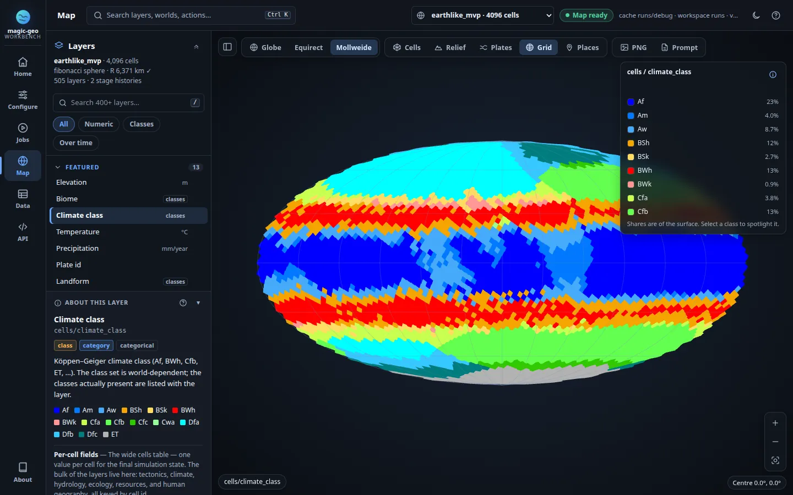

# Web workbench guide

The workbench is a local web app for the whole magic-geo workflow. You use it to
**configure** a world, **generate** it as a background job, and **explore** the
result on an interactive globe and in data tables. It runs on your machine, and
nothing is uploaded.


- [Start the workbench](#start-the-workbench)
- [Your first world in five minutes](#your-first-world-in-five-minutes)
- [Finding your way around](#finding-your-way-around)
- [Home](#home)
- [Configure](#configure)
- [Jobs](#jobs)
- [Map](#map)
- [Data](#data)
- [API & system](#api--system)
- [Keyboard shortcuts](#keyboard-shortcuts)
- [Accessibility](#accessibility)
- [Reading the data honestly](#reading-the-data-honestly)
- [Troubleshooting](#troubleshooting)
- [Extending the workbench](#extending-the-workbench)

There is also a product overview at `/landing.html` on the running server, linked
as **About** in the navigation. For the server, job and REST contracts, see the
[web workbench wiki page](wiki/15-web-workbench.md). The
[architecture notes](debugger.md) cover the security model.

## Start the workbench

For development from a checkout:

```bash
./scripts/dev.sh
# http://127.0.0.1:8642
```

The script creates or reuses `.venv`, installs any missing dependencies, builds
the native core incrementally, and starts the server with Python reload. Run
`./scripts/dev.sh --help` to see the flags (`--no-build`, `--install`,
`--no-reload`, `--port`).

With an installed package:

```bash
python -m pip install -e '.[debug]'
magic-geo serve
# http://127.0.0.1:8642
```

The server does not need an existing world. By default it looks for browser
maps (debug caches) in the workspace (`runs/`) and opens the conventional one,
`runs/debug`, when it exists. Use `--workspace <dir>` to keep generated files
somewhere else. Use `-d <cache>` to open one specific existing cache. Storage
locations are described in [runtime storage](runtime_storage.md).

The workbench is **trusted-local and single-user**. It has no login and no
per-user isolation. Keep the default loopback binding unless a trusted network
boundary or an authenticating proxy protects it.

## Your first world in five minutes

1. Open the workbench and select **New world** on Home.
2. Choose the **smoke** profile for a quick first run, or **earthlike** for Earth
   reference inputs. Keep the suggested name and random seed, or type your own.
3. Leave **Resolution** at *Profile default*. Select **Create & generate**.
   - The dialog renders the YAML on the server from the profile and your choices
     (`POST /api/config/render`), then saves it (`POST /api/config/save`).
   - It then starts a **Generate world** job whose outputs go to a folder named
     after the world, for example `runs/aurora/world.json` and
     `runs/aurora/debug`. Generating a new world never replaces the one on
     screen.
4. The Jobs view shows each phase as it runs: generation, writing the world, and
   preparing the browser map. You can switch to other views while the job runs.
   The header pill and a dot on **Jobs** show that work is in progress.
5. When the world is ready, a notification appears. Select **Open map**. The new
   world opens on the globe, and it also appears in the world picker and in the
   Home library.
6. Try a few things on the map:
   - Pick **Biome** or **Climate class** under *Featured*.
   - Press <kbd>3</kbd> for the Mollweide projection.
   - Click a cell to inspect it.
   - Open **Monthly climate** and press ▶ to play through the year.

Experts can skip the dialog. Open **Configure**, edit any YAML file, then select
**Save & generate**.

## Finding your way around

```text
┌──────┬────────────────────────────────────────────────────────────────────┐
│ Home │ Page title · Search (Ctrl K) · job activity · world picker · status │
│ Conf │────────────────────────────────────────────────────────────────────│
│ Jobs │                                                                      │
│ Map  │                          current view                                │
│ Data │                                                                      │
│ API  │                                                                      │
│ About│                                                                      │
└──────┴────────────────────────────────────────────────────────────────────┘
```

- **Navigation rail.** Home, Configure, Jobs, Map, Data and API appear in
  workflow order. On phones the rail becomes a bottom tab bar. The views are
  ARIA tabs: arrow keys, Home and End move between them. Each view also has an
  address (`#home`, `#config`, `#operations`, `#map`, `#data`, `#api`), so
  Back and Forward work. On a return visit the workbench opens the view you used
  last.
- **Command palette.** Press <kbd>Ctrl</kbd> <kbd>K</kbd> (<kbd>⌘</kbd> <kbd>K</kbd> on
  macOS) or select the search box in the header. You can jump to any view,
  layer, world, configuration, job or operation. It also runs actions such as
  *New world*, *Validate YAML*, *Export map as PNG*, projection switches and
  overlays. Matching is fuzzy: `precip` finds *Precipitation*, and a world name
  finds that world. With an empty query the palette suggests common actions and
  your pinned layers.
- **World picker.** This header menu lists every prepared world (browser map) in
  the workspace. Map and Data always show the world selected here. The status
  pill next to it reads **Map ready** or **No world**.
- **Job activity.** While a job runs, a pill in the header shows its current
  phase on every view, and the browser tab title shows it too. Select the pill
  to jump to the job. When the job finishes, the pill stays as a shortcut to the
  result, with a green or amber state instead of the pulsing dot.
- **Notifications.** Toasts appear in the bottom-right corner:
  - When a job succeeds, fails or is cancelled during your session.
  - When a world cannot be opened.

  A toast with an action, such as **Open map** or **View job**, stays until you
  dismiss it. Other toasts fade on their own.
- **Theme.** The sun/moon button switches between light and dark themes, and the
  choice is remembered. The first visit follows your system setting. The map
  canvas stays dark in both themes, so exported references keep one fixed
  background color.
- **Help.** Press <kbd>?</kbd> or select the help button. The panel lists every
  shortcut, explains the map, and has a setting to turn single-key shortcuts off.

## Home

Home is where you start. It shows three workflow cards with live status:

| Card | Shows |
|---|---|
| **Configure** | Number of valid configurations found, or the file that is ready to generate |
| **Generate** | Phase of the running job, or the outcome of the last generation |
| **Explore** | Name, cell count and layer count of the world on screen |

Below the cards:

- **Worlds** lists every prepared world. The one on screen comes first, then the
  rest, newest first. Each row shows its cell count, scope, age and folder. Type
  to filter. **Open** switches to that world and goes to the map.
- **Example seeds** lists the example configurations shipped in
  `configs/seeds/`. Select one to open it in the editor.
- **System** shows the server version, the active compute backend, any GPU the
  engine detected, the workspace path and a link to the API docs.

## Configure

### New world dialog

The **New world** dialog is the quickest way to start. You can open it from Home,
Configure, the map's empty state or the command palette.

| Field | Meaning |
|---|---|
| Profile | `default` gives neutral physical inputs. `earthlike` gives Earth reference inputs (the seasonal climate is not calibrated to Earth). `smoke` is a tiny, fast configuration. |
| World name | Written to `run.name`. Its slug is used for the file name and the output folder. |
| Seed | `run.seed`. The dice button picks a random seed. The same seed with the same settings gives the same planet. Seeds larger than 2⁵³ can be typed directly in YAML. |
| Resolution | `mesh.cell_count`: *Profile default*, 512, 2,048, 4,096 or 16,384 cells. Offered values follow the schema bounds. |
| Planet & tectonics | Optional overrides for radius, axial tilt, ocean fraction, day length, plate count, precipitation scale, erosion iterations and stellar luminosity. Leave a field blank to keep the profile value. Bounds come from the live schema. |

- **Open in editor** loads the rendered YAML as an unsaved file, so you can
  review or edit it before saving.
- **Create & generate** saves the file and starts generation straight away.

If the name is already taken, the dialog asks you for another one. It never
overwrites a file silently.

### Editor

The editor edits raw YAML, so every current and future schema field can be used
without a frontend release. It offers:

- **Line numbers and syntax colouring.** These are drawn over the text box, which
  stays the only source of truth. Files over 250 KB fall back to plain text.
- **Existing configuration.** A file picker lists configurations discovered in
  the configured directories. **Open file** asks before it discards unsaved
  edits.
- **Profile + Reset from profile.** Choosing a profile does not change anything.
  Only **Reset from profile** replaces the YAML, and it asks first when you have
  edits.
- **Validate** (<kbd>Ctrl</kbd>+<kbd>Enter</kbd>). Runs the same duplicate-key-safe
  parser and Pydantic model that the CLI and Python use. Errors list the source
  line and column and the field path. YAML over 1,000,000 bytes, or with
  pathological nesting or aliases, is rejected before the model is built.
- **Step indicator.** *Open or create → Edit & validate → Save → Generate*
  tracks where you are.
- **Save** (<kbd>Ctrl</kbd>+<kbd>S</kbd>).
  - If you keep the opened file's name, Save updates that file. If you change
    the name, it saves a copy in `<workspace>/configs`.
  - Saves are atomic. They keep your exact text, including comments and large
    integers.
  - If the file changed on disk since you opened it, you must reload it or save
    a copy.
  - **Download** creates a local file only and does not touch the server.
- **Save & generate.** Saves the file if needed, then opens Jobs with the
  *Generate world* form filled in. When the output fields still hold their
  catalog defaults, they point to a folder named after the file
  (`<workspace>/<name>/world.json` and `<workspace>/<name>/debug`). A
  destination you typed yourself is always kept.

The **Schema fields** panel lists every property, with its path, type, whether
it is required, its description, default, choices and bounds. It also shows the
root `config_version`. Filter by path or by words from the description.

All profiles use the seasonal energy model and need `config_version: 2`.
Temperature is controlled by `climate.reference_infrared_optical_depth`. The
retired mean and lapse-rate fields produce migration errors.

## Jobs

The launcher form is built from `/api/operations`; no command strings are hard
coded in the browser.

- Chips above the operation menu give quick access to the four common jobs:
  **Generate world**, **Validate natural geography**, **Render SVG map** and
  **Prepare browser map**.
- Essential fields come first. Output and advanced options sit in a disclosure.
- Each operation keeps its own draft while the page is open.
- Turning off **Prepare browser map** hides the options that depend on it.

| Operation | Purpose |
|---|---|
| Generate world | Simulate a planet from YAML and save it as JSON or `.mgeo`. It can also prepare the browser map. |
| Validate world | Run every structural, conservation and replay check on a saved world |
| Validate natural geography | Check realism gates for terrain, climate, water, ice, soils and ecology, using the *generic* or *earthlike* policy |
| Run geo validation suite | Generate every scenario in a matrix and check their paired responses |
| Calibrate world / ensemble | Compare against target ranges derived from external data |
| Derive calibration targets | Build target ranges from a local source manifest |
| Render SVG / raster map | Draw a downloadable vector map or a shaded PPM raster |
| Prepare browser map | Export a saved world's layers, tables and mesh so Map and Data can open it |
| Export Rerun recording | Write a stage-scrubbable `.rrd` file. Needs `rerun-sdk`. |

### Following a job

Only one job runs at a time; the rest wait in a queue. The selected job shows:

- **The current phase**, in plain language with its purpose. For example:
  *Checking seasonal climate accuracy — comparing thermal time steps for month 1
  of 12*.
- **Measured time**: elapsed time, time in this phase, and time since the
  worker's last output. When the engine reports a count, a determinate progress
  bar appears, for example *7 / 12 · current stage*. Otherwise the job says
  honestly that it does not estimate an overall percentage or finish time.
- **Workflow steps** for generation: *Generate world → Prepare browser map →
  Explore*.
- **Actions** that fit the outcome:
  - **Open map**, **Validate world**, **Render map** and **Reuse settings**.
  - **Prepare browser map** when the world was saved but the map step failed or
    was skipped. It reuses the saved world instead of generating it again.
- **Artifacts** as downloads, or labelled *Destination · pending*, *No download
  produced by this job*, or *Available via Open map*.
- **Submitted settings & timestamps** and the **Technical log**. Both are
  collapsible, and they stay open while the job updates. Scrolling up in the log
  pauses auto-follow.

**Cancel job** asks the worker to stop:

- A queued job is cancelled without starting.
- A running job's process group is terminated, and killed after five seconds if
  it has not stopped.
- Once publishing has begun, the job cannot be cancelled. It finishes normally
  rather than claiming a false cancellation.

Downloads are immutable snapshots that belong to the job, so later runs cannot
change an earlier download. Reports written before a validation policy failure
remain downloadable. Browser maps are built in a private staging folder and
published only on success, so a failed replacement never damages the map on
screen.

Job records live in server memory and last until the server restarts. Files on
disk persist independently.

## Map



### Layers panel

About 500 layers are grouped so you can scan them:

- **Pinned** holds your starred layers (☆ on a layer row). Pins are remembered
  in this browser.
- **Featured** holds the fields most people reach for first: elevation, biome,
  climate class, temperature, precipitation, plates, landform, water, runoff,
  ice, soil, settlement and political regions.
- **Topic groups** hold the per-cell fields. The groups are Terrain &
  tectonics, Climate & atmosphere, Oceans & coasts, Rivers, lakes & groundwater,
  Ice & permafrost, Erosion & sediment, Soils, Biomes & ecology, Resources &
  land use, Settlements & societies, and Mesh & diagnostics.
- **Time-series groups** hold *Monthly climate*, *Water budget · per stage* and
  *Depression correction · per stage*.

Each row shows a readable label with the unit on the right, and a badge for
classes, stages or months. The raw field id, for example `cells/elevation_m`,
appears in the tooltip, in the layer card and in the legend.

Press <kbd>/</kbd> to search. Search matches the field name, label, topic, unit,
role, description and class names. The chips narrow the list to **Numeric**,
**Classes** or **Over time** layers. The collapse button folds every group, and
the panel button at the top-left of the map hides the whole panel.

**About this layer** (<kbd>d</kbd>) explains the active layer. It shows the
unit, its role (field, index, identifier, diagnostic and so on), the value range,
the colour-scale range, every class with its colour, and what the source family
contains.

### Colours and legend

Each numeric layer gets a colour scale chosen from what it measures, following
current scientific-visualisation guidance (Crameri et al. 2020; Moreland 2009):

| The field is… | Scale | Example |
|---|---|---|
| An amount or index | **Viridis**, sequential: lighter means more | precipitation, runoff, most `_index` fields |
| Signed, with values on both sides of 0 | **Cool–warm**, diverging: blue below 0, light grey at 0, red above; symmetric so equal sizes get equal intensity | temperature anomalies, current components, energy residuals |
| An elevation that crosses 0 m | **Terrain**, split at sea level: blues below 0 m, green to white above, with a sharp step at the coastline | `elevation_m`, `bedrock_surface_elevation_m` |
| An identifier (`*_id`, `flow_to`, `spill_to`) | **Categorical** colours that repeat every 18 ids; −1 (none) is grey | `plate_id`, `basin_id` |
| Constant (one value everywhere) | **One colour**; the legend says “every cell = …” | an unused diagnostic |

- **Range.** Colours span the 2nd to 98th percentile of the whole time axis, so a
  colour means the same value in every stage and month. When values fall beyond
  that range the legend shows ≤/≥ and small triangles at the clipped ends; the
  tooltip gives the true extremes.
- **Legend.** Ticks are round numbers (1, 2, 5 × 10ⁿ) and a split scale always
  labels its pivot, 0 m. Bars above the ramp show how much of the planet's
  surface has each colour; they are weighted by cell area, so they read as
  “share of the surface”, not “share of cells”. A caret marks the value under
  the pointer.
- **Colour scale menu.** Under *Colour scale* in the legend you can override
  the colours (Viridis, Cool–warm, Terrain) or show the full minimum–maximum.
  PNG exports and the prompt codex follow your choice.
- **Categorical layers** use a qualitative palette in which no two classes of
  a layer share a colour:
  - Classes with a recognised cartographic colour keep it. Oceans are blue,
    lakes are lighter blue, deserts are tan, forests are shades of green, alpine
    and tundra are pale, and wetlands are teal.
  - Köppen–Geiger climate classes use the standard scheme of Beck et al.
    (2018).
  - `none` and `False` are neutral gray.
  - Every other class takes the next unused colour of a Tableau-derived set that
    is chosen to stay distinguishable.
  - The legend lists each class with its share of the surface. Select a class to
    spotlight it (the others dim); <kbd>Esc</kbd> or a second click clears it.
- **Missing values** use a flat dark gray (`#292e36`) that is distinct from every
  ramp and palette colour. The outside-map background is `#10141a`.
- **One source of truth.** The colour tables live in `debug_ui/colormaps.js`
  (generated by `scripts/generate_colormaps.py`) and `debug_ui/palettes.js`.
  The GPU shader, the legend, the tooltip, the GPT Image codex and the CLI
  exporter all read them, and parity tests keep the browser and CLI identical.

### Time bar

Per-stage and monthly layers show a time bar with these controls:

- **▶ Play / ❚❚ Pause** (<kbd>space</kbd>). Each step waits for the previous
  slice to load, so a slow request never queues a burst of fetches. Playback
  stops when you leave the map or choose a static layer.
- **Previous and next** (<kbd>,</kbd> / <kbd>.</kbd>), a scrubbing slider, and an exact
  index box.
- **A label**, such as *month 7 · Jul* or *stage_idx 4 · stage 12 · iter 3*.

Neighbouring stages are prefetched. Responses that arrive out of order never
replace a newer selection.

### Moving around the world

- **Drag** to move. On the globe the point you grab stays under the pointer;
  on the flat maps the map pans. Let go while moving and it glides to a stop.
- **Scroll or pinch** to zoom toward the pointer. **Double-click** zooms in on
  a point (<kbd>Shift</kbd> zooms out).
- The **+ / − / fit** buttons at the bottom right do the same with a single
  click.
- **Keyboard.** Select the map (<kbd>Tab</kbd> to it), then use the arrow keys
  to move, <kbd>+</kbd> / <kbd>−</kbd> to zoom (with <kbd>Shift</kbd> for bigger
  steps) and <kbd>0</kbd> to show the whole world. After a keyboard move, screen
  readers hear where the map is centred.
- **Go anywhere** from the command palette: type coordinates (`12.5 N 40 W`,
  `-33.9 151.2`), a cell (`cell 1234`), or a place name. Long jumps fly along
  the path of van Wijk & Nuij (2003), zooming out and back in, so you keep
  your bearings.
- **Projections.** <kbd>1</kbd> shows the globe, <kbd>2</kbd> the equirectangular
  projection and <kbd>3</kbd> Mollweide. The map unrolls around the place in the
  middle of the screen, which stays put. From a whole-world view the new
  projection is fitted whole; when zoomed in, the place and scale are kept.
- **Reading position.** The bottom-right corner shows the latitude and
  longitude under the pointer, to the precision the mesh supports, and a scale
  bar measured on the planet at the map centre. The bar hides on whole-world
  views, where no single scale is true.
- **Hover** shows a tooltip with the value (and unit or class), the layer, the
  coordinates and the cell id, and outlines the cell. The same text appears in
  the status line.
- Reduced-motion preferences make every move, glide and projection change
  instant.

### Overlays

| Overlay | Key | Shows |
|---|---|---|
| **Cells** | <kbd>w</kbd> | The outline of every cell, one pixel wide at any zoom; it fades out where cells are only a few pixels across |
| **Relief** | <kbd>r</kbd> | Hillshading from present-day elevation, lit from the north-west (315°, 45° up) with automatic vertical exaggeration (shown in the tooltip). Level ground and water keep their exact colours; it is off by default because shading changes how bright a colour looks |
| **Plates** | <kbd>b</kbd> | Tectonic plate boundaries |
| **Grid** | <kbd>g</kbd> | Latitude and longitude lines, 30° apart for the whole world and finer (10°, 5°, 1°) as you zoom in |
| **Places** | <kbd>p</kbd> | Settlements (capitals in gold), port sites, ruins, sacred areas and landmass centres from the world's own records. Select one to fly there and inspect its cell |

The toolbar adapts to the map's own width, dropping labels before it wraps.

### Shareable views

The address bar keeps the whole map view, for example:

```text
#map?layer=cells%2Fbiome&proj=mollweide&show=cells%2Cplaces&at=35.00%2C-120.00%2C40.00
#map?layer=cells_monthly%2Ftemperature_monthly_c&month=7
```

Opening a link like this restores the layer, stage or month (months are
1-based), projection, overlays (`show`) and camera (`at` = centre latitude,
centre longitude and the visible span in degrees) once the world loads.

### Cell inspector

Click a cell to open the inspector. It shows:

- The active layer's value for the cell, with its unit and time slice, and the
  cell's centre and area. The selected cell keeps an amber outline on the map,
  and the target button (<kbd>c</kbd>) centres the map on it.
- Every scalar field, and every nested field kept in the cell detail sidecar.
  A filter box narrows the list.
- Per-stage ledger sparklines, with a marker at the active stage.
- Monthly sparklines.
- Adjacent cells with their edge flags (plate boundary, land/water, biome
  transition). Click a neighbour to jump to it; the map follows if it is off
  screen.

Caches exported before the detail sidecar existed still open, but report
`complete: false`.

### Exporting a GPT Image reference

**PNG** captures the current camera view in the final selected projection,
including the selected stage or month and any visible overlays. View-only
touches (the atmosphere halo, hover and selection outlines, a class spotlight,
relief shading and the background vignette) are left out, so every colour in
the image is one the codex lists. **Prompt**
writes a Markdown prompt that matches the PNG's file name. It records the world,
layer, projection, time slice and camera pose, plus a colour codex:

- For numeric layers, the codex names the colour scale and gives its stops, the
  display range (with the 0 m split for terrain), clipping and the missing-data
  colour. Identifiers list their exact id colours, and a constant layer its one
  colour.
- For class layers, it gives every class with its guide colour.

Attach the PNG to GPT Image and paste the prompt. The workbench only creates
these local files. It never calls an image-generation service.

The CLI command `magic-geo export-debug-map` produces the same artifacts from
the same cache without a browser. It supports every layer, time slice,
projection, overlay, raster size and exact camera replay. Both exporters refuse
to run when cells lack boundary rings, because those cells would otherwise look
like background holes. Stage lithology codes keep their numeric scale, since
the cache has no authoritative name table for them.

## Data

Data is the table view of everything in the selected world's browser map:

| Choice | Contents |
|---|---|
| Overview | Counts of layers, stage histories, record families, sections, scalars and skipped outputs. Select a count or a family to open it. |
| Record families | Every exported list of records, paged 10–100 rows at a time. Choose *Full nested records* (JSONL) or *Scalar columns only* (Parquet). |
| Stage summaries | The per-stage scalar table for each history, plus retained stage extras |
| Model sections | Every exported dictionary (summary and model contracts, graphs, clock, telemetry, validation and calibration content) |
| World scalars | Top-level scalar metadata |
| Layer catalog | Every layer manifest entry, with its statistics |
| Cell schema | Scalar fields, skipped-layer reasons and detail sidecar metadata |
| Skipped outputs | Sections, cell fields and columns that were not promoted to layers. They are kept in the sidecar, not lost. |

**Raw JSON** opens the exact API response. JSON views show non-finite numbers as
`null`, while binary layer downloads keep their numeric missing-value encoding.
Only caches with `format: magic-geo-debug-cache` and `version: 1` are accepted.

## API & system

- **Native engine** summarizes the active backend, the native core and OpenMP
  threads, and whether CUDA and OpenCL are available (with the device, if any).
  **Full capability report** shows the complete `/api/backend` response.
- **File locations** lists the resolved storage paths. You can override them
  with `MAGIC_GEO_*` environment variables.
- **Common endpoints** is a short reference. The embedded **Swagger UI**
  (`/api/docs`), **ReDoc** (`/api/redoc`) and `/api/openapi.json` document every
  route in full.

## Keyboard shortcuts

| Keys | Action |
|---|---|
| <kbd>Ctrl</kbd> <kbd>K</kbd> / <kbd>⌘</kbd> <kbd>K</kbd> | Open or close the command palette |
| <kbd>?</kbd> | Help and shortcuts |
| <kbd>/</kbd> | Search layers (Map) |
| <kbd>d</kbd> | Toggle *About this layer* (Map) |
| <kbd>1</kbd> <kbd>2</kbd> <kbd>3</kbd> | Globe, equirectangular, Mollweide |
| <kbd>,</kbd> <kbd>.</kbd> | Previous and next stage or month |
| <kbd>space</kbd> | Play or pause the time bar |
| <kbd>w</kbd> <kbd>r</kbd> <kbd>b</kbd> <kbd>g</kbd> <kbd>p</kbd> | Cell outlines, relief, plate boundaries, grid, places |
| <kbd>c</kbd> | Centre the map on the selected cell |
| Arrow keys, <kbd>+</kbd> <kbd>−</kbd>, <kbd>0</kbd> | Move, zoom, whole world (when the map has focus; <kbd>Shift</kbd> for bigger steps) |
| Double-click | Zoom in at the pointer (<kbd>Shift</kbd>: out) |
| <kbd>Ctrl</kbd> <kbd>Enter</kbd> | Validate YAML (Configure) |
| <kbd>Ctrl</kbd> <kbd>S</kbd> | Save YAML (Configure) |
| Arrow keys, <kbd>Home</kbd>, <kbd>End</kbd> | Move between views when the navigation has focus |
| <kbd>Esc</kbd> | Close the palette, dialogs, help or the inspector; clear a class spotlight |

Single-key shortcuts never fire while you type in a field. They can be turned
off in Help → *Settings* (WCAG 2.1.4).

## Accessibility

- Every control is reachable by keyboard and has a visible focus ring.
- Views are ARIA tabs. The command palette is an ARIA combobox inside a modal
  dialog, and dialogs trap focus and return it to the control that opened them.
- Status changes such as job phases, validation results and toasts are announced
  politely, without announcing every timer tick.
- Text meets WCAG 2.2 AA contrast in both themes, and states never rely on
  colour alone: pills and steps also carry text.
- Reduced-motion preferences disable animations and make projection changes,
  fly-to moves and glides instant.
- The map is a focusable application region with instructions for screen
  readers. It can be moved and zoomed entirely from the keyboard (WCAG 2.1.1),
  and every drag has a single-pointer alternative: the zoom buttons, centring on
  a selected cell, and jumping from the command palette (WCAG 2.5.7). Its
  character keys only act while the map has focus (WCAG 2.1.4).
- Layouts reflow down to 320 CSS pixels without horizontal page scrolling. On
  phones the navigation moves to the bottom and the inspector becomes a bottom
  sheet.

## Reading the data honestly

- **Identifiers.** Fields ending in `_id` (and `flow_to` / `spill_to`) are
  labels, not quantities. They are drawn with categorical colours, never a
  ramp; read them as "same colour means same group" and hover for the exact id.
- **Constant fields** are drawn in one colour and the legend says so, instead
  of inventing a 0-to-1 range.
- **Indices and measurements.** `_index` fields are derived and usually lie in
  0–1. Fields with a unit suffix (`_m`, `_mm_y`, `_c`, …) are physical
  quantities.
- **Unavailable is not zero.**
  - When a model does not apply to a cell, or its inputs are missing, the value
    shows as *Unavailable* and in the missing-data colour.
  - A supported zero stays zero.
  - Availability flags (`*_supported`, `*_applicable`) have their own layers.
- **Residuals.** Fields with `residual` in the name should be close to zero.
  Large values mean a budget does not close.
- **Ring seams.** Visible seams between cells in flat projections are a
  documented geometry diagnostic
  (`mean_neighbor_boundary_segment_mismatch_km`), not a rendering bug.

## Troubleshooting

| Symptom | What to do |
|---|---|
| **No world** on first start | This is normal. Use **New world**, or generate with **Prepare browser map** turned on. |
| A world will not open | The toast and the status tooltip give the cache error. Re-run **Prepare browser map** for that world, or pick another. |
| Save fails | Use a plain file name, not a path. Files are saved under `<workspace>/configs`. |
| *This file changed on disk* | Reload the file, or change the name to save a copy. |
| A job is rejected | Check required inputs, numeric bounds, choices and the path policy. Inputs must be in the project; outputs must be in the workspace and must not overlap. |
| A job fails | The error summary names the failed phase. The technical log has the details. Reports written before a policy failure are still downloadable. |
| The map says *No available estimates* | This slice has no finite values. Try another stage or month, or an availability layer. |
| A record family lacks arrays | Switch **Detail** to *Full nested records*. |
| The inspector says incomplete | Re-export the world with **Prepare browser map** to create the detail sidecar. |
| Rerun export is disabled | Install `rerun-sdk`. |
| Updates are *disconnected* | The last state stays visible, and the page retries automatically. Jobs keep running on the server. |

## Extending the workbench

The frontend is plain ES modules with no build step. They are served from
`src/magic_geo/debug_ui/`:

| Module | Owns |
|---|---|
| `index.html`, `style.css` | App shell, views, design tokens (dark and light), responsive layout |
| `app.js` | Map rendering (three.js shaders, render on demand, GPU picking), layers, legend, inspector, overlays, export, Data view, routing and wiring |
| `map-navigation.js` | Camera and gestures: grab-drag, zoom to the pointer, inertia, pinch, keyboard, fly-to, projection-aware view state, screen ↔ latitude/longitude |
| `colormaps.js` | Numeric colour tables (generated), scale selection, ticks and positions, shared with the CLI exporter |
| `home-workbench.js` | Home dashboard |
| `config-workbench.js` | YAML editor, highlighting, stepper, save and validate, handoff to generation |
| `operations-workbench.js` | Operation forms, jobs, progress, cancellation, activity |
| `new-world.js` | New world dialog |
| `command-palette.js` | Command palette search and keyboard model |
| `ui.js` | Icons, toasts, theme, storage and formatting helpers |
| `palettes.js` | Categorical colours shared with the CLI exporter |
| `layer_docs.js` | Layer documentation, topics, labels and help content |
| `landing.html`, `landing.css`, `assets/` | Product landing page and screenshots |

- **New configuration field.** Add it, with a description, default and bounds,
  to the Pydantic model. The schema panel and the New world bounds pick it up
  automatically.
- **New operation field.** Add a descriptor to `web_jobs.py`. The same catalog
  drives the form and server-side validation. Never add free-form shell
  arguments.
- **New world output.** The exporter classifies it automatically, and Data shows
  it without frontend changes. Add a featured layer or a topic rule in
  `layer_docs.js` only when it helps discovery.
- **Layer documentation.** Add curated prose to `CURATED` in `layer_docs.js`,
  then run `node scripts/gen_layers_reference.mjs` to refresh
  [layers_reference.md](layers_reference.md).
- **Categorical colours.** Change `palettes.js` and `_CATEGORY_COLORS` in
  `debug_map_export.py` together. `tests/test_debug_map_export_parity.py` fails
  if they drift.
- **Numeric colour scales.** Edit the definitions in
  `scripts/generate_colormaps.py` and run it; it rewrites the tables in
  `colormaps.js`, which the CLI exporter reads directly. Scale-choice rules live
  in `numericScale()` (`colormaps.js`) and `_numeric_scale()`
  (`debug_map_export.py`); `tests/fixtures/colormap_scale_cases.json` is checked
  against both.
- **Tests.**
  - `node tests/test_debug_ui.mjs` runs the controllers against a small DOM
    stand-in, covering request ordering, races, palette search, notifications,
    URL state, colour-scale selection, projection round trips, fly-to paths and
    camera behaviour.
  - The asset and server tests live in `tests/test_debug_static_cache.py` and
    `tests/test_debug_server.py`.
