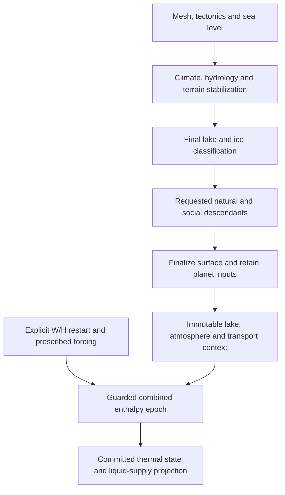

# Finalized terrain, lake and atmospheric enthalpy context

The combined-temperature enthalpy owner now has an internal entry on a completed native world. The entry reconstructs lake geometry from the hydrology that created it, rebuilds all prescribed hydrostatic, sensible-capacity, emissivity and transport coefficients, and derives transport from the actual spherical mesh. An immutable context and guarded epoch keep those coefficients attached to their original terrain, basin data and planet parameters. This is an opt-in integration boundary; the generated world's climate, hydrology, ecology and society still retain their existing production results.

The distinction matters for physical coherence. A lake's exported `water_depth_m` is clipped for diagnostics, while `hydrologic_surface_elevation_m` is conditioned to route drainage. Treating either as a physical lake surface would introduce heat storage or pressure that the generating equations did not produce. A coefficient set from the earlier fresh-marine climate solve also predates the final lake classification. The new adapter resolves those input and dependency errors without claiming that a prescribed sensible lake slab resolves mixing, stratification or freezing.

The implementation is in `cpp/src/engine/finalized_enthalpy_context.hpp`, `finalized_enthalpy_context.cpp` and `finalized_enthalpy_context_serialization.cpp`. `pipeline.cpp` records the relevant original planet inputs after the requested native pipeline completes, including society when enabled, and `world.hpp` records the new internal owner mode. The existing fresh-marine adapter, fixed-W thermal core, mass-event kernel and combined mesh owner retain their previous numerical implementations.

## Physical interpretation and research

A slab model needs a declared thermal depth. NCAR's CESM description treats the ocean slab as an approximation to a well-mixed layer with specified depth; storage depth and the surface energy flux determine its temperature response. This supports making depth an explicit model parameter. It does not supply an observed lake mixing depth or validate a universal lake cap for this generator. [NCAR slab-ocean description](https://www.cesm.ucar.edu/models/simple/slab-ocean-model).

Detailed lake studies illustrate the missing physics. Wang and colleagues evaluated the WRF lake module at a deep reservoir and showed that vertical mixing, light attenuation, vertical discretization and depth representation affect thermal behavior. A lake-body depth error can also change energy storage. Their site-specific improvements do not establish a globally transferable fixed-depth slab. [Wang et al., GMD, 2019](https://gmd.copernicus.org/articles/12/2119/2019/index.html).

Layden and colleagues tuned FLake against observations for a large global lake sample; lake depth, ice/snow albedo and light extinction were influential parameters. This reinforces the need to distinguish prescribed parameters from independently constrained lake properties. The present integration performs no observational tuning and imports none of that paper's surface-temperature accuracy results. [Layden et al., GMD, 2016](https://gmd.copernicus.org/articles/9/2167/2016/).

The independent research review adds two relevant limits. LakeMIP's shallow-lake comparison found that plausible surface temperatures did not guarantee a realistic vertical thermal structure. A later observational evaluation over a seasonally ice-covered lake found that turbulent-transfer formulations depend on surface state and meteorological inputs. Neither behavior is supplied by this code's combined sensible capacity and effective outgoing-longwave emissivity. [Stepanenko et al., GMD, 2013](https://gmd.copernicus.org/articles/6/1337/2013/), [Ala-Könni et al., GMD, 2022](https://gmd.copernicus.org/articles/15/4739/2022/).

The resulting engineering choice is narrow: retain the existing water volumetric sensible heat capacity, reconstruct the native lake depth, and require the caller to supply a positive lake mixed-layer cap when any lake exists. Each lake column uses the smaller of that cap and its reconstructed depth. The 10 m value in the production qualification is an explicit test parameter, not a recommended universal lake depth. Ocean slabs retain the existing default 50 m cap. Both are prescribed sensible reservoirs; lake ice, ocean freezing, salt-dependent heat capacity, vertical mixing, sediment heat exchange and lake surface turbulent fluxes remain unresolved.

## Dependency order

Native world generation constructs geometry, tectonic terrain and sea level before the seasonal climate and hydrology passes. Erosion, numerical-depression stabilization, cryosphere coupling and another hydrology stabilization can revise the final surface. The requested natural and, when enabled, social descendants are then generated. The finalized flag is set only after that requested chain completes. Numerical retries during the chain do not advance the new physical clock or consume source events.

The last projection does not currently update the generated hydrology or rebuild descendants. That is a separate missing connection. Annual precipitation is already consumed by the existing hydrology path; treating the new retained-water inventory or liquid outbox as an additional supply to that path would count water twice unless the old precipitation-consumption path is replaced deliberately. The current opt-in epoch supplies neither that replacement nor external delivery acknowledgement.

The earlier seasonal climate cache is excluded from context assembly. Its successful coefficient state belongs to the earlier fresh-marine surface and serves numerical climate retries. It cannot establish final-lake heat capacities. Rebuilding all columns is essential because pressure normalization depends on every cell's area and air-interface elevation: changing one lake interface can change pressure and atmospheric heat capacity throughout the mesh.

## Reconstructed lake geometry

For a wet depression, let the retained raw sink be `s`, its bed elevation be `z_s`, its spill elevation be `z_spill`, and the shared retained lake fill fraction be `f`. The new adapter repeats the existing hydrology's binary64 operation order:

\[
r=\max(0,z_{spill}-z_s),\qquad
z_{lake}=z_s+\min(1,f)r,\qquad
d_i=\max(0,z_{lake}-z_i).
\]

The replay uses the native values, not decimal-rounded world exports. Each flagged lake must have a valid canonical sink, matching depression component, matching fill fraction and matching water-body code. The sink must be its own retained raw sink and a lake. Fill fractions must lie in the generating model's finite range 0–1.5. All members of a wet component must have consistent component/sink membership, including members above the water surface.

Classification is replayed for the whole wet footprint. The existing hydrology flags a non-sink cell wet only when `d_i > 1e-9`, and always flags the sink when the wet-depression branch runs. The adapter verifies that classification and recomputes the displayed depth with its 0.2–240 m clipping. A flagged sink with zero reconstructed depth is refused: the forced display minimum cannot create physical storage. A shallow but positive reconstructed lake retains that small positive depth in its sensible capacity.

The reconstructed depth remains a depth of this generator's coarse cell model, not observed bathymetry. A wet cell represents a whole thermal control volume; partial inundation area and subcell lake geometry are not resolved.

The retained provenance records each lake's cell and sink IDs, depression component, fill fraction, sink bed and spill elevations, reconstructed free surface, unclipped depth, diagnostic depth and effective mixed-layer depth. The immutable snapshot also holds all source cells and their actual geometry. This permits a reader to distinguish the generating equation, its clipped diagnostic and the later prescribed thermal cap.

Dry geologic sinks need separate treatment. The hydrology may classify a dry saline basin with `water_body=5` while both wet flags are false. Such cells use the land sensible slab and require zero water depth. A water-body label alone is not sufficient to select a wet column. Marine cells, in contrast, require the existing marine code range, a negative bed elevation and depth exactly equal to the unary negation of that elevation; their atmospheric interface is the sea-level datum.

## Coefficients and transport

Every column uses the mesh owner's authoritative area operation, `A_i = area_km2 * 1e6` evaluated in binary64. The older fresh-marine helper performs its area product through long double; the new adapter leaves that helper unchanged and avoids relying on bit equality between two potentially different rounding paths.

| Surface | Atmospheric interface | Sensible surface capacity |
|---|---|---|
| Exposed land, including a dry saline basin | Native bed elevation | Existing mineral slab, 4.0e6 J m⁻² K⁻¹ |
| Marine | Sea-level datum, 0 m | 4.1813e6 J m⁻³ K⁻¹ times min(actual marine depth, prescribed marine cap) |
| Lake | Reconstructed native free surface | 4.1813e6 J m⁻³ K⁻¹ times min(unclipped lake depth, explicit lake cap) |

The existing `build_prescribed_climate_columns` then rebuilds all pressures and coefficients. With prescribed profile temperature and gravity, its scale height is `H_a = R_d T_profile/g`. Pressure follows the area-normalized hydrostatic expression

\[
p_i=\bar p\frac{\exp(-z_i/H_a)}{\sum_j A_j\exp(-z_j/H_a)/\sum_j A_j}.
\]

Atmospheric sensible capacity is `c_p p_i/g`. Optical depth scales with pressure and inverse gravity, and effective emissivity is `1/(1+0.75 tau_i)`. The combined sensible capacity adds the surface and atmospheric capacities once. Nodal horizontal conductivity is the prescribed atmospheric diffusivity times atmospheric capacity. Zero prescribed atmospheric pressure produces zero atmospheric capacity and transport with unit emissivity while retaining positive surface storage.

These coefficients are prescribed inputs to the enthalpy problem. Retained terrestrial water W adds the owner's existing latent/sensible reservoir only on exposed cells. Marine and lake slots keep W=0 but retain combined sensible H, radiative forcing and transport participation. The lake slab does not secretly become a retained lake-water mass reservoir, and its sensible heat capacity is not counted a second time in the source jump.

Transport is assembled from full native geometry with `build_climate_heat_transport_edges`. Fibonacci/Voronoi faces use the existing shared-face geometry and harmonic nodal resistance. Geodesic cells use the existing primal-triangle stiffness with arithmetic nodal conductivity on each triangle. Geometry validation checks spherical control volumes, reciprocal faces, canonical IDs and positive conductance rules. Latitude must match the spherical cell center, and aggregate physical areas must match the declared sphere within the existing geometry tolerance. An arbitrary adjacency list cannot be substituted for this graph.

## Immutable epoch and resource admission

Successful native finalization retains the raw mesh backend, planetary radius, gravity scale, pressure scale, reference infrared optical depth and greenhouse factor. Epoch creation requires the supplied parameters to match those recorded inputs bit for bit. This closes the previous gap in which an otherwise finalized cell set could be paired silently with a different planet atmosphere. The pure context-building function remains available for explicitly prescribed source data; only the production epoch authenticates those parameters against native finalization.

The context binds the full existing terrestrial snapshot contract plus depression sink/component IDs, spill elevation and fill fraction. That extension matters because the older snapshot matcher omits those basin fields. Both prepare and commit check finalization, snapshot identity, owner mode, retained planet provenance, current supplied planet parameters, and current source operands. A stale-input refusal occurs before entering the numerical owner. The mutable owner is private; public epoch access exposes it as const.

Construction validates the full context and restart before publishing the epoch marker on the generated surface. A malformed restart, missing lake-depth policy, invalid basin or changed planet therefore leaves no partially claimed epoch. The accepted candidate still uses the existing owner's opaque ownership and restart checks. Repeated and foreign commits retain that owner's existing refusal behavior.

Before copying source cells, the adapter limits the cell count to 4096 and separately limits each of the three dynamic geometry-vector totals to 131072 entries. The incidence allowance accommodates split geodesic faces and the total size of symmetrized native neighbor lists. The final positive transport graph is capped at 32768 edges. These are explicit admission bounds; oversized caller-constructed geometry is rejected before immutable snapshot allocation.

The context and epoch serializers retain round-trippable binary64 source values, lake reconstruction, slab options, raw and mapped planet inputs, physical diagnostics, full owner properties and actual owner state. Scope fields remain false for an astronomical source calendar, original-source accuracy, lake stratification/ice, and live hydrology delivery or descendant rebuilding.

## Qualification record

The single frozen control invocation passed **297 checks** on production Fibonacci geometry and native 12-cell geodesic geometry. It covered clipped deep and shallow lakes, dry saline basins, pressure normalization, planet and basin mutation guards, malformed classifications, geometry admission and a zero-atmosphere context. It made no thermal calls.

The single production invocation generated one complete 128-cell world in the declared healthy seed configuration, then passed **30 integration checks**. It reconstructed two lakes in depression component 0, both associated with raw sink cell 4. Their free surface was 3441.9343533416272 m, with unclipped depths 176.34068399968328 m and 85.72585919193398 m. Both used the explicitly supplied 10 m sensible slab. The existing displayed depths happened to be unclipped in this real-world case; the separate constructed controls exercised both diagnostic clipping limits.

Both one-second thermal calls produced candidates and committed. The one explicit solid import caused one mass-event call; the empty successor did not repeat it. Error carried from 2,716,864,151.57428 J after the first commit to 5,433,728,054.831993 J after the second, below the unchanged global budget 5,100,644,719,097.883 J. Dividing the final global bound by the mesh area gives an area-mean bound of about 1.0653e-5 J m⁻²; it is not a separate per-cell guarantee. The two calls used 16,124 scalar evaluations, 70 field evaluations and 64 reconstruction leaves in total. There were no adaptive thermal retries.

The production driver compared the full serialized generated world before and after both commits and all guard controls. It remained byte-identical. Both lake slots retained W=0 and gained sensible enthalpy, confirming their participation in the complete thermal mesh. Stale lake data, changed planet inputs, changed provenance, a foreign epoch and a stale repeated candidate were refused as declared.

Both native invocations exited successfully with empty stderr and no remaining process group. Controls took about 0.034 seconds; production, including full world generation and serialization, took about 11.194 seconds. The rebuilt library loaded all eight V3/V4 generation exports, the new sources passed strict warning checks, and four existing normal/unavailable pipeline targets rebuilt successfully without new legacy numerical runs. The evidence retains one driver compile setup correction and one read-only symbol-name check correction, both before numerical qualification.

The completed independent retained-data audit passed all five contexts, 524 column records, the complete geometry/coefficient reconstruction, both owner receipts and their actual before/after state observations, all 64 thermal reconstruction leaves, and all 13 tamper controls. It verified all 107 prelaunch source/artifact pins. Its final result freeze is `65d5134ad813f302fdf12c00099f786dba48e910b3aea68bc84ecbc521ed7d23`, reader freeze `9bf6b66eb2c24b8e31f81db030b46c637ec7b473a5b6c9ee721ce6599605c906`, and report `7de2b1a5e25db66d5343bffc2de4bc5b30a74f1807f998c78cd79bd247a88f6d`; the successful audit took about 3.707 seconds and made no native or world-generation call.

Two earlier incomplete reader attempts are preserved. The first encountered a reused eight-column mass-fixture admission limit; that limit was extended to the predeclared 128-cell scope with explicit acceptance/refusal controls. The second found 128 signed-zero publication differences in the expected post-source enthalpy boxes: native interval addition returns a lower endpoint of -0 when H=0 and inherited error is zero, while Fraction arithmetic had published +0. Exact readers must preserve JSON `-0` as negative binary64 zero; decoding it first as an integer can erase that sign. The reader now publishes the native sign on that specific branch and retains strict bit comparisons. A separate resource-only runner amendment aligned the audit with its launch limits before outcome access. No native run was repeated, no nonzero bound discrepancy was found, and no numerical tolerance was changed.

The [complete evidence package](../runs/finalized-enthalpy-context-review/README.md) retains source copies, native outputs, independent reader history and relocation checks. The prelaunch authority is `3b58a96bbf0234401402df1a40a78d6fbadfe88ecfe1659ef4a7b112dd1c05c8` with 107 source/artifact pins. The tested driver is `2492b18aabc48987c297147b5a4eb03fd05c05c8877f5b74615f1cc58717aaea`, the rebuilt native library is `c14bef16d0b8ff8ed02ea63c3d1fb67205d77c4fc15f54d5a97cfac95b8d8d85`, and the native result freeze is `2076978cd0519574db32b3dddb3f95b6f84e99f8f9cfb6f09384eef6079978c9`. The earlier frozen annual studies and failed targets were not rerun or changed.

The test deliberately starts from an explicit canonical state, H=0 everywhere with W=1 kg m⁻² on exposed cells and W=0 on marine/lake cells. This means the initial combined temperature is the declared freezing reference. It does not treat an annual or monthly mean temperature as an instantaneous initial condition. The prescribed 400 W m⁻² forcing and the single explicit solid import are test inputs. They are not inferred from the world's atmospheric precipitation diagnostics or orbital means.

Both accepted interval targets are one second. The global error budget is total physical area times 0.01 J m⁻², and the separate stage tolerance is area times 1e-8 J m⁻². These are global joule budgets scaled for the actual planetary mesh, not the small synthetic-area absolute tolerances from earlier controller studies. The qualification does not extend the duration or phase-accuracy claims of those studies.

The independent reader's lake and coefficient checks are numerical consistency checks. Its high-precision exponential comparison and geometry roundoff comparisons do not turn approximate hydrostatic or mesh source coefficients into rigorously certified physical observations. The unchanged owner/core error proof remains conditional on the recorded canonical coefficients and explicit source inputs.

## Remaining integration work

The actual orbital forcing generator produces at least 360 time subdivisions before angular splits, whereas the current mesh owner admits at most 128 committed forcing windows. Its interval records also carry duration fractions rather than a shared exact endpoint calendar. A full orbit requires an explicit bounded history/capacity design and an endpoint/fluence rounding contract. Resetting accumulated error or source history, merging unequal forcing windows, or replacing fine forcing with monthly means would change the problem rather than complete the present contract.

Original-source uncertainty remains distinct from canonical numerical error. The source calendar must account for how astronomical quadrature, precipitation phase and temperature, event masses, and initial W/H are obtained. The current precipitation fields provide no complete phase-resolved atmospheric moisture inventory, and mean temperatures do not uniquely define a phase-boundary restart. The new context does not fill those gaps with an inferred source sequence.

Live hydrology must consume committed liquid delivery under a causal water budget and then rebuild every affected downstream dependency if surface or basin geometry changes. The existing projection remains useful as a reviewable calculation on frozen baseline inputs; it is not evidence that generated rivers, lakes, ecology or settlements have consumed that water. Likewise, annual glacier ablation remains an open production correction: the current annual-temperature creation and melt conditions do not overlap for newly generated ice.

This implementation establishes an authenticated finalized context on which those further changes can be based. It supplies neither a full seasonal cryosphere simulation nor observational validation of the resulting world climate.

## Sources

1. NCAR, CESM. [Slab Ocean Model](https://www.cesm.ucar.edu/models/simple/slab-ocean-model). Accessed 2026-09-11. Prescribed mixed-layer depth and storage interpretation.
2. Wang, F., Ni, G., Riley, W. J., Tang, J., Zhu, D., and Sun, T. [WRF lake-module evaluation](https://gmd.copernicus.org/articles/12/2119/2019/index.html). Geoscientific Model Development 12, 2119–2138, 2019. DOI 10.5194/gmd-12-2119-2019.
3. Layden, A., MacCallum, S. N., and Merchant, C. J. [Global FLake evaluation and tuning](https://gmd.copernicus.org/articles/9/2167/2016/). Geoscientific Model Development 9, 2167–2189, 2016. DOI 10.5194/gmd-9-2167-2016.
4. Stepanenko et al. [LakeMIP shallow-lake comparison](https://gmd.copernicus.org/articles/6/1337/2013/). Geoscientific Model Development 6, 1337–1352, 2013. DOI 10.5194/gmd-6-1337-2013.
5. Ala-Könni et al. [Seasonally ice-covered lake turbulent-transfer validation](https://gmd.copernicus.org/articles/15/4739/2022/). Geoscientific Model Development 15, 4739–4755, 2022. DOI 10.5194/gmd-15-4739-2022.
6. Native implementation: `hydrology.cpp`, `physical_columns.cpp`, `climate_transport.cpp`, `seasonal_climate.cpp`, `seasonal_climate_cache.cpp`, `solar_insolation.cpp`, `pipeline.cpp`, `terrestrial_water.cpp`, `enthalpy_mesh_owner.cpp`, and the new finalized-context sources. Exact source copies and hashes are retained in the qualification package; these are implementation evidence, not external physical calibration.
