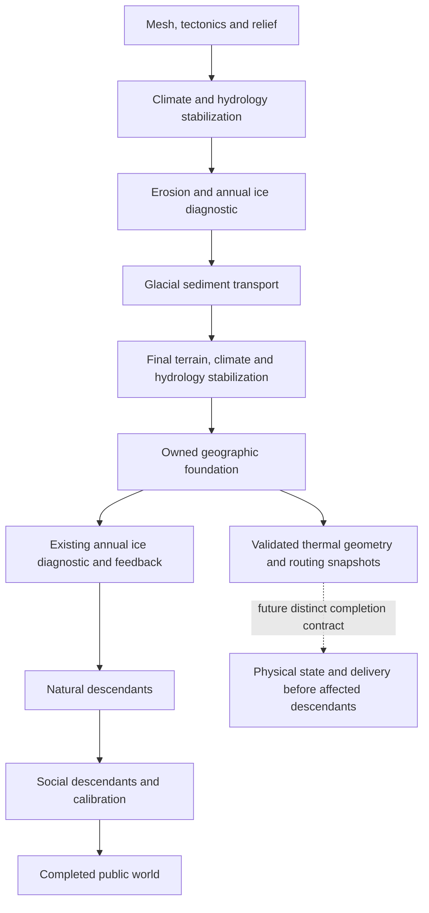

# Geographic initialization and layered calendar prerequisites

This review adds an internal geographic handoff before downstream generation and a thermal error-share guard to the mapped layered owner. It does not supply a physical ice initial condition or adopt seasonal ablation in generated worlds. Historical experiments remain frozen.

## What the geographic source actually supplies

The previous production pipeline offered its explicit finite-state epoch only after natural and social descendants were complete. That made it unsuitable as the eventual insertion point for a physical state that changes ice, runoff, temperature or habitat. A source review against the exact preceding pipeline identifies an earlier boundary: immediately after the last `cryosphere_coupling` terrain/climate/hydrology stabilizer succeeds, before the second annual ice derivation and deferred feedback summary.

The new move-only `GeographicFoundation` owns the world-under-construction, a copy of its original Params and the two operands required by the deferred feedback summary. It exposes read-only geographic state, validated thermal-context capture and validated liquid-routing capture. These snapshots own their operands independently. They use the same requested source revision, but each validates a different dependency set; one does not substitute for the other.

The stabilizer has already established lake classification, spill/fill operands and conditioned routing. Later `generate_lake_basins` assigns identifiers and aggregates those cells; it does not establish their wet classification. The previous late-readiness comment incorrectly attributed classification to this later aggregation and has been corrected. The late `terrestrial_surface_finalized` flag retains its existing descendants-complete meaning.

`finish_legacy_generation` consumes the foundation through the unchanged remaining diagnostic branch. Its references into owned Params and feedback operands remain valid until that function finishes. Read-only getters return borrowed references, which callers must stop using when the foundation is finished or destroyed. Consumption is one-shot even if a later descendant throws. Failed const snapshot capture does not consume or mutate the foundation. This interface does not promise rollback of a failed downstream generation.

The thermal context binds actual areas, spherical geometry, pressure/capacity and horizontal heat edges, lake geometry and initial climate operands. The routing graph separately binds receivers, conditioned surface, areas and terminal classifications. Basin IDs assigned later are annotations and are excluded from both operand contracts. A future physical completion must distinguish this immutable source revision from new published climate/water state: its modified final temperatures cannot be passed off as unchanged initial-climate operands.

## Initialization is a separate scientific input

Current cells carry static annual thickness and climate diagnostics. They do not carry conserved instantaneous water mass W, enthalpy H, vertical phase inventory or an equilibrated deep temperature profile. Creating those quantities from annual thickness and mean temperature would introduce a new physical model. At the freezing point, temperature alone leaves liquid fraction undetermined; this follows directly from the latent enthalpy interval, without requiring a climate calibration argument.

GEMB describes layer-specific firn state, externally supplied atmospheric forcing and long spin-up for deep-column initialization. It also distinguishes compaction from mass changes. These are reasons to declare the vertical initial state and forcing history here, not evidence that a generated annual thickness proxy is a complete firn column. GEMB's specific layer depths, densities and spin-up durations are not adopted. [Gardner et al., 2023](https://gmd.copernicus.org/articles/16/2277/2023/).

The Community Firn Model separates spin-up from its main transient run and uses site forcing to form its initial profile. GLASS likewise initializes coupled soil, water and vegetation state by cycling specified forcing in its evaluation. These studies support treating initialization as an explicit, model-dependent procedure; they do not provide a universal number of spin-up years or validate this repository's uncalibrated starting climate. [Stevens et al., 2020](https://gmd.copernicus.org/articles/13/4355/2020/), [Zorzetto et al., 2024](https://gmd.copernicus.org/articles/17/7219/2024/).

The proposed next adapter is `finalized_geography_supplied_layer_state_v1`: a complete geographic-ID mapping of canonical active/deep water mass and explicit enthalpy, or a tagged equilibrium temperature plus explicit liquid mass. At freezing, liquid mass must be provided; zero explicitly selects solid water. It would reuse the foundation's area, top sensible capacity, emissivity and heat edges, with separately bound orbital forcing. This adapter is a design, not an implemented or qualified initializer.

For initial support, grounded retained water belongs to exposed nonlake land. Marine and lake cells remain thermal participants with retained W=0 and the declared sensible slab capacity. The code's term `nonwater` means capacity outside the separately retained latent-water reservoir; a prescribed lake/ocean slab still contains sensible water storage. The 10 m lake mixed layer in the fresh qualification is an explicit case parameter, not a physical default recommendation.

## A thermal share must charge the cumulative bound

The mapped owner carries one global energy error E across active state, finite deep inventory and unresolved exported parcels. A thermal component reports a local endpoint error U for its newly advanced active coordinates. For an optional share q, the owner now records and checks:

\[
E_{\mathrm{after}}=\operatorname{upper}\!\left(\operatorname{outwardAdd}(E_{\mathrm{before}},U)\right),\qquad
D=\operatorname{outwardSubtract}(E_{\mathrm{after}},E_{\mathrm{before}}),\qquad
\operatorname{upper}(D)\le q.
\]

Here E_before is measured after any accepted private material/remap prefix. The source error therefore remains a separate charge; the thermal share cannot conceal it. The owner still checks the unchanged global budget and every active/deep physical-domain floor. D is a witness for the increase already included in E_after, not another term to add to it. Internal backward-Euler stage bounds are not independently added again.

The distinction matters when E is large. In the manufactured control E=2^40 J, a small positive U can cause outward publication to increase E by 2^-12 J, even though U is below the 1e-6 J requested share. The request must then refuse. The retained witness includes before-E, U, after-E, the outward difference, optional quota and pass flag. No witness is invented when failure occurs before this calculation. A finite positive quota is allowed only on a thermal request; omission preserves the previous cumulative-budget behavior.

Preparation keeps all state changes private. A quota refusal retains its diagnostic/work receipt but publishes no state, clock, source IDs or forcing history. The optional quota is part of transaction identity: changing it under an already used transaction ID conflicts, while exact replay returns the existing receipt and adds no thermal charge. The internal owner receipt model advances to v4; this is not a public world model migration.

## Count bounds do not reserve a complete calendar

The layered owner's default 256 preparations and 128 commits could not admit even the solar generator's minimum 360 windows. It now permits explicit opt-in hard caps of 4096 preparations and 2048 commits, with unchanged defaults. A separate unique forcing-value limit is 524288 by default and 2097152 at maximum. Seed histories and new forcing vectors are checked before graph/material/thermal work; reuse of an identical retained forcing window does not allocate another vector.

This only removes count and unique-vector prerequisites. Receipts retain both initial and final snapshots, each containing the growing forcing history. Over K windows of N cells, those repeated operands grow on the order of N*K². A unique-vector cap of N*K does not bound all retained receipt bytes or all live copies. Existing per-receipt 64 MiB and history 128 MiB caps remain unchanged.

For the previously retained 1080-window Earthlike calendar and a declared 128-cell context, unique forcing values number 138240. This arithmetic fits the new opt-in count limits and default unique-value limit. Reserving the full 64 MiB receipt slot for every window, however, would require 72,477,573,120 bytes, exceeding the history cap. That deliberately conservative reservation is not a measured size estimate or proof that exact receipts require that many bytes. It shows that the current full-slot policy cannot establish admission for that year. No new calendar or annual thermal execution is performed to make this comparison.

The remaining coordinator must bind the complete calendar to the actual source and owner, reserve all resource classes and compose a whole-horizon budget. A safely rounded initial-E plus source allowance plus thermal allowance must fit the joint budget. Each source transition must debit its actual outward increase; each solar-window thermal share must be consumed once. If multiple source events split a solar window, their thermal requests must partition its tick share or debit a remaining allowance. Reusing the full share on every subinterval is invalid. Resetting the owner per window discards the cumulative guarantee.

A complete admission design must handle preparation retries, event IDs, scalar/thermal work, pending exports, initial/final snapshot storage, replay keys, receipt history and peak private-candidate memory. It may require shared immutable forcing records or a tighter complete-history size proof. Raising the current byte limits without a complete reservation would move the refusal point without demonstrating production feasibility.

## Production publication remains unfinished

The annual cryosphere pass still overwrites thickness and surface mass balance. `generate_ice_sheets` also resets wet-cell ice state and derives sheet/deglaciation summaries. The seasonal climate validator binds published temperature to the earlier sensible-climate receipt; the hydrology validator binds temperature, precipitation and runoff to the old stage; settlement provenance binds climate applicability. These consumers require an explicit successor contract before a new physical state can be published.

Annual hydrology has already allocated precipitation. Seasonal retained snow plus additional meltwater cannot simply be added to that existing supply. An adopted branch must own precipitation phase/enthalpy and subsequent retained/delivered liquid exactly once, preserve lake volume or perform a conservative geometry change, then generate or rebuild affected natural/social descendants. Gross melt/refreeze cannot be inferred from endpoint phase differences alone. Initial state, prescribed sources, general mass export, drainage/receiving acknowledgment, annual numerical accuracy and versioned public/API/UI exposure remain open gates.

The present changes make the source boundary and per-request error accounting concrete. They do not close the planetary water cycle, calibrate snow/firn parameters or establish a successful warm-season ablation year.

## Qualification

The new geographic driver passes **37 checks**. Its one fresh 128-cell full generation uses seed 424271, eight plates, no erosion iterations, one CPU thread and output precision eight, with all remaining Params at their recorded defaults. It captures the source at revision 41, verifies failed-capture atomicity, original-parameter ownership, move/consumption guards and final descendant readiness. It completes ten stratigraphic columns and two settlements. This particular case has no lakes; the new runtime result therefore does not add coverage for a positive-depth lake column.

The separate baseline driver calls the retained preceding full native library once for that same new case. The complete serialized worlds agree byte for byte: **2,262,616 bytes**, SHA256 `d09d36b8f3e97000fe9d0bcb27933450f0aa23a98ae0546ea5e2228b594185ee`. No fields are omitted or normalized for comparison. Both processes exit zero with empty stderr, are reaped and leave no process group; elapsed times are about 11.54 and 11.13 seconds. Neither driver invokes layered thermal evolution. This is one new comparative generation case, not a replay of a historical scientific experiment.

The first build succeeded but exposed an invocation error: a separate CMake build directory still defaults its shared-library output to the Python package. That temporarily replaced the installed library. Before any generation or layered thermal execution, the recorded original bytes were restored from the frozen solar-calendar archive and their SHA256 rechecked. Reconfiguration with an explicit isolated library-output directory produced the same new binary there. The incident, first logs and accidental output are retained; the package is restored to `fa17d36b6759b88b524ddcbd822eb025b6454d6356fe585f799fedd11b949731`, and the isolated new library is `f8f48a09fccb97544213d4a7ba379686aa0cfc7ea283f466c2fa5121c8009c6a`.

The new layered suite passes **52 checks**, with 13 prepares, five commit calls (four fresh and one replay), 14 graph builds, five one-second manufactured thermal calls, ten internal BE calls and one material/calorimeter operation. No calendar or historical experiment is executed. The large-E control reports U=8.88178419700126e-16 J, but its outward global increase is exactly 2^-12 J; the upper difference bound is 0.00024414062500000005 J, so the 1e-6 J quota correctly refuses. The identical supplied state accepts under a separate request that omits this optional quota.

The independent reader was pinned before quota outcomes. Its first run passes **1,255 assertions**, binding all 13 inventory requests, five charge witnesses, private-state preservation, four fresh commits, prepare/commit replay and reported work. It uses exact rational operands for the charge calculation. It treats the nested thermal U and material error as supplied certificates; it does not independently re-prove their differential equations, general geometry, domain floors or thermal ledgers. No post-outcome producer or reader correction was needed.

All 187 frozen C++/CMake files still match their pre-execution pins. The [evidence package](../runs/layered-calendar-handoff-review/README.md) retains sources, preimages, inventories, first outcomes, reader, complete world comparison and the build-path incident. Native generation counts, manufactured checks and reader assertions concern different scopes and are not additive physical validation coverage.

## Subsequent storage work

The [separate storage and lifetime review](layered_calendar_storage_review.md) replaces the growing forcing copies described above with immutable shared prefixes and a lossless normalized journal. Owner v5 retains private reservations through the last candidate/diagnostic alias and charges seed/framing bytes. Its new 72-check lifetime and 31-check byte-budget suites pass, and an independent reader reconstructs every complete emitted receipt. These results leave the handoff/v4 evidence above frozen. Full-year admission remains open: with 128 thermal nodes, 1080 accepted intervals and the default 32 leaves, mandatory enthalpy coefficient objects alone require at least 278,691,840 bytes, exceeding the unchanged 128 MiB history cap after normalization.

## Subsequent supplied-state initialization

The proposed adapter above is now implemented under the name `finalized_supplied_layered_state_v1`. The [initializer review](finalized_layered_state_research.md) qualifies explicit canonical active/deep mass and tagged enthalpy or equilibrium temperature/liquid input against the actual foundation coefficients and matching routing epoch. It adds conversion error once, constructs one private owner, and advances no physical time or publication state. Its first 63-request control suite passes 204 checks; one new 128-cell foundation with three lakes passes six integration checks. The independent exact reader binds all retained inputs and conversion witnesses. The original handoff evidence remains frozen.

This supplies a declared initial state, not a profile inferred from annual diagnostics or a spin-up model. The [full-horizon retention plan](layered_full_horizon_storage_plan.md) remains proposed: external complete-proof retention, resource admission, complete source/event scheduling and versioned descendant publication still need implementation and qualification before an annual production run.
