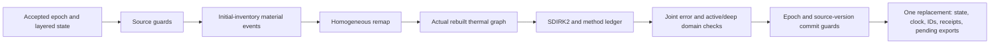

# Layered ice state ownership and geographic dependency guards

Qualified internal foundation, 2026-09-11. The fixed owner suite passes all 54 checks and independent retained-data replay. This implementation is compiled into an isolated native build; ordinary generation and the installed library are unchanged. [Evidence package](../runs/layered-ice-owner-review/README.md)

The previously qualified material, remap and SDIRK2 components can produce a valid private result while leaving an application with inconsistent state if it separately publishes new layer masses, thermal energy, event IDs or exports. This owner makes those fields one accepted bundle. Preparation reads an immutable base and constructs a private successor. Commit checks the owner identity, geographic epoch and exact accepted base before replacing the bundle once.

## Geographic and temporal order

Local layered-column IDs are mapped explicitly to actual geographic Cell IDs. The initial mapping must cover the complete captured domain without duplicates, reproduce each canonical geographic area exactly, and place every horizontal heat edge on a geographic adjacency. The captured routing graph retains the relevant wet classification, receiver, conditioned surface, slope and lake routing operands. Both preparation and commit compare the observed geographic operands and their revision to that same immutable epoch. The application must supply a synchronized observation; this interface does not lock arbitrary external world mutations.

Forcing vectors use actual geographic Cell-ID order. The owner maps them to local columns and then the graph builder maps them to top thermal nodes. Interior layers receive no duplicated shortwave or nonwater heat capacity. Reusing a forcing ID with different values or windows refuses, as do overlapping windows with different identities. A thermal interval must fit within its declared forcing window and its represented duration must close the exact owned clock. Material/remap-only transactions have zero duration.

Optional stages are skipped explicitly. Failed preparation or stale/foreign commit leaves the accepted physical bundle unchanged. Operational work counters still record attempted computation. An exact replay of a committed transaction returns its recorded result; changing any serialized request operand under the same transaction ID refuses. A sibling candidate from an older accepted base cannot overwrite a later commit. Pending exports from earlier transactions remain in the new accepted snapshot.

## Energy scope and the correct method ledger

The joint error covers active thermal energy, nonempty deep inventories and unresolved export energies. A fixed material event or remap receives that inherited error once; old exports are unchanged identity coordinates. Thermal advancement adds the outer SDIRK2 endpoint bound once. Its internal backward-Euler error bounds are not additional endpoint charges. The larger final joint radius must still admit every active and positive deep store, even though deep energy was unchanged during the thermal step. Exactly empty deep stores retain their existing zero-energy constraint.

The discrete thermal ledger uses the represented off-diagonal duration `ho` and diagonal duration `hd`: absorbed energy is `(ho+hd) Σ A S`, and emission is `Σ A (ho OLR1 + hd OLR2)`. Each internal edge has one shared signed weighted transfer. The global storage/radiation residual is independently assembled from the second-stage base defect and second-stage algebraic residual. The base defect already includes conversion of the first-stage heating field; that conversion is retained as a diagnostic and is not added again. The ledger also retains `(ho+hd−h) Σ A S` when relating the method quadrature to nominal physical-duration shortwave.

This is a method ledger, not a measured continuous-time radiation integral or a gross melt/refreeze total. The independent [material review](layered_material_evolution_research.md) explains the phase enthalpy reference, joint nonexpansion and mass-projection limits. Its primary snow/firn research motivates explicit transport policy and conservative layer redistribution; it does not supply a transaction or hydraulic policy for this owner.

## Fixed qualification result

One predeclared run performed 18 preparations and nine commit attempts across three owner instances, including three fresh commits. It exercised receiver/revision changes, foreign and sibling candidates, exact transaction replay after later commits, conflicting request operands, consumed events, failed material/remap prefixes, the pending-export cap, and changed forcing identity. Every preparation preserved the accepted state. Successful commits published the complete candidate; rejected and replayed commits preserved the current state. This sequential suite does not qualify adversarial thread scheduling or every resource limit.

The scientific seed copies the archived eight-node 1800-second endpoint and both unresolved liquid-export certificates. One new 900-second thermal interval reaches 2700 seconds with outer endpoint bound **33.01664467538174 J**. Adding the inherited **40.19708134661563 J** gives **73.21372602199739 J**. A subsequent zero-duration cold-solid export raises the joint bound to **73.21372602202673 J**; the committed identity remap adds zero. The final revision is 3, its clock remains 2700 seconds, and all three pending exports remain owned. Both surface layers retain liquid at the freezing plateau; all six interior layers and both deep stores remain solid under the full final bound. The fixed maximum is 3340 J. These are canonical projected-mass energy bounds, not measured trajectory errors.

The separate one-second synthetic control uses local-to-geographic mapping `[1,0]`. Geographic forcing `[1,2]` becomes local forcing `[2,1]`. Its accepted thermal candidate adds **3.3209008545402184e-8 J**, enlarging the joint radius from 1 to **1.0000000332090089 J**. That makes the unchanged positive deep store's lower energy enclosure fall below its absolute floor. The owner returns `uncertain_physical_domain` with no final state, retaining the original accepted snapshot.

Started work matches the fixed inventory: one geographic capture, three constructors, 17 graph builds, three material calls, two calorimeter calls, three remaps, two SDIRK2 calls and four internal backward-Euler calls. There were 2494 scalar evaluations under the combined 65536 ceiling. No mass routing, world generation or historical thermal solve ran. The native process exited successfully with empty stderr and was reaped.

Before outcomes, two source reviewers checked the adapter and 50 corruption controls were rejected. The first actual independent replay passed 233719 owner assertions, 2534 material assertions, 670 remap assertions, 16851 thermal assertions and the retained geometry checks. These repeated field and arithmetic assertions are audit workload, not independent scientific cases. Replay binds the frozen inventory, prior endpoint, actual component requests, exact stage-weighted ledger, immutable state carry and full enlarged-error domain. The owner qualification target builds with strict warnings; both it and the full native library disable floating-point contraction. A launcher preflight initially rejected differing manifest schemas before creating a launch or calling native code; its original script and diagnosis are retained. Scientific inputs, quotas, source and reader remained fixed through the single actual run.

## Production boundaries that remain open

The current native pipeline sets `terrestrial_surface_finalized` after natural and social descendants have already been generated. A physical evolution branch needs a separate geometry-ready boundary after final hydrologic stabilization, followed by owned evolution and compatible publication before those descendants. Moving the existing flag alone would change its documented meaning without supplying that publication sequence. Legacy annual cryosphere routines also reset diagnostic fields and must not overwrite a later conserved layered result.

The new seed is an explicit trusted canonical starting witness for a new bounded owner lifetime. It can retain earlier pending exports, consumed event IDs and forcing declarations. It does not restore earlier transaction request/result records or lifetime work counters and therefore is not a durable exactly-once restart format. Full persistence remains a separate required contract.

The subsequent [owner v2 receiving boundary](layered_parcel_absorption_research.md) can atomically absorb complete saved parcels into prescribed retained stores using their recorded joules. That separate qualification does not add routing or acknowledgment by another owner.

No export acknowledgment is inferred from the existing mass-only router. Thermodynamic delivery needs the actual recorded carried joules, a bound transfer, and a concrete receiver acceptance. Reconstructing carried energy from the separately rounded donor temperature can produce a different amount. Exports bound for another owner remain owned and unresolved until that bridge is implemented.

The energy certificate remains conditional on canonical rounded mass and prescribed geometry. Original-mass effects, complete-ablation topology transactions, physical drainage/basal policy, production dispatch, descendant regeneration and annual accuracy remain unfinished. Serialized receipt/history and finite-work limits do not claim a process-wide heap limit for every copy a caller may retain.
