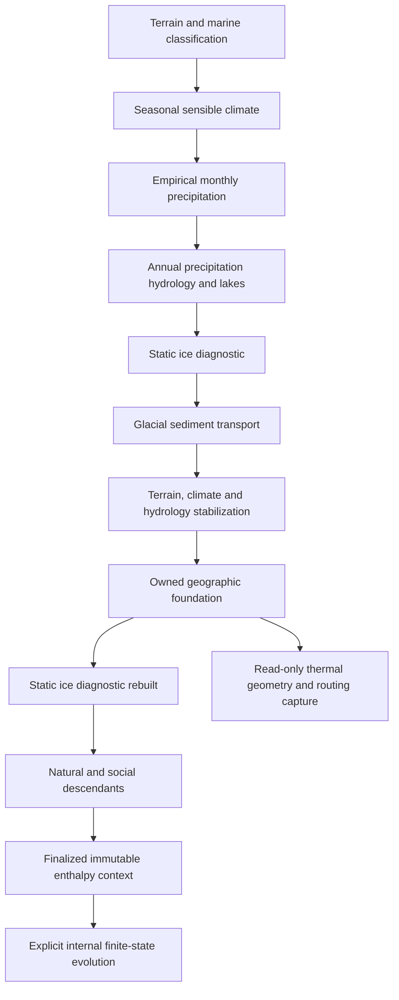

# Production seasonal calendar and glacier ablation

Generated glacier thickness remains a static annual diagnostic. Its current ablation branch is unreachable: creating ice requires annual temperature below −3 °C, while the ablation expression requires temperature above −1.5 °C. The new calendar and interval error allowance supply two prerequisites for a finite seasonal replacement. They do not yet change generated ice, precipitation consumption, hydrology or dependent public layers.

The implementation compiles every original submonthly solar window into a contiguous, exact binary64 clock covering one declared year. It retains original orbital operands, unchanged absorbed flux, and explicit signed differences caused by the new clock. Each window receives a fixed share of a whole-year thermal error allowance. An optional owner request limit enforces that share while preserving cumulative energy error, source identity and forcing history.

## Existing physical and dependency problem

`derive_cryosphere_state` clears thickness and derives it again from annual temperature, precipitation, latitude and elevation. Its cold factor is `clamp((-Tannual-3)/22,0,1.25)`. Positive thickness therefore implies `Tannual < -3`. Both the subsequent warm-thickness reduction at `Tannual > -2` and positive ablation at `Tannual > -1.5` are unreachable. Thickness is computed before surface mass balance and is never advanced by mass balance multiplied by physical time. Replacing the ablation expression alone would leave this thickness calculation intact.

The existing model identity, `exposed_land_annual_grounded_ice_diagnostic_v1`, explicitly says that physical time and water/energy budgets are not resolved. It is a static diagnostic, not a solved ice equilibrium. Its accumulation-area fraction is a temperature/precipitation proxy, and its equilibrium-line altitude is an elevation percentile. These names do not establish integrated accumulation and ablation areas or an ice continuity solution.

The ordinary native order includes two ice derivations around glacial sediment transport and another terrain/climate/hydrology stabilization. Those stabilizations recompute a consistent diagnostic terrain state; they are not successive physical years. Ordinary annual hydrology consumes precipitation before the final ice snapshot. Adding a new meltwater amount to that existing precipitation supply would count water twice wherever precipitation was already retained by a seasonal reservoir.

The existing internal epoch begins after descendants have already been generated. The new [geographic foundation](geographic_foundation_calendar_research.md) also permits validated read-only geometry/routing capture immediately after the final stabilizer, before the remaining annual ice pass and descendants. Its current finishing path consumes the source through the unchanged diagnostic branch. Production completion still requires a distinct publication boundary: accepted seasonal water/ice state and delivered liquid must become authoritative before affected descendants are generated, or those descendants must be rebuilt. A later call to the annual ice diagnostic must not erase the accepted state.

There is no missing Python producer that already supplies conserved meltwater. Flowline histories compute diagnostic losses from negative net surface mass balance after native hydrology. The exported `glacial_meltwater_index` combines contact, runoff, flow accumulation and deglaciation proxies; it is not a routed mass source. A successor must preserve explicit historical dispatch and stage-local glacial-sediment provenance while introducing a distinct physical-state contract. The [consumer map](../runs/seasonal-solar-calendar-review/evidence/consumers/README.md) traces API, viewer, CSV, CLI and downstream field use.

## Scientific basis and limits of available climate information

A monthly mean temperature does not determine positive-temperature exposure. Constant −1 °C and equal durations at −3 °C and +1 °C have the same monthly mean and different positive degree-time. Retaining the fourth moment for radiation does not resolve this ambiguity either. Precipitation phase requires an additional temporal correlation: the amount falling during cold conditions cannot be recovered from separate monthly precipitation and temperature means.

The production periodic solver retains monthly means, flux integrals and monthly boundary temperatures. It discards the resolved internal stage trajectory. Thus a seasonal melt or snow/rain split cannot be reconstructed from its exported averages without an additional declared model. dEBM illustrates that melt calculations driven by monthly forcing require specific variability and energy-budget parameterizations; its coefficients are not automatically transferable to this combined surface/atmosphere temperature model. [Krebs-Kanzow et al., 2021](https://tc.copernicus.org/articles/15/2295/2021/index.html).

GLASS distinguishes solid and liquid water, precipitation energy, phase inventory limits and liquid movement. It also examines temporal numerical behavior near phase changes. Those distinctions support an enthalpy/state approach here, without implying adoption of its multilayer snow physics or calibration. [Zorzetto et al., 2024](https://gmd.copernicus.org/articles/17/7219/2024/gmd-17-7219-2024.html).

ZEMBA includes separate atmospheric moisture and land energy/water processes. The repository's empirical precipitation does not supply that atmospheric closure. Prescribed precipitation can define an external source for a land subsystem, but a closed ledger for that subsystem is not a closed planetary water cycle. [Gunning et al., 2025](https://gmd.copernicus.org/articles/18/2479/2025/index.html).

The selected internal thermal model retains the existing combined sensible capacity, effective longwave emissivity and positive geometric heat-transport graph. Its additional exposed-land water reservoir supplies latent and sensible water storage. Wet cells remain thermal participants with retained W=0. Fixed TOA albedo remains prescribed; updating albedo from uncertain evolving snow/ice would change the field and would need separate mathematical and physical review.

## Original orbital forcing and the new exact clock

`SolarOrbitForcing` supplies daily-mean radiation for a rapidly rotating sphere at an implicit semimajor axis of 1 AU. Its equal-time twelve-month convention places periapsis at the center of month 0 with solar longitude −75°. The default partition resolves both true anomaly and elapsed time, with at least 360 time subdivisions and additional angular splits. Numerical support for eccentricity near 1 does not validate daily averaging when orbital motion during a rotation becomes appreciable.

The old forcing record retained month index, duration fraction, declination and inverse-square distance factor. It did not retain absolute time endpoints. Multiplying each duration fraction by the year and then repeatedly adding durations does not guarantee exact agreement at interval boundaries or at the declared year endpoint.

Three fields now supplement each orbital record: the original binary64 mean-anomaly begin/end operands and an absolute end-fraction coordinate. Existing duration, declination and flux operations are unchanged. Internal end fractions use the existing mean-anomaly origin; month ends use the binary64 coordinate `(month+1)/12`, with the final endpoint exactly 1. Adjacent end-coordinate differences and the original duration fractions are separately retained quantities and need not be bit-identical.

For a positive declared binary64 year Y, the calendar chooses `q = nextafter(Y,+infinity)-Y` and verifies that `N = Y/q` is an integer no larger than 2^53. The calendar begins at0. Each end-fraction f is mapped to `roundTiesToEven(f*N)` using exact integer arithmetic on the canonical binary64 fraction. Endpoints are then integer multiples of q. Collapsed or nonincreasing windows cause refusal; unequal forcing windows are never merged.

The exact rounding helper decomposes f into its binary significand and exponent, forms the integer product with N in two 64-bit words, and examines quotient, half-bit and remaining bits. It does not multiply f*N in floating point, assume an 80-bit long double, or require a compiler-specific 128-bit integer. The count and fraction limits keep the product within 106 significant bits. Subnormal fractions and exact halfway cases have explicit handling.

For every accepted window, begin and end ticks are contiguous, the positive duration is `(end_tick-begin_tick)*q`, and subtraction/addition of the published times closes exactly. These values also lie on the owner's endpoint lattice, whose local quantum can be finer than the year quantum. The calendar verifies complete coverage through tick N. Rounded month boundaries can differ from exact rational twelfths of Y by clock quantization; they are not silently presented as exact rational monthly durations.

The calendar's absorbed flux is the original binary64 operation `(1-albedo)*incident_flux`, with positive-product underflow refused. It is not rescaled to hide a duration change. Each window retains outward enclosures for:

- published end time minus the exact product of canonical Y and canonical end fraction;
- published duration minus the exact product of canonical Y and the original duration fraction;
- unchanged absorbed flux multiplied by that signed duration difference, per cell.

These enclose publication differences between explicitly represented operands. They do not bound the error in Kepler inversion, declination quadrature, the daily-average approximation, or conversion of original physical parameters. The JSON schema labels the fluence difference as signed and explicitly declares original orbital accuracy uncertified.

A signed annual fluence difference can cancel. Even exact equality of annual fluence does not establish identical temperatures or phase timing. For two specified piecewise-constant forcing waveforms with the same flux levels, shifted boundaries and a common horizon, a useful separate bound is `sum_j |delta_time_j| * sum_i A_i*|S_(i,j+1)-S_(i,j)|`. This follows by writing the fields as sums of step-function jumps and applying the triangle inequality. The current calendar does not claim or implement that waveform bound, and it would not cover shifted precipitation-event times.

## Error allowance across a whole calendar

The mesh owner carries a global area-weighted canonical energy-error bound E in joules. Existing source jumps charge inherited E once, and accepted thermal steps charge their actual outward rounded E increments. The original owner allocated the current global headroom across each requested interval. That is safe for a single interval, but permits an early interval to use most of the year's available allowance.

The optional `maximum_thermal_error_increment_j` request field limits thermal increments independently of sources. After the source jump, the owner freezes `headroom = min(down(B-E_after_source), Q_interval)`. If the option is absent, the existing arithmetic is retained. Zero, negative and nonfinite supplied limits refuse before source or thermal calls. Within the interval, the existing exact tick fractions allocate that fixed headroom to proposed steps. Accepted actual rounded increments must fit their individual shares, including publication rounding.

The calendar fixes a whole-year thermal allowance Bthermal and gives each window `Q_i = down(Bthermal * window_ticks / N)`, evaluated with outward interval arithmetic. Each positive share is no greater than its exact duration fraction of Bthermal, so their exact sum is at most Bthermal. A window's unused allowance is not reassigned. Thermal adaptation may subdivide its window, while original forcing and source-event interpretation remain fixed.

A coordinator must consume each window share only once. If physical source boundaries require separate committed requests inside one solar window, their allowances must partition its ticks or debit an explicit remaining window allowance. Reusing the full Q_i for every partial request would invalidate the annual thermal allocation argument even though the owner's global B check remains effective.

This establishes thermal allowance composition; it does not yet implement a complete horizon scheduler. Such a scheduler must reserve initial E, Bthermal and a source allowance Bjump with a safely rounded total no greater than B. It must charge the actual outward source increase `E_afterA-E_beforeA`, including addition/publication rounding, against Bjump before commit. Reserving Bjump only inside a cumulative ceiling would allow thermal work to consume future source capacity. The independent request limit avoids that mixing.

Neither a small global E nor a closed discrete ledger establishes physical source accuracy. The present proof conditions on canonical coefficients, projected W and recorded import enthalpy. A per-cell quantity E/A can supply a conservative component domain bound; it is not a separate per-cell contraction theorem or permission to sum inherited E over cells.

## Capacity, identity and refusal behavior

Legacy defaults remain 128 committed intervals and 256 preparations. Explicit opt-in limits may now admit up to 2048 commits and 4096 prepares. Retained full-mesh forcing values have an independent bound: default 524288 values, exactly the old 4096-cell × 128-window worst case; maximum 2097152 values. Constructor restart admission and new-window admission enforce this bound before source or thermal work. A known forcing vector does not consume another history slot.

The mapped layered owner now has the same explicit count and unique-forcing-value limits, plus its own optional thermal share witness charged against the actual outward cumulative-E increase. Its receipt/history byte limits are unchanged, and `require_owner_capacity` below still checks the earlier mesh owner. Neither that function nor the new layered limits establishes complete layered-year admission. [Layered handoff and calendar review](geographic_foundation_calendar_research.md).

Calendar allocation is bounded before constructing the orbital object. The conservative reservation is `(768+360)*2^refinement` windows, followed by checks against the window and forcing-value limits. This release's hard window limit 2048 means the conservative level 1 reservation is refused even where its eventual exact count might fit. Refusal is an explicit capacity limit, not a statement that the orbital physics requires level 0 or that level 0 is accurate enough for a thermal year.

`require_owner_capacity` checks a fresh owner's complete calendar window, prepare, cell, forcing-value and forcing-identifier capacities. It does not validate an already-used owner's remaining resources or admit precipitation IDs, retries, scalar evaluations, thermal leaves, or total output bytes. Those require a complete execution plan. Retaining every verbose owner receipt duplicates growing histories, so a linear bound on one restart is not a bound on aggregate archived receipts.

The calendar owns its exact orbital options, year, albedo, refinement, identifier and latitude ordering through immutable data. `build_finalized_solar_calendar` takes the complete finalized cell ordering and requires the same year length as the context. The existing context's planet identity does not include orbital inputs, so the calendar explicitly owns them. The factory is a compiler, not a context-bound execution receipt or scheduler. The eventual coordinator must bind the calendar to the actual context and next accepted restart and preserve that authority through all requests.

The new retained-value field is an additive change to internal owner context/receipt serialization. Historical internal stdout byte equality is not claimed. Ordinary public world serialization and the static grounded-ice model are not migrated by this addition.

## Qualification and production completion gates

The [fixed protocol](../runs/seasonal-solar-calendar-review/evidence/native/PROTOCOL.md) separates complete solar-calendar controls from short manufactured owner tests. The four orbital cases use tilt/eccentricity pairs `(0,0)`, `(23.5,.016)`, `(90,.8)` and `(40,.99)`, seven latitudes including both poles, and the production default year length. Independent replay must establish exact round-to-even ticks, full chronology, node/flux identity, timing and signed-fluence enclosures, and the sum of fixed quotas. A separately declared solar-equation check concerns libm consistency, not astronomical accuracy.

The two owner intervals use deliberately manufactured capacities, emissivity 0 and `(Tf,ci,cl,Lf)=(1,1,1,1)` to exercise the actual source, transport, quota and commit machinery. They cover 0–.25 seconds and do not claim to represent two solar windows or Earth snow physics. The strict-budget, invalid-budget and retained-history-cap controls distinguish bounded refusal from publication of a private prefix. No full annual thermal integration or previous closed study is rerun.

The one frozen qualification passes **557 calendar/control checks and 24 owner checks**. The four calendars contain 1080, 1080, 944 and 1058 windows, respectively: 4162 windows and 29,134 cell-window flux records in total. Each uses the exact year endpoint with 8,470,997,842,243,093 ticks of 2⁻²⁸ seconds. Both executions exit successfully with empty stderr, no timeout, reaped processes and no remaining process groups. Recorded elapsed times are about 0.118 seconds for the calendar controls and 0.0116 seconds for the manufactured owner suite; these are measurements of these bounded cases, not annual thermal performance estimates.

Five preparations produce two committed candidates and three expected refusals. The first interval uses one A call and one thermal call; the second uses one thermal call and carries the exact preceding accepted state. Global E progresses from .01 J to .010166005874349992 J and then .010323230446453396 J under global B=.1 J, with each interval's thermal allowance fixed at .005 J. The strict 1e-30 J allowance makes one thermal call and refuses at its one-attempt cap. Zero allowance and insufficient forcing history refuse before physical calls. Total observed work is one A call and three thermal calls. No rejected private state, source ID or forcing history is committed.

The production library with hash `fa17d36b6759b88b524ddcbd822eb025b6454d6356fe585f799fedd11b949731` loads all eight V3/V4 generator exports without calling them. The source freeze retains 102 source files and eight prelaunch artifacts. Native evidence is frozen separately with all first invocation outputs and earlier pre-execution corrections.

The first independent actual replay passes the complete retained qualification and rejects all 15 tampered records. Its reader was frozen before numerical outcomes; no post-outcome reader or native correction was needed. The earlier pre-outcome metadata adapter correction and all prior reader/launcher versions remain preserved. The audit reuses the qualified mesh/source mathematical cores, adds the optional quota minimum and retained-value admission, and independently checks calendar integer arithmetic and signed bridges. Its approximately 1.94-second runtime concerns retained-data replay only.

Production completion requires more than these controls. Initial W/H must be explicitly supplied or derived by a named initialization policy; temperature at the melting point does not determine latent H. Precipitation amount, phase and temperature must follow an explicit external calendar, or a new proof must cover state-dependent source selection. Monthly means alone do not determine snowfall history. Imported rain and future melt cannot fund a simultaneous initial withdrawal.

Drainage must consume only proved available liquid, preserve exactly-once delivery and allow retained water to refreeze. A terminal drainage operation cannot invent extra elapsed time. Lake geometry is currently an annual diagnostic: rerunning its fill rule is not conservative lake-volume evolution, and changing water surfaces invalidates the immutable thermal context unless state and geometry are remapped consistently.

The final authoritative outputs should initially distinguish retained solid/liquid mass, net phase change and delivered liquid. Endpoint phase differences do not determine gross melt/refreeze totals if a path changes direction. Finite seasonal snow is not automatically mature perennial glacier ice. A complete production witness must start from declared ice, pass through a genuinely warm energy-positive season, reduce retained solid mass, retain or deliver liquid once, update the native final state and rebuild affected descendants. Those remain the completion gates for the ablation defect.

## Sources and retained evidence

The [independent scientific/source report](../runs/seasonal-solar-calendar-review/evidence/independent/README.md) supplies the branch proof, source dependency snapshots, identifiability examples and seven-step production protocol. Its initial proposal mentioned two solar-window integrations; the qualification here explicitly narrows that portion to manufactured quota tests and does not claim the proposed physical prefix. The production objective remains open.

1. Krebs-Kanzow et al. (2021), dEBM, [The Cryosphere 15, 2295–2313](https://tc.copernicus.org/articles/15/2295/2021/index.html). Monthly forcing, melt parameterization and mass-balance components.
2. Zorzetto et al. (2024), GLASS v1.0, [Geoscientific Model Development 17, 7219–7244](https://gmd.copernicus.org/articles/17/7219/2024/gmd-17-7219-2024.html). Solid/liquid water, source energy, inventory limits and temporal behavior.
3. Gunning et al. (2025), ZEMBA v1.0, [Geoscientific Model Development 18, 2479–2508](https://gmd.copernicus.org/articles/18/2479/2025/index.html). Atmospheric moisture and land energy/water balances.

No empirical glacier coefficient, density, calibration tolerance or recommended timestep from these papers is adopted by the calendar implementation.
