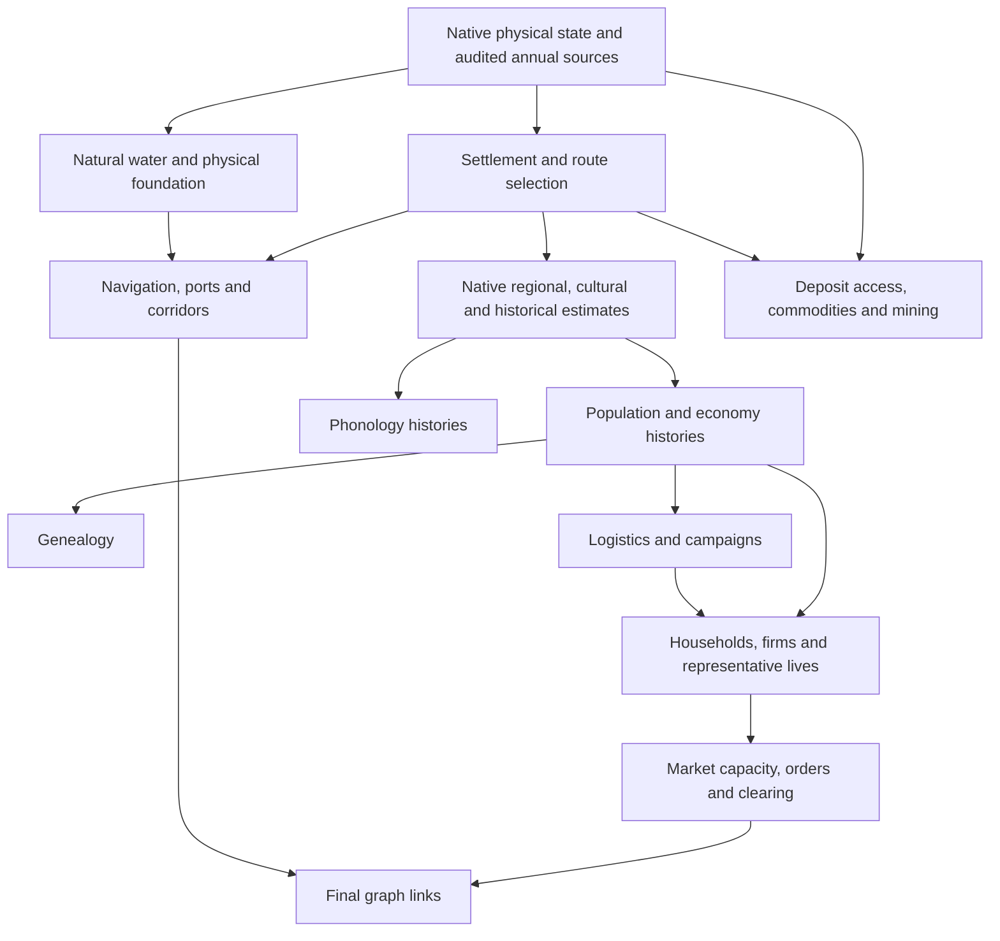

# Settlement and social estimate availability

For the current native seasonal path, this migration carries the existing annual settlement proxy's applicability through the social pipeline. An unsupported source is no longer consumed as a measured zero population, an absent conflict, an inaccessible deposit, or an empty market. Physical geography and material records retain their separately reviewed equations.

The annual settlement score is supported only inside its existing open interval, −14 to 48 °C. Other score bonuses cannot restore an unsupported candidate. This is an applicability interval for this particular proxy, not a human survival or habitability limit. The separate population response equations and agricultural support contract remain unchanged; the migration does not replace their assumptions with the settlement interval.

## Source order

The full Python API retains cells internally until every enrichment finishes, including when the caller requests a summary without cells. Native seasonal energy and annual-source validation precede human inference. The physical foundation creates the seasonal aridity and natural water descriptors before their consumers execute.

This diagram shows the main dependency paths rather than every physical subsystem. Economy continues to consume its actual native resource and agriculture descriptors; it gains no dependency on a separate agricultural publication. Logistics retains its actual route and trade inputs and gains no corridor dependency. Demographics consumes logistics networks and exchanges without requiring campaign outputs as an artificial prerequisite.

## Publication contracts

| Family | Current seasonal contract | Availability behavior |
| --- | --- | --- |
| Settlement and native routes | Selection v3; native route model v1 with its current source | Unsupported annual score sources cannot nominate a site. Structural water cells remain inapplicable with known zero score. |
| Native population, culture, ruins, conflict, dynasties and territorial history | Native social envelope v1; seven own contracts v2 | Regional estimates and complete candidate families have explicit coverage. Base geography, actual IDs and era slots remain where independently known. The native language model stays v1. |
| Navigation, ports and corridors | v3 | Local supported ports remain visible. An unknown competing path cost makes the inferred path unavailable. Known absent paths remain distinguishable from unknown ones. |
| Resource deposits, commodities and ore attachment | Resource v5; commodity and ore v3 | Material occurrences remain physical records; access and viability depend on supported human inputs. |
| Agriculture and mining | Land use v3 | Previously reviewed agricultural availability equations remain unchanged. Unknown mining candidate membership cannot become a zero-valued absent component. |
| Worldbuilding | v4 | Source ancestry changes; the five realism equations remain unchanged. |
| Population/economy, genealogy/phonology, logistics/campaigns | v2 | Each estimate propagates the availability of its actual contributors. Unknown sequential history state is not reset to zero. |
| Demographics, representative life events and markets | v2 | Household and era slots remain. Firm selection and representative sampling publish explicit coverage. Market clearing retains actual exchange slots with independently nullable quantities. |
| Trade graph | v1 for corridor v3 | Each edge copies its typed corridor ID and `route_path_supported`. Native route topology and trade quantities remain available independently. |
| Reef port links | Separate `reef_port_links_model` | The physical reef model stays unchanged. Supported emitted port IDs and link completeness are separate annotations. |

Historical explicit model versions retain their original numerical paths. Missing or malformed current declarations cannot silently select a historical branch. Current validators reject mismatched declarations and invalid owned output. Consumers audit their actual prerequisites; the demographic, market, logistics and genealogy paths preserve valid existing descendant annotations. Some derived products, including graphs and population-history rows, can be rebuilt from audited sources.

## Reading unknown and empty results

Current social record estimates use typed availability maps or dedicated flags. For numeric estimates, true accompanies a finite value and false accompanies JSON null. Some supported outputs have boolean or string types, which remain explicit in exported schemas. Not every count is an estimate: emitted record counts remain literal counts and have separate family coverage. Consumers must inspect that coverage before concluding that an empty list means no population, no conflict or no firms.

Availability also has a model domain. `estimated_world_population` sums the modeled population regions, whose membership follows political regions. With no such regions, that empty sum is a supported zero; it does not establish that the physical world is uninhabited. Population pressure and cultural continuity require nonempty contributors and remain null/false in this case. Prescribed era slots can remain while their empty territorial snapshots have unavailable population and geometry estimates. An existing physical deposit has a different domain: unavailable settlement inputs leave its economic estimates null/false even when there are no modeled regions.

There are three distinct representative-person outcomes: a known positive population supplies the fixed sample graph, known zero population supplies a complete empty sample, and unavailable population supplies an unavailable empty sample. These samples are diagnostics, not a population microsimulation. Firm sector selection similarly distinguishes a known nonpositive output from an unknown candidate.

Child stages use separate annotation maps. Market route annotations use `market_capacity_estimate_availability`; exchange annotations use `market_clearing_estimate_availability`. They do not replace a parent's `estimate_availability` map. An unknown trade-graph corridor link is null with `route_path_supported=false`; a known absent path has ID −1 with `route_path_supported=true`.

Geography-only generation excludes social inference. Current resource economics are unavailable in that scope; separately named geographic baseline estimates remain numeric. CSV companion schemas, debug-table metadata and the inspector preserve null, false and numeric zero. Unsupported dry cells and surface-inapplicable water have separate display states. Empty declared families and all-null declared fields remain inspectable with coverage.

## Verification scope

The retained native C API 128-cell world completed every Python API enrichment stage, passed full CLI validation and round-tripped exactly through MessagePack. It contains no unsupported dry cells, so mixed-availability behavior is established by the separately identified stage and equation controls rather than attributed to that complete world. Focused tests also cover strict types, tampering, parent order, atomic publication, child-map preservation and historical numerical parity.

Fresh full, geography-only and summary runs passed. Geography validation passed 150 checks and all 14 layer contracts, with three inapplicable checks and no failures. The summary world exactly matches the full world after cell suppression. All 54,272 cell fields published by geography-only mode equal the full run; physical deposit, commodity, ore and reef projections also match after excluding their explicitly human annotations. Soil-history records retain their existing distinct historical-era and natural-stage time axes.

A separate unchanged four-decimal seasonal configuration generated a complete world with 53 supported and three unsupported dry cells, two settlements and one route. Its initial run exposed an area-serialization audit defect. Both population area checks now account for configured decimal rounding and floating-point accumulation without changing simulation values. The corrected fresh full and summary runs passed, as did final CLI validation on both complete configurations. The original failure and the 278 passing precision/native-social checks remain in the evidence.

Public checks include 99 Python tests, 38 subtests, 31 direct JavaScript tests, 18 assertions on exported payloads and 9,873 retained-export checks. Live browser review covered the map, zero/water states, unavailable estimates and complete/incomplete empty families; synthetic display controls are identified separately from generated-world evidence. A measured inspector overflow was corrected with a scoped wrapping rule. These focused counts overlap earlier reviews and are not a whole-repository test claim.

[Adoption evidence and hashes](../runs/settlement-social-availability-adoption/README.md) record the installed 140 source/test/fixture paths, tested native library, preserved preimages and postcopy checks.

The separate annual-ice production defect remains open. This migration does not adopt the isolated cryosphere experiments, alter their thresholds or relax Earth-profile calibration limits.
