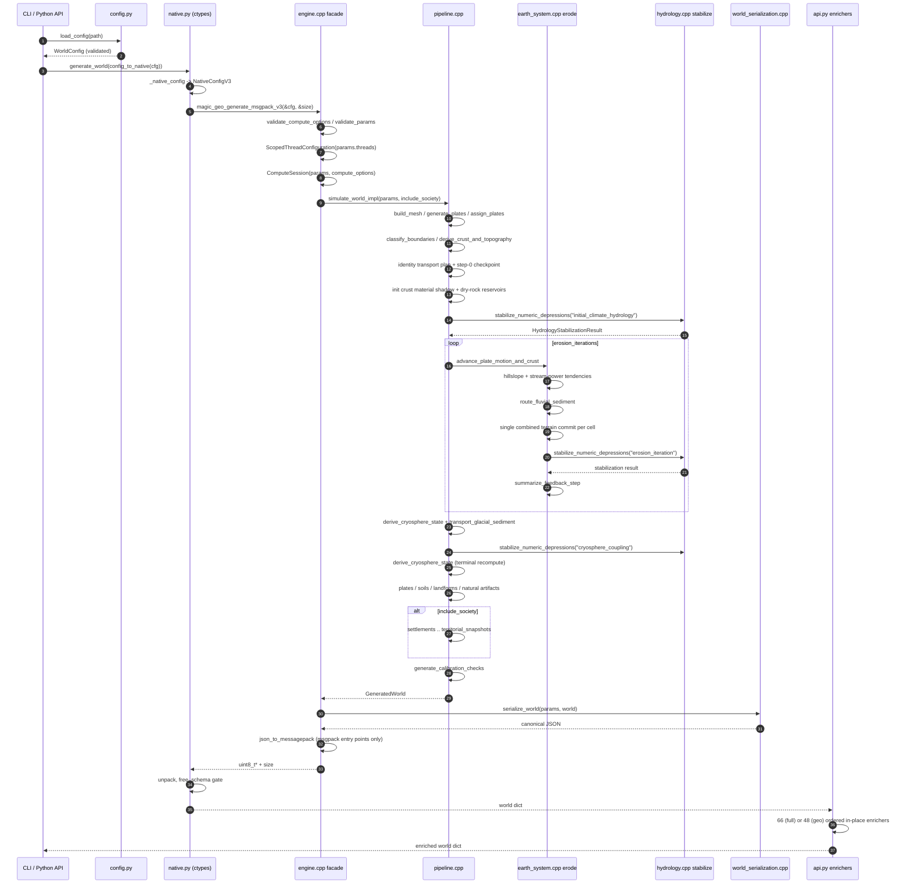

# Architecture

[Wiki home](./README.md) > Architecture

magic-geo is a four-layer system: a Pydantic-validated YAML configuration surface, a C++20 shared library that runs the entire physical and civilizational simulation, a `ctypes` marshalling boundary that hands the config across as a versioned POD struct and receives one JSON/MessagePack world document back, and a Python enrichment stage that mutates that document in a fixed order before it is written to disk. This page is the definitive reference for the boundaries between those layers, the exact ordered stage sequences on both sides, why that ordering is load-bearing, and the determinism contract every contributor must preserve. Everything here is cited to the source file and line where it is implemented; anything the codebase marks as unresolved, non-authoritative, or uncalibrated is carried forward with that framing intact.

## On this page

- [Layer overview](#layer-overview)
- [Responsibility split](#responsibility-split)
- [The ctypes boundary](#the-ctypes-boundary)
- [The world document as the sole interchange format](#the-world-document-as-the-sole-interchange-format)
- [Native stage sequence](#native-stage-sequence)
- [The maturation loop](#the-maturation-loop)
- [The hydrology stabilization inner loop](#the-hydrology-stabilization-inner-loop)
- [Python enricher sequence](#python-enricher-sequence)
- [Why ordering is load-bearing](#why-ordering-is-load-bearing)
- [Simulation, result, and serialization boundary](#simulation-result-and-serialization-boundary)
- [Determinism contract](#determinism-contract)
- [Module ownership](#module-ownership)
- [Invariants a contributor must preserve](#invariants-a-contributor-must-preserve)
- [Worked example: tracing one run end to end](#worked-example-tracing-one-run-end-to-end)
- [Limitations and unresolved claims](#limitations-and-unresolved-claims)
- [See also](#see-also)

---

## Layer overview

### ASCII layer diagram

```text
┌──────────────────────────────────────────────────────────────────────────────┐
│ LAYER 0 — CONFIGURATION (Python, pydantic)                                    │
│                                                                              │
│   magic-geo.yaml ──> parse_config_yaml()  config.py:612                      │
│      │                 ├─ _check_yaml_complexity()          config.py:557    │
│      │                 ├─ _UniqueKeySafeLoader (dup-key reject) config.py:85 │
│      │                 └─ WorldConfig.model_validate()      config.py:607    │
│      │                      9 sections / 44 leaf fields, extra="forbid"      │
│      ▼                                                                       │
│   WorldConfig ──> config_to_native()  config.py:840  ==> nested JSON dict     │
└────────────────────────────────────┬─────────────────────────────────────────┘
                                     │  nested dict {run, planet, mesh, …}
┌────────────────────────────────────▼─────────────────────────────────────────┐
│ LAYER 1 — ctypes MARSHALLING (src/magic_geo/native.py)                        │
│                                                                              │
│   _native_config()  native.py:281                                            │
│      flatten 9 sections -> NativeConfigV1 (41 fields)   native.py:47          │
│                          -> NativeConfigV2 (+2 compute) native.py:93          │
│                          -> NativeConfigV3 (+1 timestep) native.py:102        │
│   _load_library()   native.py:130  (7 symbols; 5 generators c_void_p,        │
│                                     2 free_* restype None)                   │
└────────────────────────────────────┬─────────────────────────────────────────┘
                                     │  const CConfigV3*  (C ABI, 320 B on LP64)
┌────────────────────────────────────▼─────────────────────────────────────────┐
│ LAYER 2 — NATIVE ENGINE (libmagic_geo_native.so)                              │
│                                                                              │
│   c_api.cpp  magic_geo_generate_msgpack_v3 / _json_v3 / geo variants          │
│      ▼                                                                       │
│   engine.cpp facade                                        engine.cpp:16     │
│      validate_compute_options -> validate_params                             │
│      -> ScopedThreadConfiguration -> ComputeSession                          │
│      ▼                                                                       │
│   pipeline.cpp  simulate_world_impl(params, include_society) pipeline.cpp:6   │
│      mesh -> plates -> boundaries -> crust/topography                        │
│      -> identity transport plan -> step-0 checkpoint                         │
│      -> material shadow -> dry-rock reservoirs                               │
│      -> initial ocean/climate/hydrology stabilization                        │
│      -> erode() maturation loop  x erosion_iterations                        │
│      -> cryosphere coupling                                                  │
│      -> plate summary, soils/biomes/resources, landforms                     │
│      -> natural artifacts (ice sheets .. stratigraphy)                       │
│      -> [ if include_society ] settlements .. territorial snapshots          │
│      -> calibration checks                                                   │
│      ▼   GeneratedWorld { earth, natural, society, calibration_checks }       │
│   world_serialization.cpp  serialize_world()   world_serialization.cpp:42     │
│      READ-ONLY over GeneratedWorld; hand-rolled canonical JSON                │
│      ▼                                                                       │
│   messagepack.cpp  json_to_messagepack()  (msgpack entry points only)         │
└────────────────────────────────────┬─────────────────────────────────────────┘
                                     │  malloc'd char* / uint8_t* + size
┌────────────────────────────────────▼─────────────────────────────────────────┐
│ LAYER 3 — PYTHON ENRICHMENT (src/magic_geo/api.py)                            │
│                                                                              │
│   _consume_msgpack_pointer / _consume_json_pointer   native.py:184 / :169     │
│   _require_current_world_schema()                    native.py:234            │
│   _require_configured_planet_snapshot()              api.py:185               │
│   [geo only] _strip_native_civilization_outputs()    api.py:269               │
│   66 ordered enrichers (generate_world)              api.py:200-265           │
│   48 ordered enrichers (generate_geo_world)          api.py:308-374           │
│      each mutates the SAME dict in place; no copies, no rollback              │
└────────────────────────────────────┬─────────────────────────────────────────┘
                                     │  dict[str, Any]
┌────────────────────────────────────▼─────────────────────────────────────────┐
│ LAYER 4 — ARTIFACT WRITERS (src/magic_geo/io/, cli/commands/)                 │
│   write_world (.json / .mgeo)  write_summary_markdown  write_cells_csv        │
│   raster_map / svg_map / geotiff       debug_export / debug_map_export        │
└──────────────────────────────────────────────────────────────────────────────┘
```

### Mermaid layered architecture

```mermaid
flowchart TD
    subgraph L0["Layer 0 — Configuration (Python)"]
        Y["magic-geo.yaml"]
        PC["parse_config_yaml<br/>config.py:612"]
        WC["WorldConfig<br/>9 sections / 44 leaf fields<br/>config.py:458"]
        CTN["config_to_native<br/>config.py:840"]
        Y --> PC --> WC --> CTN
    end

    subgraph L1["Layer 1 — ctypes boundary"]
        NC["_native_config<br/>native.py:281"]
        V3["NativeConfigV3<br/>V2 + maturation_timestep_ma"]
        LL["_load_library<br/>7 v3 symbols<br/>native.py:130"]
        NC --> V3 --> LL
    end

    subgraph L2["Layer 2 — Native engine (C++20)"]
        CAPI["c_api.cpp<br/>extern C entry points"]
        FAC["engine.cpp facade<br/>validate → threads → ComputeSession"]
        PIPE["pipeline.cpp<br/>simulate_world_impl"]
        GW["GeneratedWorld<br/>earth / natural / society / checks"]
        SER["world_serialization.cpp<br/>serialize_world (read-only)"]
        MP["messagepack.cpp<br/>json_to_messagepack"]
        CAPI --> FAC --> PIPE --> GW --> SER --> MP
    end

    subgraph L3["Layer 3 — Python enrichment"]
        GATE["schema + planet-snapshot gates<br/>native.py:234 / api.py:185"]
        STRIP["_strip_native_civilization_outputs<br/>geo-only, api.py:269"]
        ENR["ordered enrichers<br/>66 full / 48 geo"]
        GATE --> STRIP --> ENR
    end

    subgraph L4["Layer 4 — Artifacts"]
        OUT["world.json / world.mgeo<br/>summary.md / cells.csv<br/>maps / debug exports"]
    end

    CTN -->|nested dict| NC
    LL -->|"const CConfigV3*"| CAPI
    MP -->|"uint8_t* + size"| GATE
    ENR --> OUT
```



---

## Responsibility split

| Layer | Owns | Explicitly does not own | Entry points | Primary source |
|---|---|---|---|---|
| Config validation | YAML syntax and complexity limits, duplicate-key rejection, type coercion, range/enum constraints, cross-field constraints, profiles, dotted-path overrides, atomic file writes | Any physics; any knowledge of the C struct layout beyond field names | `parse_config_yaml`, `load_config`, `create_config`, `apply_config_overrides`, `write_config`, `config_to_native` | `src/magic_geo/config.py` |
| ctypes marshalling | Flattening 9 config sections into 3 nested POD structs, enum→int mapping, `bool`→`int`, UTF-8 name encoding, library discovery, symbol binding, pointer ownership/free, MessagePack hardening, schema gate | Physics; any interpretation of world fields beyond `schema_version` and `planet_parameters` | `generate_world`, `generate_geo_world`, `backend_info` | `src/magic_geo/native.py` |
| Native simulation | Mesh, plates, crust, topography, ocean, climate, hydrology, erosion, sediment, cryosphere, soils/biomes/resources, landforms, natural artifacts, settlements/civilization/history, calibration checks, all ledgers and histories | JSON key order (that lives in the serializers), enrichment, rendering | `magic_geo::detail::simulate_world` / `simulate_geo_world` | `cpp/src/engine/pipeline.cpp:6` |
| Native serialization | Top-level key order, per-record field order, precision floors, round-trip contracts, model/contract declaration blocks, MessagePack transcoding | Any state mutation — serializers are read-only over `GeneratedWorld` | `serialize_world`, `json_to_messagepack` | `cpp/src/engine/world_serialization.cpp:42` |
| Python enrichment | Post-hoc diagnostics, derived indices, trajectories, graphs, geometry reconstruction, model-contract declarations, realism check suites | Native state — enrichers read native fields and add new keys; they do not re-run the simulation | `generate_world`, `generate_geo_world`, `generate_from_file`, `generate_geo_from_file` | `src/magic_geo/api.py:195`, `:287` |
| Output writers | `.json` / `.mgeo` world files, Markdown summaries, cell CSV, raster/SVG/GeoTIFF maps, debug bundles | Generation; validation | `magic_geo.io.write_world` and friends, `magic-geo generate` / `render` / `render-raster` / `export-debug` / `export-debug-map` / `export-rerun` | `src/magic_geo/io/`, `src/magic_geo/cli/commands/` |

The facade prologue is identical across all four public C++ entry points (`cpp/src/engine.cpp:16`, `:27`, `:38`, `:51`):

```cpp
detail::validate_compute_options(compute_options);   // core.cpp:233
detail::validate_params(params);                     // core.cpp:239
detail::ScopedThreadConfiguration thread_configuration(params.threads);  // core.cpp:213
detail::ComputeSession compute_session(params, compute_options);
return detail::serialize_world(params, detail::simulate_world(params));
```

The one-argument overload `generate_world_json(const Params&)` hard-codes `compute_backend = 1` (CPU) and delegates (`cpp/src/engine.cpp:10-14`).

---

## The ctypes boundary

### Exported C ABI symbols

Declared in `cpp/include/magic_geo/native.hpp:166-188` inside `extern "C"`. The shared library is built with `CXX_VISIBILITY_PRESET hidden` and `VISIBILITY_INLINES_HIDDEN YES` (`CMakeLists.txt:146`, `:150`), so nothing else escapes.

| Symbol | Signature | Used by Python? |
|---|---|---|
| `magic_geo_backend_info_json` | `const char*(void)` | yes — `native.py:346` |
| `magic_geo_generate_json` | `const char*(const CConfig*)` | no (v1, always CPU) |
| `magic_geo_generate_json_v2` | `const char*(const CConfigV2*)` | no |
| `magic_geo_generate_json_v3` | `const char*(const CConfigV3*)` | yes — `native.py:370` |
| `magic_geo_generate_geo_json_v2` | `const char*(const CConfigV2*)` | no |
| `magic_geo_generate_geo_json_v3` | `const char*(const CConfigV3*)` | yes — `native.py:396` |
| `magic_geo_generate_msgpack_v3` | `const uint8_t*(const CConfigV3*, size_t*)` | yes — `native.py:360` |
| `magic_geo_generate_geo_msgpack_v3` | `const uint8_t*(const CConfigV3*, size_t*)` | yes — `native.py:386` |
| `magic_geo_free_string` | `void(const char*)` | yes — `native.py:178` |
| `magic_geo_free_buffer` | `void(const uint8_t*)` | yes — `native.py:226` |

`_load_library` resolves exactly seven of these inside a single `try` (`native.py:132-144`); an `AttributeError` becomes `RuntimeError("native library does not expose the current V3 JSON and MessagePack ABI; rebuild magic_geo_native from the current source tree")`. **Python only ever calls the v3 entry points.**

### Struct mirrors

| Python struct | C struct | Added fields | Source |
|---|---|---|---|
| `NativeConfigV1` | `magic_geo::CConfig` | 41 fields in exact declaration order; `bool` mirrored as `c_int` | `src/magic_geo/native.py:47` |
| `NativeConfigV2` | `magic_geo::CConfigV2` | `compute_backend` (`c_int`), `opencl_prefer_gpu` (`c_int`); `_anonymous_ = ("base",)` | `src/magic_geo/native.py:93` |
| `NativeConfigV3` | `magic_geo::CConfigV3` | `maturation_timestep_ma` (`c_double`); `_anonymous_ = ("base",)` | `src/magic_geo/native.py:102` |

`_anonymous_` lets nested fields be read/written flat while preserving the exact nested memory layout.

### Renames and coercions crossing the boundary

`config_to_native` performs **no** renames — it is a one-liner returning `config.model_dump(mode="json")` (`src/magic_geo/config.py:840-843`). Every rename happens in `_native_config` (`src/magic_geo/native.py:281`):

| YAML path | Native field | Transform | Line |
|---|---|---|---|
| `run.seed` | `seed` | `int(...)` → `c_uint64` | `native.py:292` |
| `run.name` | `name` | `str(...).encode("utf-8")` → `c_char_p` | `native.py:293` |
| `mesh.backend` | `mesh_backend` | renamed + `MESH_BACKEND_IDS[...]` (`fibonacci_sphere`=0, `geodesic_icosahedron`=1) | `native.py:17`, `:307` |
| `mesh.cell_count` | `cell_count` | emitted **before** `mesh_backend` (struct order differs from YAML order) | `native.py:306` |
| `hydrology.preserve_geologic_depressions` | `preserve_geologic_depressions` | `1 if … else 0`; emitted **before** `river_percentile` (reversed vs. YAML) | `native.py:322` |
| `erosion.iterations` | `erosion_iterations` | renamed (prefix disambiguates) | `native.py:324` |
| `erosion.maturation_timestep_ma` | `maturation_timestep_ma` | lives in V3, not the V1 base | `native.py:340` |
| `compute.backend` | `compute_backend` | renamed + `COMPUTE_BACKEND_IDS[...]` (`auto`=0, `cpu`=1, `opencl`=2, `cuda`=3) | `native.py:22`, `:337` |
| `compute.opencl_prefer_gpu` | `opencl_prefer_gpu` | `1 if … else 0` | `native.py:338` |
| `output.include_cells` | `include_cells` | `1 if … else 0` | `native.py:331` |

The remaining 34 of the 41 `NativeConfigV1` fields keep their exact leaf name with `float → c_double`, `int → c_int`. Unknown backend names raise `KeyError` from the dict lookup, not a friendly `ConfigError` — the pydantic `Literal` constraints (`config.py:240`, `:425`) are what actually prevent this in practice.

### Pointer ownership and hardening

| Concern | Implementation | Source |
|---|---|---|
| Pointer loss | every generating symbol uses `restype = ctypes.c_void_p`, never `c_char_p`, so ctypes cannot copy-and-lose the pointer before it can be freed | `native.py:147-161` |
| JSON free | `magic_geo_free_string(ptr)` in a `finally` | `native.py:177-178` |
| MessagePack free | `memoryview.release()` **before** `free_buffer(ptr)` — the view aliases the malloc'd block | `native.py:223-226` |
| Zero-copy read | `(ctypes.c_ubyte * size).from_address(int(ptr))` → `memoryview(...).cast("B")` | `native.py:198-199` |
| Unpack hardening | `raw=False, use_list=True, strict_map_key=True, max_bin_len=0, max_ext_len=0`, `ext_hook=_reject_msgpack_extension` | `native.py:201-212`, `:40` |
| Error envelopes | a dict payload containing `"error"` is raised as `RuntimeError(str(payload["error"]))` | `native.py:179-180`, `:229-230` |
| Schema gate | `schema_version` must be `type(...) is int` (rejects `bool`) and equal `CURRENT_WORLD_SCHEMA_VERSION == 2`; no retired fields; complete, finite, non-`bool` `planet_parameters` with `radius_km`/`gravity_g`/`geological_age_ga` strictly `> 0` | `native.py:234-278`, `serialization.py:27` |

There is **no module-level library cache**: `_load_library()` runs on every public call (`native.py:345`, `:354`, `:380`).

---

## The world document as the sole interchange format

Nothing but the world document crosses from native to Python. There is no callback surface, no shared memory view of `Cell`, no partial streaming, and no second channel for diagnostics — every ledger, residual, telemetry counter, and contract declaration that Python or a validator needs must first be emitted by a serializer in `cpp/src/engine/`.

| Property | Value | Source |
|---|---|---|
| Root type | JSON object / MessagePack map | `world_serialization.cpp:42` |
| `schema_version` | integer literal `2` | `world_serialization.cpp:49` |
| Top-level key count | 57, emitted in a stable hand-rolled order | `world_serialization.cpp:49-289` |
| First key | `schema_version` | `world_serialization.cpp:49` |
| Last key | `cells` (emitted as `[]` when `params.include_cells == false`) | `world_serialization.cpp:289` |
| Non-finite values | impossible — both `num()` and `roundtrip_num()` throw `std::runtime_error("attempted to serialize a non-finite simulation value")` | `cpp/src/engine/core.cpp`, `cpp/src/engine/numeric_serialization.cpp` |
| MessagePack path | strict transcoding **of the canonical JSON document**, deliberately preserving every decimal-quantization boundary the Python enrichers consume | `cpp/src/engine/README.md:27-29` |
| Geo-only shape at the C++ layer | **identical** — `simulate_geo_world` runs the same `serialize_world`; society vectors are simply empty | `pipeline.cpp:272`, `engine.cpp:35` |

The geo/full divergence is therefore created entirely in Python, by `_strip_native_civilization_outputs` (`api.py:269-284`) running **before** any enricher:

| Removed from | Count | Constant |
|---|---|---|
| top level | 15 | `NATIVE_CIVILIZATION_TOP_LEVEL_FIELDS` — `api.py:86` |
| every cell dict | 4 (`culture_region_id`, `language_region_id`, `political_region_id`, `settlement_score`) | `NATIVE_CIVILIZATION_CELL_FIELDS` — `api.py:106` |
| `summary` | 58 | `NATIVE_CIVILIZATION_SUMMARY_FIELDS` — `api.py:115` |

Then `world["generation_scope"] = "geo_only"` is set (`api.py:305`). The module comment states the rationale directly (`api.py:83-85`): the native serializer retains stable empty/default civilization schema fields, so the Python geo API removes those placeholders before any natural-system enricher can observe them. `settlement_score` is the load-bearing removal: it is computed by `derive_soils_biomes_resources` (`environment.cpp:410`), which runs on **both** paths, so the native geo document really does carry populated habitability scores. Mixed natural/human enrichers read the key with a `0.0` default (`aquifer_resources.py:107`, `ecosystem_dynamics.py:57`), so stripping it forces the documented no-human baseline branch instead of letting a native habitability score act as a human-presence signal in a world with no humans.

`generate_geo_world` additionally raises `ValueError` unless `output.include_cells` is true (`api.py:296-300`), because natural enrichers and layer validation consume per-cell state.

---

## Native stage sequence

`magic_geo::detail::simulate_world_impl(const Params&, bool include_society)` in `cpp/src/engine/pipeline.cpp:6` is the **only** complete stage ordering in the tree (`cpp/src/engine/README.md:87`). `simulate_world` passes `include_society = true` (`pipeline.cpp:268`); `simulate_geo_world` passes `false` (`pipeline.cpp:272`).

The result container is `GeneratedWorld { EarthSystemState earth; NaturalArtifacts natural; SocietyArtifacts society; std::vector<CalibrationCheck> calibration_checks; }` (`cpp/src/engine/world.hpp:48-53`).

| # | Line | Call | Consumes | Produces / mutates |
|---|---|---|---|---|
| 1 | `pipeline.cpp:12` | `build_mesh(params)` | `params` | `earth.cells` — sphere mesh with neighbor graph, positions, control-volume areas |
| 2 | `pipeline.cpp:13-15` | guard | `params.plate_count`, `cells.size()` | throws `plate_count must be smaller than generated mesh cell count` |
| 3 | `pipeline.cpp:17` | `generate_plates(params)` | `params` | `earth.plates` — Euler axes, angular speeds, continental/oceanic assignment |
| 4 | `pipeline.cpp:18` | `choose_plate_seeds(params, cell_count)` | `params`, cell count | deterministic seed cell index per plate |
| 5 | `pipeline.cpp:24-29` | inline loop | seeds, `cells[i].p` | `plate.initial_center`, `plate.center`, `plate_centers` |
| 6 | `pipeline.cpp:30` | `assign_plates(plate_centers, cells)` | plate centers | per-cell `plate_id` by nearest center |
| 7 | `pipeline.cpp:31` | `classify_boundaries(params, plates, cells)` | `plate_id`, plate kinematics | per-cell divergent/convergent/transform flags and smoothed forcing |
| 8 | `pipeline.cpp:32-37` | `derive_crust_and_topography(params, plates, cells, &earth.initial_oceanic_crust_age)` | boundary flags, plate continental bias | crust type, lithology, thickness, density, initial crust age, thermal-subsidence targets, initial elevation and sediment interface, `InitialOceanicCrustAgeDiagnostics` |
| 9 | `pipeline.cpp:38-41` | `build_identity_crust_transport_plan(cells)` | `cells` | identity (no-motion) transport plan for the step-0 checkpoint |
| 10 | `pipeline.cpp:42-64` | `is_oceanic_crust_state` + `crust_equilibrium_elevation_m` per cell | crust type/lithology/age/thickness/density | `initial_isostatic_equilibrium_m`, `initial_thermal_subsidence_target_m` operand vectors |
| 11 | `pipeline.cpp:69-89` | `summarize_plate_motion_step(..., id=0, erosion_iteration=-1, stage="initial_plate_domains", ...)` | everything above | first `earth.plate_motion_history` record — the identity-overlap initial checkpoint carrying all-cell initial crust age at binary64 round-trip precision |
| 12 | `pipeline.cpp:90-96` | `initialize_crust_material_shadow(...)` | cells, step-0 record id/stage/iteration | opening packet table of the non-authoritative sparse dry-rock mass shadow |
| 13 | `pipeline.cpp:97-105` | `initialize_crust_dry_rock_accounting(...)` | cells, plate count, shadow id | three-reservoir counter-model plus the initial upper-mantle exchange counter-reserve; slab tables stay empty |
| 14 | `pipeline.cpp:107-116` | `stabilize_numeric_depressions(params, cells, 0, "initial_climate_hydrology", -1, ...)` | terrain, crust state | **first ocean/climate/hydrology pass** (see [inner loop](#the-hydrology-stabilization-inner-loop)); appends correction events and water-budget stages |
| 15 | `pipeline.cpp:117-133` | `summarize_feedback_step(cells, 0, "initial_climate_hydrology", -1, ...)` | stabilization result | first `earth.feedback_history` entry |
| 16 | `pipeline.cpp:135-147` | `erode(params, plates, cells, …)` | everything above | the maturation loop — `params.erosion_iterations` passes (see below) |
| 17 | `pipeline.cpp:149-150` | `capture_feedback_reference(cells)` | post-maturation state | `pre_cryosphere_reference` snapshot |
| 18 | `pipeline.cpp:151` | `derive_cryosphere_state(params, cells)` | temperature, elevation, precipitation | glaciers, ice thickness, snowline, glacier flow directions |
| 19 | `pipeline.cpp:152-156` | `transport_glacial_sediment(0, feedback_stage_id, cells)` | ice state, sediment interface | appended to `earth.glacial_transport_history`; terminal glacial erosion/deposition via the shared material primitive |
| 20 | `pipeline.cpp:157-166` | `stabilize_numeric_depressions(..., "cryosphere_coupling", -1, ...)` | post-glacial terrain | re-solves sea level / climate / water budget / hydrology |
| 21 | `pipeline.cpp:167` | `derive_cryosphere_state(params, cells)` (second call) | stabilized climate | terminal cryosphere state recomputed after stabilization; a zero-duration endpoint operator |
| 22 | `pipeline.cpp:168-184` | `summarize_feedback_step(..., "cryosphere_coupling", ..., cryosphere_applied=true, ..., &pre_cryosphere_reference)` | all of the above | final feedback record |
| 23 | `pipeline.cpp:186` | `summarize_plates(params, cells, plates)` | final cell/plate state | per-plate aggregate statistics |
| 24 | `pipeline.cpp:187` | `derive_soils_biomes_resources(params, cells)` | climate, lithology, landform inputs | `soil_type`, `soil_depth_m`, `fertility`, `biome`, `resource` |
| 25 | `pipeline.cpp:188` | `derive_landforms(cells)` | elevation, slope, water, ice | `landform` classification |
| 26 | `pipeline.cpp:189` | `generate_ice_sheets(cells)` | ice state (takes `cells` by non-const ref) | `natural.ice_sheets`, per-cell `ice_sheet_id` |
| 27 | `pipeline.cpp:190` | `generate_lake_basins(params, cells)` | depressions, spill graph (non-const `cells`) | `natural.lake_basins`, per-cell `lake_basin_id` |
| 28 | `pipeline.cpp:191` | `generate_watersheds(params, cells)` | `basin_id`, flow graph | `natural.watersheds` |
| 29 | `pipeline.cpp:192` | `generate_coastal_features(params, cells)` | shoreline, sediment | `natural.coastal_features` |
| 30 | `pipeline.cpp:193` | `generate_sedimentary_basins(cells)` | sediment thickness, basins | `natural.sedimentary_basins` |
| 31 | `pipeline.cpp:194-197` | `generate_stratigraphic_columns(cells, natural.sedimentary_basins)` | sedimentary basins | `natural.stratigraphic_columns` |

### Society branch — skipped entirely by `simulate_geo_world`

The guard `if (include_society)` is at `pipeline.cpp:199`; the block spans `pipeline.cpp:199-260`. `simulate_geo_world` executes stages 1–31 identically and leaves every `SocietyArtifacts` member default-constructed.

| Line | Call | Produces |
|---|---|---|
| `pipeline.cpp:200` | `generate_settlements(params, cells)` | `society.settlements` |
| `pipeline.cpp:201` | `generate_routes(params, cells, settlements)` | `society.routes` |
| `pipeline.cpp:202` | `generate_political_regions(params, cells, settlements, routes)` | `society.political_regions` |
| `pipeline.cpp:208` | `generate_border_segments(params, cells)` | `society.borders` |
| `pipeline.cpp:209` | `generate_trade_flows(cells, settlements, routes)` | `society.trade_flows` |
| `pipeline.cpp:214` | `generate_cultural_layers(params, cells, settlements, political_regions, borders, trade_flows)` | `society.cultural_layers` (cultures, languages, sacred areas, ruins) |
| `pipeline.cpp:222` | `generate_historical_layers(cells, settlements, political_regions, borders, trade_flows, cultural_layers)` | `society.historical_layers` (eras, events) |
| `pipeline.cpp:230` | `generate_population_regions(cells, political_regions, cultural_layers)` | `society.population_regions` |
| `pipeline.cpp:235` | `generate_conflicts(cells, political_regions, borders, trade_flows, cultural_layers, population_regions)` | `society.conflicts` |
| `pipeline.cpp:243` | `generate_dynasties(political_regions, cultural_layers, historical_layers, population_regions, conflicts)` | `society.dynasties` |
| `pipeline.cpp:250` | `generate_territorial_snapshots(params, cells, political_regions, settlements, cultural_layers, historical_layers, population_regions, conflicts)` | `society.territorial_snapshots` |

After the branch rejoins, `generate_calibration_checks(earth.cells, natural.watersheds)` runs on **both** paths (`pipeline.cpp:261-264`) because it depends only on cells and watersheds. `return world` is at `pipeline.cpp:265`.

### Mermaid pipeline sequence



---

## The maturation loop

`erode` lives at `cpp/src/engine/earth_system.cpp:914`; the loop is `for (int iter = 0; iter < params.erosion_iterations; ++iter)` at `:928`.

| Step | Line | What happens |
|---|---|---|
| 1 | `earth_system.cpp:929` | `capture_feedback_reference(cells)` → `previous` |
| 2 | `earth_system.cpp:930` | `advance_plate_motion_and_crust(params, iter + 1, plates, cells, plate_motion_history, crust_material_shadow, crust_dry_rock_accounting)` → returns `tectonic_elevation_change`. Internally rotates plates, builds the forward-overlap `CrustTransportPlan`, plate-boundary segments, the candidate-fate ledger, and the shadow/reservoir step, then appends a `PlateMotionStep` |
| 3 | `earth_system.cpp:946` | `acc_scale` = the 95th-percentile land flow accumulation, floored at `1.0` |
| 4 | `earth_system.cpp:950` | `transport_hillslope_sediment(...)` → `HillslopeSedimentTransportStage` plus `hillslope_production_depth_m` / `hillslope_deposition_depth_m` tendency arrays |
| 5 | `earth_system.cpp:966-996` | `#pragma omp parallel for schedule(static)` stream-power loop → per-cell `erosion_depth_m = stream * maturation_timestep_scale(params)`. The **exported** `cell.erosion_rate` is set to the unscaled `stream` — the 5 Ma reference response — while only the applied depth is scaled |
| 6 | `earth_system.cpp:999` | `route_fluvial_sediment(...)` → `FluvialSedimentRoutingStage` with the full cell-indexed routing-input snapshot |
| 7 | `earth_system.cpp:1010-1097` | combined commit loop: splits each stage's source depth into `alluvium_entrainment` vs. `bedrock_erosion` against the finite mobile inventory, accumulates `depth_m * area_km2 / 1000` volumes, then makes a **single** `apply_sediment_interface_material_change(...)` call per cell (`:1070`) for the combined tectonic + hillslope + fluvial change, and updates `sediment_net_budget_m` |
| 8 | `earth_system.cpp:1098`, `:1102`, `:1111` | `maximum_sediment_interface_closure_residual_m(cells, "post hillslope/fluvial transport")` and two `validate_sediment_source_partition(...)` audits (`"hillslope"`, `"fluvial"`) |
| 9 | `earth_system.cpp:1120-1121` | push `sediment_routing` and `hillslope_transport` onto their histories |
| 10 | `earth_system.cpp:1122` | `stabilize_numeric_depressions(params, cells, feedback_history.size(), "erosion_iteration", iter + 1, ...)` |
| 11 | `earth_system.cpp:1131` | `summarize_feedback_step(..., "erosion_iteration", iter + 1, ..., erosion_applied=true, cryosphere_applied=false, plate_motion_applied=true, crust_transport_applied=true, crust_evolution_applied=true, plate_motion_history.back().id, &previous)` |

The commit loop asserts its own consistency: if the interface primitive changes the compatibility surface by more than `max(1e-9, |surface| * 1e-12)` it throws `hillslope/fluvial sediment-interface update changed the compatibility surface` (`earth_system.cpp:1081-1093`).

### Timestep scaling

`maturation_timestep_scale(params) = params.maturation_timestep_ma / MATURATION_REFERENCE_TIMESTEP_MA` where the reference is `5.0` (`cpp/src/engine/core.cpp:44-47`, `cpp/src/engine/constants.hpp:72`). The config bounds `maturation_timestep_ma` to `(0.0, 5.0]` (`config.py:382`), so the scale is always in `(0, 1]` — a refinement knob relative to the shipped reference step, never a coarsening one.

The engine publishes its own process order as a machine-readable string in `simulation_clock.iteration_process_order` (`cpp/src/engine/process_serialization.cpp:2118-2119`):

```text
{plate_motion->crust_transport->crust_evolution->
 precommit_tendency_evaluation[tectonic_elevation+hillslope_sediment+stream_power_incision;
                               prior_stabilized_surface_hydrology]->
 provisional_terrain_composition->
 fluvial_sediment_routing[prior_flow_graph+provisional_accommodation]->
 finite_alluvium_bedrock_inventory_and_terrain_commit->
 (sea_level->climate->causal_water_budget->hydrology->numeric_depression_correction)*until_stable
}*configured_erosion_iterations->
cryosphere_state->glacial_sediment_transport->
finite_alluvium_bedrock_inventory_and_terrain_commit->
(sea_level->climate->causal_water_budget->hydrology->numeric_depression_correction)*until_stable->
cryosphere_state_recompute
```

The same object declares `physical_time_resolved = false`, `nominal_time_calibrated = false`, `absolute_geological_age_resolved = false`, `process_rate_calibration_resolved = false`, `time_step_convergence_demonstrated = false`, and `cryosphere_advances_nominal_time = false` (`process_serialization.cpp:2083-2087`, `:2117`). Those flags are part of the schema and must not be softened.

---

## The hydrology stabilization inner loop

`stabilize_numeric_depressions` (`cpp/src/engine/hydrology.cpp:1122`) is the convergence coordinator that every terrain-mutating stage hands control to. It is called **exactly three kinds of times**: once for `"initial_climate_hydrology"` (`pipeline.cpp:107`), once per maturation iteration for `"erosion_iteration"` (`earth_system.cpp:1122`), and once for `"cryosphere_coupling"` (`pipeline.cpp:157`).

Per pass, in this order (`hydrology.cpp:1140-1155`):

| Order | Call | Effect |
|---|---|---|
| 1 | `apply_sea_level(params, cells)` | volume-constrained sea-level solve via the datum-shift primitive; accumulates `sea_level_adjustment_m` |
| 2 | `label_marine_water_bodies(cells)` | marine connectivity labelling |
| 3 | `compute_climate(params, cells)` | circulation, currents, moisture transport, temperature/precipitation |
| 4 | `compute_hydrologic_water_budget(...)` | appends one `HydrologicWaterBudgetStage` per pass |
| 5 | `compute_flow_and_rivers(params, cells)` | priority-flood, drainage, rivers |
| 6 | depression scan + correction | collects `depression_policy == 1` (numeric) components; if none remain, validates interface closure and returns |

The loop index runs `recomputation_index <= NUMERIC_DEPRESSION_CORRECTION_MAX_PASSES` where that constant is `16` (`cpp/src/engine/constants.hpp:55`). Reaching the cap with candidates still present throws `numeric depression correction did not converge within the bounded pass count` (`hydrology.cpp:1177-1179`) — the engine fails loudly rather than emitting an unstabilized world. Candidate validity is also checked: a numeric-policy cell with a negative component id, negative sink id, or depth at or below `NUMERIC_DEPRESSION_FILL_DEPTH_TOLERANCE_M` throws `numeric depression correction candidate is invalid` (`hydrology.cpp:1160-1164`).

Because each pass appends a water-budget stage, `hydrologic_water_budget_history` is longer than `earth_system_feedback_history` whenever any correction pass fired.

---

## Python enricher sequence

Both entry points share a preamble and then mutate one dict in place through a fixed ordered list. There is no dependency graph, no scheduler, and no rollback: the list literal **is** the dependency declaration.

### `generate_world` — 66 calls (`src/magic_geo/api.py:195-266`)

Preamble: `native_generate_world(config_to_native(config))` (`api.py:198`) → `_require_configured_planet_snapshot(world, config)` (`api.py:199`, raises `RuntimeError("native planet_parameters do not match the configured planet snapshot")`).

| # | Line | Enricher | Module |
|---|---|---|---|
| 1 | `api.py:200` | `mesh_lod` | `mesh_lod.py` |
| 2 | `api.py:201` | `spherical_index` | `spherical_index.py` |
| 3 | `api.py:202` | `cell_geometry` | `cell_geometry.py` |
| 4 | `api.py:203` | `sea_level_diagnostics` | `sea_level_diagnostics.py` |
| 5 | `api.py:204` | `ocean_circulation` | `ocean_circulation.py` |
| 6 | `api.py:205` | `climate_continentality` | `climate_continentality.py` |
| 7 | `api.py:206` | `geology_realism` | `geology_realism.py` |
| 8 | `api.py:207` | `tectonic_zones` | `tectonic_zones.py` |
| 9 | `api.py:208` | `fault_systems` | `fault_systems.py` |
| 10 | `api.py:209` | `seasonal_climate_history` | `climate_dynamics.py` |
| 11 | `api.py:210` | `climate_energy_balance(world, config.planet)` | `climate_energy.py` |
| 12 | `api.py:211` | `planet_realism(world, config.planet)` | `planet_realism.py` |
| 13 | `api.py:212` | `climate_realism` | `climate_realism.py` |
| 14 | `api.py:213` | `lake_overflow_history` | `hydrology_dynamics.py` |
| 15 | `api.py:214` | `watershed_diagnostics` | `watershed_diagnostics.py` |
| 16 | `api.py:215` | `sediment_routing_history` | `sediment_routing.py` |
| 17 | `api.py:216` | `hydrology_realism` | `hydrology_realism.py` |
| 18 | `api.py:217` | `river_network_evolution` | `river_network_evolution.py` |
| 19 | `api.py:218` | `sediment_transport_history` | `sediment_dynamics.py` |
| 20 | `api.py:219` | `sequence_stratigraphy` | `sequence_stratigraphy.py` |
| 21 | `api.py:220` | `ice_sheet_history` | `cryosphere_dynamics.py` |
| 22 | `api.py:221` | `ice_sheet_stability` | `cryosphere_stability.py` |
| 23 | `api.py:222` | `ice_flowline_history` | `cryosphere_flow.py` |
| 24 | `api.py:223` | `soil_diagnostics` | `soil_dynamics.py` |
| 25 | `api.py:224` | `biome_diagnostics` | `biome_dynamics.py` |
| 26 | `api.py:225` | `permafrost_diagnostics` | `permafrost_diagnostics.py` |
| 27 | `api.py:226` | `glacial_landforms` | `glacial_landforms.py` |
| 28 | `api.py:227` | `biome_ecotones` | `biome_ecotones.py` |
| 29 | `api.py:228` | `biome_realism` | `biome_realism.py` |
| 30 | `api.py:229` | `aquifer_resources` | `aquifer_resources.py` |
| 31 | `api.py:230` | `hydrology_budget` | `hydrology_budget.py` |
| 32 | `api.py:231` | `wetland_diagnostics` | `wetland_diagnostics.py` |
| 33 | `api.py:232` | `groundwater_flow` | `groundwater_flow.py` |
| 34 | `api.py:233` | `river_channel_morphology` | `river_channel_morphology.py` |
| 35 | `api.py:234` | `river_hydraulics` | `river_hydraulics.py` |
| 36 | `api.py:235` | `settlement_route_models` | `settlement_routes.py` |
| 37 | `api.py:236` | `political_geography_models` | `political_geography.py` |
| 38 | `api.py:237` | `cultural_geography_models` | `cultural_geography.py` |
| 39 | `api.py:238` | `historical_geography_model` | `historical_geography.py` |
| 40 | `api.py:239` | `civilization_geography_models` | `civilization_geography.py` |
| 41 | `api.py:240` | `territorial_geography_model` | `territorial_geography.py` |
| 42 | `api.py:241` | `navigability_diagnostics` | `navigability_diagnostics.py` |
| 43 | `api.py:242` | `port_sites` | `port_sites.py` |
| 44 | `api.py:243` | `route_corridors` | `route_corridors.py` |
| 45 | `api.py:244` | `karst_diagnostics` | `karst_diagnostics.py` |
| 46 | `api.py:245` | `ecosystem_dynamics` | `ecosystem_dynamics.py` |
| 47 | `api.py:246` | `reef_diagnostics` | `reef_diagnostics.py` |
| 48 | `api.py:247` | `species_ranges` | `species_ranges.py` |
| 49 | `api.py:248` | `wildfire_disturbance` | `wildfire_disturbance.py` |
| 50 | `api.py:249` | `resource_deposits` | `resource_dynamics.py` |
| 51 | `api.py:250` | `ore_genesis` | `ore_genesis.py` |
| 52 | `api.py:251` | `sedimentary_resource_systems` | `sedimentary_resource_systems.py` |
| 53 | `api.py:252` | `petroleum_migration` | `petroleum_migration.py` |
| 54 | `api.py:253` | `commodity_occurrences` | `commodity_resources.py` |
| 55 | `api.py:254` | `land_use_zones` | `land_use_zones.py` |
| 56 | `api.py:255` | `natural_frontiers` | `natural_frontiers.py` |
| 57 | `api.py:256` | `worldbuilding_realism` | `worldbuilding_realism.py` |
| 58 | `api.py:257` | `population_history` | `history_dynamics.py` |
| 59 | `api.py:258` | `economy_history` | `economy_dynamics.py` |
| 60 | `api.py:259` | `dynasty_genealogy` | `dynasty_genealogy.py` |
| 61 | `api.py:260` | `logistics_history` | `logistics_history.py` |
| 62 | `api.py:261` | `demographic_agents` | `demographic_agents.py` |
| 63 | `api.py:262` | `market_clearing` | `market_clearing.py` |
| 64 | `api.py:263` | `graph_diagnostics` | `graph_diagnostics.py` |
| 65 | `api.py:264` | `boundary_geometry` | `boundary_geometry.py` |
| 66 | `api.py:265` | `phonology_history` | `phonology_history.py` |

### `generate_geo_world` — 48 calls in 9 commented sections (`src/magic_geo/api.py:287-375`)

Preamble: `include_cells` guard (`api.py:296`) → `native_generate_geo_world(...)` (`api.py:302`) → planet-snapshot gate (`api.py:303`) → `_strip_native_civilization_outputs(world)` (`api.py:304`) → `world["generation_scope"] = "geo_only"` (`api.py:305`).

| Section (verbatim comment) | # | Line | Enricher |
|---|---|---|---|
| `# Geometry and physical topology.` | 1 | `api.py:308` | `mesh_lod` |
| | 2 | `api.py:309` | `spherical_index` |
| | 3 | `api.py:310` | `cell_geometry` |
| `# Tectonic and geologic diagnostics consume the native crust simulation.` | 4 | `api.py:313` | `geology_realism` |
| | 5 | `api.py:314` | `tectonic_zones` |
| | 6 | `api.py:315` | `fault_systems` |
| `# Sea state and ocean circulation precede atmospheric refinements.` | 7 | `api.py:318` | `sea_level_diagnostics` |
| | 8 | `api.py:319` | `ocean_circulation` |
| `# Equilibrium and seasonal climate layers.` | 9 | `api.py:322` | `climate_continentality` |
| | 10 | `api.py:323` | `seasonal_climate_history` |
| | 11 | `api.py:324` | `climate_energy_balance(world, config.planet)` |
| | 12 | `api.py:325` | `planet_realism(world, config.planet)` |
| | 13 | `api.py:326` | `climate_realism` |
| `# Surface water routing and sediment evolution.` | 14 | `api.py:329` | `lake_overflow_history` |
| | 15 | `api.py:330` | `watershed_diagnostics` |
| | 16 | `api.py:331` | `hydrology_realism` |
| | 17 | `api.py:332` | `sediment_routing_history` |
| | 18 | `api.py:333` | `river_network_evolution` |
| | 19 | `api.py:334` | `sediment_transport_history` |
| | 20 | `api.py:335` | `sequence_stratigraphy` |
| `# Cryosphere, soils, and climate-conditioned biomes.` | 21 | `api.py:338` | `ice_sheet_history` |
| | 22 | `api.py:339` | `ice_sheet_stability` |
| | 23 | `api.py:340` | `ice_flowline_history` |
| | 24 | `api.py:341` | `soil_diagnostics` |
| | 25 | `api.py:342` | `permafrost_diagnostics` |
| | 26 | `api.py:343` | `glacial_landforms` |
| | 27 | `api.py:344` | `biome_diagnostics` |
| | 28 | `api.py:345` | `biome_ecotones` |
| | 29 | `api.py:346` | `biome_realism` |
| `# Soil- and biome-dependent water systems.` | 30 | `api.py:349` | `aquifer_resources` |
| | 31 | `api.py:350` | `hydrology_budget` |
| | 32 | `api.py:351` | `wetland_diagnostics` |
| | 33 | `api.py:352` | `groundwater_flow` |
| | 34 | `api.py:353` | `river_channel_morphology` |
| | 35 | `api.py:354` | `river_hydraulics` |
| | 36 | `api.py:355` | `karst_diagnostics` |
| `# Ecosystems and disturbances. Settlement/port inputs are deliberately absent, so mixed models follow their natural baseline branches.` | 37 | `api.py:359` | `ecosystem_dynamics` |
| | 38 | `api.py:360` | `reef_diagnostics` |
| | 39 | `api.py:361` | `species_ranges` |
| | 40 | `api.py:362` | `wildfire_disturbance` |
| `# Natural-resource formation and occurrence diagnostics.` | 41 | `api.py:365` | `resource_deposits` |
| | 42 | `api.py:366` | `ore_genesis` |
| | 43 | `api.py:367` | `sedimentary_resource_systems` |
| | 44 | `api.py:368` | `petroleum_migration` |
| | 45 | `api.py:369` | `commodity_occurrences` |
| `# Only physical graph and boundary products are valid in this scope.` | 46 | `api.py:372` | `physical_graph_diagnostics` |
| | 47 | `api.py:373` | `physical_boundary_geometry` |
| | 48 | `api.py:374` | `geo_evolution_provenance` |

### Set relationships

`api.py` imports 69 distinct `enrich_world_with_*` functions (`api.py:6-80`).

| Set | Count | Members |
|---|---|---|
| Called by both | 45 | the natural-system enrichers common to both lists |
| Full-world only | 21 | `settlement_route_models`, `political_geography_models`, `cultural_geography_models`, `historical_geography_model`, `civilization_geography_models`, `territorial_geography_model`, `navigability_diagnostics`, `port_sites`, `route_corridors`, `land_use_zones`, `natural_frontiers`, `worldbuilding_realism`, `population_history`, `economy_history`, `dynasty_genealogy`, `logistics_history`, `demographic_agents`, `market_clearing`, `graph_diagnostics`, `boundary_geometry`, `phonology_history` |
| Geo-only | 3 | `physical_graph_diagnostics`, `physical_boundary_geometry`, `geo_evolution_provenance` |

`enrich_world_with_graph_diagnostics` calls `enrich_world_with_physical_graph_diagnostics(world)` as its first action (`graph_diagnostics.py:552`), and `enrich_world_with_boundary_geometry` calls `enrich_world_with_physical_boundary_geometry(world)` first (`boundary_geometry.py:280`) — the full-world variants are strict supersets, not replacements.

### Ordering deltas between the two lists

Beyond the 21 omitted civilization enrichers, the geo list deliberately reorders five things:

| Delta | Full-world position | Geo-only position |
|---|---|---|
| geology/tectonics/faults move before sea level and ocean circulation | 7–9 (after 4–5) | 4–6 (before 7–8) |
| `hydrology_realism` runs before `sediment_routing_history` | 17 (after 16) | 16 (before 17) |
| `permafrost_diagnostics` + `glacial_landforms` run before `biome_diagnostics` | 26–27 (after 25) | 25–26 (before 27) |
| `karst_diagnostics` joins the water-systems block | 45 (after `route_corridors`) | 36 (after `river_hydraulics`) |
| graph/boundary products use the `physical_*` variants | 64–65 | 46–47 |

### Enrichers taking non-default arguments

| Enricher | Extra parameter | Value passed by `api.py` | Why |
|---|---|---|---|
| `climate_energy_balance` | `planet` | `config.planet` (`api.py:210`, `:324`) | the radiation budget needs `stellar_luminosity`, `greenhouse_factor`, `atmosphere_pressure_bar`, `axial_tilt_deg`, `orbital_eccentricity` |
| `planet_realism` | `planet` | `config.planet` (`api.py:211`, `:325`) | second consistency gate — recomputes `planet_parameter_snapshot(planet)` and raises if the world disagrees |

Five enrichers have depth/cost parameters that `api.py` always leaves at their defaults:

| Enricher | Signature | Default | Source |
|---|---|---|---|
| `ice_sheet_history` | `(world, step_count: int = 8)` | 8 mass-balance steps per ice sheet | `cryosphere_dynamics.py:11` |
| `sediment_transport_history` | `(world, step_count: int = 6)` | 6 transport steps per basin | `sediment_dynamics.py:44` |
| `lake_overflow_history` | `(world, simulation_years: int = 12)` | 12-year fill/spill trajectory | `hydrology_dynamics.py:292` |
| `sediment_routing_history` | `(world, route_limit: int = 12, max_path_length: int = 72)` | 12 traced source paths, 72 cells max | `sediment_routing.py:82-86` |
| `ice_flowline_history` | `(world, flowline_limit: int = 10, max_path_length: int = 48)` | 10 flowlines, 48 cells max | `cryosphere_flow.py:86-90` |

Every other enricher has the signature `(world: dict[str, Any]) -> dict[str, Any]`.

---

## Why ordering is load-bearing

The engine README states the rule first (`cpp/src/engine/README.md:328-329`): *"Preserve pipeline order: many stages deliberately enrich the shared `Cell` state, and later stages consume those fields."* The Python layer has the same property, enforced only by the literal order of the call list.

### Native ordering dependencies

| Producer stage | Field / structure written | Consumer stage | What breaks if reordered |
|---|---|---|---|
| `build_mesh` (`pipeline.cpp:12`) | `cells`, neighbor graph, `area_km2` | everything | the plate-count guard at `:13` and every subsequent stage index out of range |
| `assign_plates` (`:30`) | `plate_id` | `classify_boundaries` (`:31`) | boundary classification has no plate pairs to compare |
| `classify_boundaries` (`:31`) | divergent/convergent/transform forcing | `derive_crust_and_topography` (`:32`) | ridge/trench/orogen uplift terms and the initial oceanic ridge seeding vanish |
| `derive_crust_and_topography` (`:32`) | crust type/thickness/density/age, sediment interface | steps 9–11 operand vectors (`:38`–`:64`) | the step-0 checkpoint records uninitialized isostatic and thermal operands |
| `summarize_plate_motion_step` step 0 (`:69`) | `plate_motion_history[0]`, its id and stage | `initialize_crust_material_shadow` (`:90`), `initialize_crust_dry_rock_accounting` (`:97`) | the shadow and reservoir tables have no anchoring motion-step id |
| `initialize_crust_material_shadow` (`:90`) | `crust_material_shadow.history.back().id` | `initialize_crust_dry_rock_accounting` (`:97`, argument) | the reservoir opening table cannot link to a shadow step |
| first `stabilize_numeric_depressions` (`:107`) | sea level, climate fields, flow graph, `flow_accumulation` | `erode` (`:135`) | `acc_scale` (`earth_system.cpp:946`) and the stream-power slope term have no hydrology to read |
| `erode` (`:135`) | final terrain, sediment, crust history | `derive_cryosphere_state` (`:151`) | ice forms on pre-maturation topography |
| `derive_cryosphere_state` (`:151`) | ice thickness, `glacier_flow_to` | `transport_glacial_sediment` (`:152`) | no glacial source/target graph exists |
| `transport_glacial_sediment` (`:152`) | mutated terrain | `stabilize_numeric_depressions` cryosphere pass (`:157`) | sea level and drainage are stale relative to glacial excavation |
| that stabilization (`:157`) | stabilized climate | second `derive_cryosphere_state` (`:167`) | the terminal ice state is not the post-stabilization endpoint |
| `derive_soils_biomes_resources` (`:187`) | `soil_type`, `biome`, `resource`, `fertility` | `generate_settlements` (`:200`), and the whole Python soil/biome/resource chain | settlement scoring and all soil/biome/resource enrichers read defaults |
| `derive_landforms` (`:188`) | `landform` | `generate_coastal_features` (`:192`), most enrichers | landform-keyed branches silently take fallbacks |
| `generate_sedimentary_basins` (`:193`) | `natural.sedimentary_basins` | `generate_stratigraphic_columns` (`:194`, argument) | columns are generated against an empty basin list |
| `generate_watersheds` (`:191`) | `natural.watersheds` | `generate_calibration_checks` (`:261`, argument) | drainage-metric calibration checks lose their input |
| `generate_settlements` (`:200`) | `society.settlements` | `generate_routes` (`:201`), `generate_political_regions` (`:202`), `generate_trade_flows` (`:209`), cultural/historical/territorial layers | the entire civilization chain collapses to empty |

The society chain in `pipeline.cpp:199-260` is an explicit argument-passing chain — each generator takes the outputs of the previous ones as parameters, so reordering it is a compile error rather than a silent behavior change. The natural chain, by contrast, communicates through the shared mutable `Cell` array, so reordering it compiles fine and silently produces different physics.

### Python ordering dependencies (verified reads)

| Producer enricher | Key it writes | Consumer enricher(s) | Verified at |
|---|---|---|---|
| `cell_geometry` | `world["cell_adjacency_edges"]` | `climate_continentality`, `tectonic_zones`, `fault_systems`, `graph_diagnostics`, `boundary_geometry` | `climate_continentality.py:64`, `tectonic_zones.py:246`, `fault_systems.py:203`, `graph_diagnostics.py:58`, `boundary_geometry.py:56` |
| `sea_level_diagnostics` | `marine_region_id`, `marine_chokepoints` | `ocean_circulation`, `reef_diagnostics`, `navigability_diagnostics` | `ocean_circulation.py:187`, `:310`; `navigability_diagnostics.py:256` |
| `climate_continentality` | `distance_to_marine_water_km` | `groundwater_flow`, `species_ranges` | `groundwater_flow.py:87` |
| `biome_diagnostics` | `potential_evapotranspiration_mm_y`, `climatic_water_deficit_mm_y` | `biome_ecotones`, `biome_realism`, `ecosystem_dynamics` | `biome_ecotones.py:65` |
| `soil_diagnostics` | `soil_moisture_index`, `soil_organic_matter_fraction`, `soil_ph` | `biome_diagnostics`, `permafrost_diagnostics`, `aquifer_resources`, `wetland_diagnostics`, `karst_diagnostics` | `biome_dynamics.py:82`, `:126`, `:134`; `karst_diagnostics.py:21`, `:31` |
| `ice_flowline_history` | `ice_flowline_driving_stress_kpa` | `glacial_landforms` | `glacial_landforms.py:159` |
| `permafrost_diagnostics` | `permafrost_extent_index` | `glacial_landforms` | `glacial_landforms.py:229` |
| `ice_sheet_history` | `world["ice_sheet_histories"]` | `ice_sheet_stability` | `cryosphere_stability.py:16` |
| `sediment_transport_history` | `world["sediment_transport_histories"]` | `sequence_stratigraphy`, `sedimentary_resource_systems` | `sequence_stratigraphy.py:28` |
| `aquifer_resources` | `groundwater_recharge_km3_y`, `groundwater_recharge_mm_y`, `world["aquifer_systems"]` | `groundwater_flow`, `karst_diagnostics`, `route_corridors` | `groundwater_flow.py:153`, `:297`, `:331`, `:384`; `karst_diagnostics.py:57` |
| `groundwater_flow` | `baseflow_support_index` | `river_channel_morphology` | `river_channel_morphology.py:195` |
| `river_channel_morphology` | `river_channel_width_m`, `world["river_channel_systems"]` | `river_hydraulics`, `navigability_diagnostics` | `river_hydraulics.py:144`, `:188`; `navigability_diagnostics.py:52` |
| `river_hydraulics` | `hydraulic_navigability_index` | `navigability_diagnostics` | `navigability_diagnostics.py:53` |
| `navigability_diagnostics` | `coastal_navigability_index`, `harbor_suitability_index`, `navigable_waterway_id` | `port_sites`, `route_corridors`, `natural_frontiers` | `port_sites.py:55`, `:89`, `:101-102`; `route_corridors.py:328-332` |
| `port_sites` | `port_site_id` | `route_corridors` | `route_corridors.py:335` |
| `ecosystem_dynamics` | `primary_productivity_index`, `vegetation_biomass_index`, `fishery_productivity_index` | `species_ranges`, `wildfire_disturbance`, `reef_diagnostics`, `commodity_occurrences` | `species_ranges.py:113-114`, `:265` |
| `natural_frontiers` | `world["natural_frontiers"]` | `graph_diagnostics` | `graph_diagnostics.py:396` |

The civilization tail is a strict chain by data availability: `population_history` (58) → `economy_history` (59) → `dynasty_genealogy` (60) and `logistics_history` (61) → `demographic_agents` (62) → `market_clearing` (63). Every one of these writes explicit zeroed defaults when its upstream array is absent, which is exactly why geo-only omits them rather than running them against stripped inputs.

**What breaks if you reorder.** Nothing throws. Every enricher reads with `.get(key, default)`, so moving a consumer above its producer silently substitutes the default — a zero index, an empty list, a `"non_marine"` class — and the run completes with a plausible-looking but causally disconnected world. This is the single most dangerous class of change in the Python layer, and it is why the geo-only list carries explicit section comments rather than being a copy of the full list with deletions.

---

## Simulation, result, and serialization boundary

`cpp/src/engine/world.hpp` defines the handoff between computation and output:

| Struct | Members | Line |
|---|---|---|
| `EarthSystemState` | `cells`, `initial_oceanic_crust_age`, `crust_material_shadow`, `crust_dry_rock_accounting`, `plates`, `plate_motion_history`, `numeric_depression_correction_history`, `hydrologic_water_budget_history`, `feedback_history`, `sediment_routing_history`, `hillslope_transport_history`, `glacial_transport_history` | `world.hpp:10-23` |
| `NaturalArtifacts` | `ice_sheets`, `lake_basins`, `watersheds`, `coastal_features`, `sedimentary_basins`, `stratigraphic_columns` | `world.hpp:25-32` |
| `SocietyArtifacts` | `settlements`, `routes`, `political_regions`, `borders`, `trade_flows`, `cultural_layers`, `historical_layers`, `population_regions`, `conflicts`, `dynasties`, `territorial_snapshots` | `world.hpp:34-46` |
| `GeneratedWorld` | `earth`, `natural`, `society`, `calibration_checks` | `world.hpp:48-53` |

The three declared functions are `simulate_world`, `simulate_geo_world`, and `serialize_world` (`world.hpp:55-57`). The boundary rules, stated in the README and reinforced in the header:

| Rule | Where stated |
|---|---|
| Domain stages must not depend on JSON serializers | `cpp/src/engine/README.md:25` |
| `internal.hpp` marks the serializer block with `// Output rendering. Simulation stages do not depend on these functions.` | `cpp/src/engine/internal.hpp:439` |
| New domain stages belong before `serialize_world`; serializers must be read-only over `GeneratedWorld` | `cpp/src/engine/README.md:358-359` |
| `serialize_world` takes `const GeneratedWorld&` | `cpp/src/engine/world_serialization.cpp:42` |
| `internal.hpp` is the private cross-TU interface; none of its symbols are exported | `cpp/src/engine/README.md:257-259` |
| Shared records are private to the native target under `types/`; constants and schema-name tables live separately | `cpp/src/engine/README.md:256-258` |

Practical consequence: a new physical quantity requires **two** edits — the stage that computes it into `Cell` or a history record under `types/`, and the corresponding read-only serializer under `entity_serialization.cpp` / `process_serialization.cpp` / `summary.cpp`. There is no reflection and no schema generator; key order is written by hand in emission order.

---

## Determinism contract

The README invariant (`cpp/src/engine/README.md:339-340`): *"Preserve RNG consumption, OpenMP schedules, floating-point expression order, serializer key order, and precision unless a schema/behavior change is intended."* Each clause maps to a concrete mechanism.

| Clause | Mechanism | Source |
|---|---|---|
| RNG consumption | There is no stateful generator threaded through the pipeline. All procedural variation comes from stateless hashes: `splitmix64(x)`, `hash01(seed, a, b)` = `splitmix64(seed ^ (a * 0x9e3779b97f4a7c15) ^ (b * 0xbf58476d1ce4e5b9)) >> 11` divided by `2^53`, and `signed_noise(seed, a, b) = hash01(...) * 2 - 1`. Because the inputs are explicit `(seed, index, index)` tuples rather than draw order, adding or removing a call does not shift any other value — but changing the index arguments does. | `cpp/src/engine/core.cpp:126-138`; declared `internal.hpp:67-69` |
| OpenMP schedules | Every one of the 20 parallel regions in the library uses `schedule(static)`; one (`climate.cpp:118`) adds `collapse(2)`. Static scheduling makes the iteration→thread mapping a pure function of thread count, so any reduction written into distinct indices is order-independent. | `grep 'omp parallel' cpp/src/` — `mesh.cpp:792,817`; `tectonics.cpp:67,112,184,298,320,352,364,416,1174,1247`; `climate.cpp:118,292`; `hydrology.cpp:373,714`; `environment.cpp:304,419`; `earth_system.cpp:966`; `civilization.cpp:59` |
| Thread policy scope | `ScopedThreadConfiguration` only acts when `requested_threads > 0`: it saves `omp_get_max_threads()`, calls `omp_set_num_threads(requested_threads)`, and restores the previous ICV in the destructor. `threads = 0` leaves host policy untouched. | `cpp/src/engine/core.cpp:213-231` |
| Floating-point expression order | `-ffp-contract=off` is applied to all CXX sources of `magic_geo_native` under GNU/Clang, blocking FMA-induced drift. CUDA sources add `--fmad=false --ftz=false --prec-div=true --prec-sqrt=true`. | `CMakeLists.txt:140`, `:200` |
| Serializer key order | Hand-rolled emission order in `serialize_world` and each fragment serializer; 57 top-level keys, first `schema_version` (`:49`), last `cells` (`:289`). No map iteration, no sorting, no reflection. | `cpp/src/engine/world_serialization.cpp:42-292` |
| Precision | Two primitives: `num(value, precision)` (`std::fixed`, decimal places) and `roundtrip_num(value)` (`std::defaultfloat`, `max_digits10` significant digits, exact binary64 round trip). Replay-critical state uses the latter; display fields use `output.float_precision` (default `4`, range `0…8`, enforced in both `config.py:450` and `core.cpp:430`). | `cpp/src/engine/core.cpp`, `cpp/src/engine/numeric_serialization.cpp` |
| Non-finite rejection | Both primitives throw `attempted to serialize a non-finite simulation value`, so no NaN/Inf can reach the document. | `cpp/src/engine/numeric_serialization.cpp` |
| Transport format | The MessagePack facade transcodes the canonical JSON document rather than re-serializing from structs, deliberately preserving every decimal-quantization boundary the enrichers consume. | `cpp/src/engine/README.md:27-29`; `engine.cpp:46`, `:59` |
| Backend determinism scope | CPU is the authoritative reference path. The accelerator overlap shadow launches an FP64 continuous-moment reduction over the exact CPU CSR, checks it against bounds, records telemetry, and **discards the result**. CPU geometry, coverage, membership classes, categories, production remap, and scientific state remain authoritative; complete parity stays **false**. | `cpp/src/engine/README.md:294-303` |

Determinism boundaries that are **not** claimed:

- Changing `output.float_precision` is not purely cosmetic: `summary_json` derives a local rounding scale `10^clamp(float_precision, 0, 8)` and quantizes each conflict intensity through it *before* aggregating the summary statistics, so the aggregates themselves move with the precision setting (`cpp/src/engine/summary.cpp:712`, `:721`). The scale itself is not an emitted world-document key.
- Changing `erosion.maturation_timestep_ma` changes applied incision depth but deliberately does **not** change the exported `cell.erosion_rate`, which stays the 5 Ma reference response (`earth_system.cpp:987-993`). The comment gives the reason: otherwise merely refining `dt` would change soils, ecosystems, land use, and resource diagnostics by construction.
- `time_step_convergence_demonstrated` is `false` in the serialized clock (`process_serialization.cpp:2087`). Reproducibility across timestep values is not claimed.

---

## Module ownership

### Native engine translation units

28 engine `.cpp` files plus 5 non-engine sources are compiled into `magic_geo_native` (`CMakeLists.txt:94-129`).

| TU | Owns |
|---|---|
| `cpp/src/engine/core.cpp` | math/geometry primitives, `splitmix64`/`hash01`/`signed_noise`, JSON primitives (`json_escape`, `num`, `add_*`), `maturation_timestep_scale`, `validate_params`, `validate_compute_options`, `ScopedThreadConfiguration` |
| `cpp/src/engine/mesh.cpp` | `build_mesh` — Fibonacci-sphere and geodesic-icosahedron construction, neighbor graph, control-volume areas |
| `cpp/src/engine/tectonics.cpp` | `generate_plates`, `choose_plate_seeds`, `assign_plates`, `classify_boundaries`, `derive_crust_and_topography`, `is_oceanic_crust_state`, `crust_equilibrium_elevation_m`, `summarize_plate_motion_step`, `advance_plate_motion_and_crust`, `summarize_plates`, `lithology_resistance` |
| `cpp/src/engine/plate_boundary_segments.cpp` | exact directed cross-plate reciprocal control-volume segment identity/geometry, direct Euler kinematics, opening/remapped crust witnesses, candidate side pairs, explicit unknown physical polarity |
| `cpp/src/engine/crust_transport.cpp` | CPU-authoritative exact spherical forward-overlap geometry, extensive-state remap, raw arrangement diagnostics, coalesced retained-area classes keyed by sorted contributing source IDs |
| `cpp/src/engine/crust_overlap_candidate_fate.cpp` | deterministic non-allocating crosswalk from multiplicity ≥ 2 membership classes to conservative boundary plate-pair consensus and endpoint-incidence evidence; emits candidate roles or explicit unknown; no polarity/slab/state mutation |
| `cpp/src/engine/crust_material.cpp` | the non-authoritative persistent sparse dry-rock mass shadow (source-normalized packet allocation, final-edge remainder, canonical origin keys, unresolved rule sources, proportional provenance-preserving sinks) |
| `cpp/src/engine/crust_reservoir.cpp` | the non-authoritative finite three-reservoir dry-rock accounting counter-model; empty plate-owned slab tables; `physical_basis_resolved = false` on every transfer |
| `cpp/src/engine/oceanic_age_depth.cpp` | the centralized continuity-adjusted relative oceanic basement-subsidence curve and its finite nonnegative age guard |
| `cpp/src/engine/initial_oceanic_age.cpp` | `multi_source_nominal_ridge_graph_travel_time_v1` — ridge seeding, one nominal half-rate, deterministic multi-source Dijkstra, reachable/ceiling-clamped/no-active-ridge-path statuses |
| `cpp/src/engine/sediment_partition.cpp` | checked mutation primitives for the bedrock-surface / mobile-sediment geometry and the cell-indexed alluvium-vs-bedrock source-partition audits |
| `cpp/src/engine/ocean.cpp` | `apply_sea_level` (volume-constrained solve via the datum-shift primitive), `label_marine_water_bodies`, `ocean_distance` |
| `cpp/src/engine/climate.cpp` | `compute_climate` — circulation, currents, moisture transport, temperature/precipitation fields |
| `cpp/src/engine/hydrology.cpp` | water budget, priority flood, drainage, depression policy, and the master `stabilize_numeric_depressions` convergence loop |
| `cpp/src/engine/earth_system.cpp` | `erode`, `transport_hillslope_sediment`, `route_fluvial_sediment`, `capture_feedback_reference`, `summarize_feedback_step` |
| `cpp/src/engine/environment.cpp` | `derive_cryosphere_state`, `transport_glacial_sediment`, `derive_soils_biomes_resources`, `derive_landforms`, `generate_ice_sheets`, `generate_coastal_features`, `generate_sedimentary_basins`, `generate_stratigraphic_columns` |
| `cpp/src/engine/water_features.cpp` | `generate_lake_basins`, `generate_watersheds`, boundary-ring geometry |
| `cpp/src/engine/settlements.cpp` | `generate_settlements`, `generate_routes`, `route_barrier_cost` |
| `cpp/src/engine/civilization.cpp` | `generate_political_regions`, `generate_border_segments`, `generate_trade_flows`, `generate_cultural_layers` |
| `cpp/src/engine/history.cpp` | `generate_historical_layers`, `generate_population_regions`, `generate_conflicts`, `generate_dynasties`, `generate_territorial_snapshots`, `generate_calibration_checks` |
| `cpp/src/engine/pipeline.cpp` | **the only complete simulation-stage ordering** |
| `cpp/src/engine/messagepack.cpp` | strict bounded-depth canonical-JSON → MessagePack transcoding |
| `cpp/src/engine/numeric_serialization.cpp` | `roundtrip_num` / `roundtrip_double_array_json` — general-format `max_digits10` for replay-critical state. *Not listed in the README responsibility table (documentation gap).* |
| `cpp/src/engine/summary.cpp` | `summary_json` and the model-description fragments; read-only |
| `cpp/src/engine/entity_serialization.cpp` | read-only JSON fragments for every entity family including `cells_json` |
| `cpp/src/engine/process_serialization.cpp` | read-only JSON for process ledgers, `simulation_clock_json`, `add_nominal_time_fields` |
| `cpp/src/engine/crust_reservoir_serialization.cpp` | read-only JSON for the shadow and three-reservoir histories, preserving the explicit false-authority flags |
| `cpp/src/engine/world_serialization.cpp` | `serialize_world` — top-level schema ordering and assembly |
| `cpp/src/engine.cpp` | public C++ facade: the five `magic_geo::generate_*` functions |
| `cpp/src/c_api.cpp` | the C ABI, `params_from_c_config` / `compute_options_from_c_config`, malloc string/buffer copies, error envelopes |
| `cpp/src/opencl_compute.cpp` | generation-scoped `ComputeSession` — CPU/OpenCL/CUDA orchestration, dynamic OpenCL discovery, automatic fallback, unified telemetry, `backend_info_json()` |
| `cpp/src/cuda_compute.cu` | native NVIDIA discovery, persistent CUDA buffers/stream/events, FP64 kernels (built only when CUDA 12.8+ is found) |
| `cpp/src/cuda_compute_stub.cpp` | build-preserving stub when no CUDA toolchain is present |
| `cpp/src/crust_overlap_shadow.cpp` | separately named, **discarded-output** FP64 continuous-moment reduction validated over the exact CPU overlap CSR (parity harness only) |

Headers (not TUs): `internal.hpp` (private cross-TU interface), `model.hpp` + `types/{core,crust_reservoir,earth_system,world}.hpp`, `constants.hpp`, `schema_names.hpp`, `world.hpp`, `messagepack.hpp`, and the single public header `cpp/include/magic_geo/native.hpp`.

### Python package modules

| Module / package | Owns |
|---|---|
| `src/magic_geo/config.py` | `WorldConfig` and the 9 section models (`RunConfig`, `PlanetConfig`, `MeshConfig`, `TectonicsConfig`, `ClimateConfig`, `HydrologyConfig`, `ErosionConfig`, `ComputeConfig`, `OutputConfig`), `ConfigError`, `_UniqueKeySafeLoader`, YAML complexity limits, profiles, overrides, `write_config`/`load_config`, `config_to_native` |
| `src/magic_geo/native.py` | ctypes struct mirrors, library discovery/loading, pointer consumption, MessagePack hardening, schema gate, `generate_world` / `generate_geo_world` / `backend_info` |
| `src/magic_geo/api.py` | the two ordered enrichment pipelines, the geo-only stripping sets, the planet-snapshot gate, `generate_from_file` / `generate_geo_from_file` |
| `src/magic_geo/serialization.py` | `CURRENT_WORLD_SCHEMA_VERSION = 2`, retired-field detection, the `.mgeo` container format (`MGEO_MAGIC`, header struct, size limits) |
| `src/magic_geo/planet_parameters.py` | `PLANET_PARAMETER_DEFAULTS` (12 keys mirroring `PlanetConfig`), `planet_parameter_snapshot`, strict `planet_radius_km` / `planet_gravity_g` / `surface_gravity_m_s2` readers |
| `src/magic_geo/scaling.py` | `fit_power_law` and `PowerLawFit` (used by Hack's-law fitting), `HACK_FIT_MINIMUM_BASIN_AREA_KM2` |
| `src/magic_geo/control_volume_geometry.py` | shared control-volume geometry helpers for enrichers and replay |
| 69 `enrich_world_with_*` modules | one enricher family each — see the two sequence tables above for the module that owns each call |
| `src/magic_geo/io/` | the writer facade: `write_cells_csv`, `write_summary_markdown`, `write_json`, `write_raster_map`, `write_svg_map`, plus `read_world` / `write_world` / `write_world_binary` re-exported from `serialization.py` (`io/__init__.py:9-25`) |
| `src/magic_geo/geotiff.py` | GeoTIFF raster output |
| `src/magic_geo/cli/` | Typer app (`_app.py`), 8 command modules (`config`, `generate`, `validate_geo`, `validate`, `calibrate`, `render`, `export`, `serve`), shared validators |
| `src/magic_geo/calibration/` | real-Earth calibration sources, readers, sampling, derivation, evaluation, reports |
| `src/magic_geo/geo_validation_suite/` | geo suite manifest, empirical layer, evaluation, report |
| `*_validation.py` (23 modules) | strict replay and contract validators — crust transport, crust process, material shadow, dry-rock accounting, candidate fate, plate boundary edges, sediment interface, sediment source partition, initial oceanic age, oceanic age depth, and the human-geography families |
| `src/magic_geo/debug_export.py`, `debug_map_export.py`, `debug_rerun.py`, `debug_server.py`, `debug_ui/` | debug bundles, map exports, deterministic re-runs, and the local debug web UI |
| `src/magic_geo/web_jobs.py` | job orchestration for the web workbench |

`src/magic_geo/__init__.py` re-exports only the configuration surface — `ConfigError`, `WorldConfig`, `apply_config_overrides`, `config_schema`, `create_config`, `dump_config_yaml`, `list_config_profiles`, `load_config`, `parse_config_overrides`, `parse_config_yaml`, `write_config` (`__init__.py:3-31`). Generation is imported from `magic_geo.api` explicitly.

---

## Invariants a contributor must preserve

Verbatim in substance from `cpp/src/engine/README.md:326-359`, plus the Python-side invariants implied by `api.py` and `native.py`.

| # | Invariant | Where enforced or stated |
|---|---|---|
| 1 | **Preserve pipeline order.** Many stages deliberately enrich the shared `Cell` state, and later stages consume those fields. | `README.md:328-329`; the ordering is only in `pipeline.cpp` |
| 2 | **Preserve the sediment-interface authority boundary.** Mutation code updates the two canonical fields (`bedrock_surface_elevation_m`, nonnegative `sediment_thickness_m`) through the checked helpers and *derives* `elevation_m`; it must not independently mutate all three. | `README.md:330-332`; `sediment_partition.cpp`; asserted at `earth_system.cpp:1081-1093` |
| 3 | **Preserve plate-boundary evidence boundaries.** Exact segment geometry and direct unsmoothed kinematics are authoritative; nominal km/Ma is uncalibrated; the oceanic-side result is only a subducting/overriding *candidate pair*; physical sides remain explicitly `unknown`; the ledger must not be described as driving smoothed cell forcing or slab transfers until those consumers are implemented and independently validated. | `README.md:333-338` |
| 4 | **Preserve RNG consumption, OpenMP schedules, floating-point expression order, serializer key order, and precision** unless a schema/behavior change is intended. | `README.md:339-340` |
| 5 | **Keep the v1 `CConfig` and v2 `CConfigV2` field order, types, and 64-bit sizes stable.** `Params` may grow at the tail for source-level C++ use; C++ clients rebuild when it changes. The unversioned C++ overload and the v1 C entry point always use CPU. Compute controls belong to `ComputeOptions`/`CConfigV2`; the nominal timestep belongs to `CConfigV3`. Python mirrors every C layout via `ctypes`. | `README.md:341-345`; `engine.cpp:10-14`; `native.py:47`, `:93`, `:102` |
| 6 | **Keep all declared public symbols visible and all `magic_geo::detail` symbols hidden.** | `README.md:346-347`; `CMakeLists.txt:146`, `:150` |
| 7 | **Preserve backend truthfulness.** `cpu` must not initialize or probe CUDA or OpenCL; below-threshold `auto` CPU selection is not a fallback; explicit `opencl`/`cuda` must never silently fall back; `auto` must never select a CPU OpenCL device; automatic eligibility uses the *generated* mesh size, not only the requested size; qualifying FP64 devices must expose the required numerical/runtime behavior; serialized telemetry must identify actual dispatch counts, work sizes, transfer bytes/timings, allocations, device capabilities, and any automatic fallback reason. | `README.md:348-355` |
| 8 | **Explicit OpenMP thread counts are generation-scoped** and restore the calling thread's prior ICV on every exit; `threads = 0` leaves host policy untouched. | `README.md:356-357`; `core.cpp:213-231` |
| 9 | **New domain stages belong before `serialize_world`; serializers must be read-only over `GeneratedWorld`.** | `README.md:358-359`; `internal.hpp:439` |
| 10 | **Serializers and summaries must preserve the explicit *false* authority/physical-basis flags** — no dry-rock mass, sediment density, porosity, compaction, grain provenance, chemical weathering, physical source/sink, material provenance, solid volume, phase, mass-weighted age, mantle, slab, global crust-cycle, subduction polarity, or connected-fragment topology claims; physical time, process-rate calibration, and whole-coupling timestep convergence stay false; every reservoir transfer's `physical_basis_resolved` is false. | `README.md:249-254`, `:271-273`, `:280-285`, `:316-320`; `process_serialization.cpp:2083-2087`, `:2117` |
| 11 | **Python enricher order is a dependency declaration.** Every enricher reads with `.get(key, default)`; moving a consumer above its producer silently substitutes defaults rather than raising. | `api.py:200-265`, `:308-374`; verified reads in the table above |
| 12 | **Geo-only stripping happens before any enricher.** Native civilization placeholders must be removed so mixed natural models take their documented no-human default branches. | `api.py:83-85`, `:269-284`, `:304` |
| 13 | **`generate_geo_world` requires `output.include_cells = true`.** | `api.py:296-300` |
| 14 | **The planet snapshot must round-trip.** The world's `planet_parameters` must equal `planet_parameter_snapshot(config.planet)`, checked once in `api.py` and again inside `planet_realism`. | `api.py:185-192`; `planet_realism.py` |
| 15 | **`PLANET_PARAMETER_DEFAULTS` duplicates `PlanetConfig` defaults by hand** — the two literals must be kept in sync manually. | `planet_parameters.py:10` vs. `config.py:161-232` |

Test coverage backing these: `cpp/tests/native_api_test.cpp` protects the public boundary and concurrent session behavior; `cpp/tests/c_api_v1_client_test.cpp` compiles against a frozen layout header **without including the current header**, so ABI drift fails at compile time; the Python suite provides the end-to-end physics, replay, schema, and mutation-rejection gates (`cpp/src/engine/README.md:361-364`).

---

## Worked example: tracing one run end to end

The smallest reproducible full-stack run uses the `smoke` profile (128 cells, 8 plates, 1 erosion iteration, CPU, 1 thread — `config.py:519-528`):

```bash
# 1. Materialize a config from a built-in profile.
#    Every command lives in one flat namespace; there is no `config` subgroup.
python -m magic_geo init-config --profile smoke --output /tmp/smoke.yaml

# 2. Generate a full world (native simulation + 66 enrichers).
python -m magic_geo generate --config /tmp/smoke.yaml --output /tmp/world.mgeo

# 3. Generate the natural-systems-only variant (native geo path + 48 enrichers).
python -m magic_geo generate --config /tmp/smoke.yaml --output /tmp/geo.mgeo --geo-only
```

The equivalent Python, using only public surfaces:

```python
from magic_geo.api import generate_geo_world, generate_world
from magic_geo.config import create_config, load_config

config = create_config("smoke")                 # config.py:754
world = generate_world(config)                  # api.py:195  -> 66 enrichers
geo = generate_geo_world(config)                # api.py:287  -> 48 enrichers

assert world["schema_version"] == 2             # native.py:236
assert "generation_scope" not in world          # full world never sets it
assert geo["generation_scope"] == "geo_only"    # api.py:305
assert "settlements" in world and "settlements" not in geo   # api.py:86
assert "settlement_score" not in geo["cells"][0]             # api.py:106
```

Dropping one layer at a time, to inspect a boundary directly:

```python
# Skip the enrichers: raw native document, schema-gated but not enriched.
from magic_geo.config import config_to_native
from magic_geo.native import generate_world as native_generate_world

raw = native_generate_world(config_to_native(config))          # native.py:349
assert len(raw["plate_motion_history"]) == config.erosion.iterations + 1
#   step 0 is the "initial_plate_domains" identity checkpoint (pipeline.cpp:69)
#   plus one step per maturation iteration (earth_system.cpp:930)

# Force the JSON transport instead of MessagePack, to compare the two paths.
raw_json = native_generate_world(config_to_native(config), serialization="json")

# Inspect the compute-session telemetry without generating anything.
from magic_geo.native import backend_info
info = backend_info()                                          # native.py:344
```

What each stage contributes to the document, for a run with `erosion.iterations = N`:

| Array | Length | Why |
|---|---|---|
| `plate_motion_history` | `N + 1` | step 0 checkpoint (`pipeline.cpp:69`) + one per maturation iteration (`earth_system.cpp:930`) |
| `earth_system_feedback_history` | `N + 2` | `initial_climate_hydrology` (`pipeline.cpp:117`) + `N` × `erosion_iteration` (`earth_system.cpp:1131`) + `cryosphere_coupling` (`pipeline.cpp:168`) |
| `hillslope_sediment_transport_history` | `N` | one push per iteration (`earth_system.cpp:1121`) |
| `fluvial_sediment_routing_history` | `N` | one push per iteration (`earth_system.cpp:1120`) |
| `glacial_sediment_transport_history` | `1` | single terminal pass (`pipeline.cpp:152`) |
| `hydrologic_water_budget_history` | `≥ N + 2` | one entry per stabilization recomputation, and a single stabilization runs `recomputation_index = 0 … NUMERIC_DEPRESSION_CORRECTION_MAX_PASSES`, so at most 17 entries before it either returns or throws (`hydrology.cpp:1137-1145`, `constants.hpp:55`) |
| `initial_oceanic_crust_age_ledger` | single object | produced once at `pipeline.cpp:32` |
| `calibration_checks` | fixed by the check set | `pipeline.cpp:261`, runs on both paths |

---

## Limitations and unresolved claims

The architecture deliberately separates authoritative results from non-authoritative shadows, counter-models, and diagnostics. These caveats are part of the design, not defects to be edited away:

- **Physical time is not resolved.** `simulation_clock` explicitly sets `physical_time_resolved = false`, `nominal_time_calibrated = false`, `absolute_geological_age_resolved = false`, `process_rate_calibration_resolved = false`, and `time_step_convergence_demonstrated = false` (`process_serialization.cpp:2083-2087`). The nominal-time block injected into seven ledgers carries the same flags. "Ma" in this codebase means a nominal interval derived from `erosion.maturation_timestep_ma`, not a calibrated physical duration.
- **The crust material shadow is non-authoritative.** It is a persistent sparse dry-rock mass shadow that does not implement solid volume, phase, mantle, slab, or global crust-cycle conservation (`README.md:54-59`).
- **The three-reservoir dry-rock accounting is a counter-model.** Every transfer's `physical_basis_resolved` is `false`; slab packet tables remain empty; the initial upper-mantle exchange counter-reserve is *not* an upper-mantle mass estimate. Arithmetic closure across the three tables must never be described as physical provenance, solid-volume or phase closure, sediment/subduction coupling, or a resolved mantle/slab crust cycle (`README.md:60-63`, `:305-324`).
- **Subduction polarity is unknown.** A sole oceanic-like side at a convergent segment supplies candidate subducting and inverse overriding sides only. The physical sides remain `unknown`, the decision source remains `none`, and the confidence remains zero. Physical subduction polarity, slab selection, slab geometry/transfer, and material fate remain false (`README.md:210-220`).
- **The plate-boundary ledger does not drive the simulation.** It is authoritative for segment geometry and direct unsmoothed kinematics, but the degree-normalized smoothed cell forcing drives the tectonic rules and does not consume it. Its km/Ma values are a nominal reference-step scale, not a calibrated physical velocity (`README.md:193-213`).
- **Accelerator parity is false.** When OpenCL or CUDA is active the continuous-overlap shadow reconstructs three incoming moments, checks them against bounds, records telemetry, and **discards the result**. CPU geometry, coverage, membership classes, categories, production remap, and scientific state remain authoritative. Complete parity stays false, and the source notes that the development host has no usable OpenCL platform or CUDA compiler/device, so only CPU/stub integration and pure reconciliation logic are verified there (`README.md:294-303`).
- **Coalesced overlap classes are not topology.** A membership area class may contain disconnected atomic pieces; it is not a connected topology or fate record, and its metadata must continue to keep topology, physical fate, local pairwise kinematics, slab selection, and subduction polarity unresolved (`README.md:44-47`, `:275-285`).
- **The initial oceanic age field is a procedural graph field.** It uses one global nominal rate over the oceanic-like neighbor graph — not reconstructed seafloor creation. Local rates, flowlines, convergence/subduction history, and physical creation and destruction provenance remain unresolved (`README.md:115-132`).
- **The sea-level solver cannot manufacture realistic continental shelves.** At the 4,096-cell Earth reference a cell is roughly 400 km across, so one scalar elevation mixes land, shelf, slope, and deep ocean. Subcell area–elevation distributions and margin shelf–slope–rise profiles are named as the *next* architecture, not an implemented model (`README.md:167-175`).
- **Thermal subsidence borrows a shape, not a datum.** The implementation changes branches at 70 Ma and offsets the old branch to enforce C0 value continuity; it does not claim derivative continuity or reproduce the cited paper's absolute-depth datum. A distinct realized thermal-relief state, absolute basement calibration, sediment loading, thermal structure, heat flow, dynamic topography, flexure, and physical dynamics remain unresolved (`README.md:143-165`).
- **Fail-closed caps are memory-safety limits, not physics.** 64 control-volume segments per cell, 8 reciprocal mesh segments per cell, 1,024 packets per surface owner, 1,000,000 packets across live reservoirs, and 1,000,000 transfers per step are numerical guards, explicitly *not* physical flux or capacity limits (`README.md:190-191`, `:321-324`).
- **`numeric_serialization.cpp` is missing from the README responsibility table.** It is compiled into the library (`CMakeLists.txt:113`) and owns `roundtrip_num`, but the responsibility list at `README.md:35-102` does not mention it. This is a documentation gap in the source, noted here rather than silently corrected.
- **Payload size and RSS figures in the engine README are stale.** The `178,764,102` uncompressed JSON bytes and `371,176 KB` maximum RSS were measured at a historical pre-initial-age checkpoint; the README states directly that current payload size and RSS have not been remeasured (`README.md:288-292`).
- **Enricher reordering fails silently.** The Python layer has no dependency graph and no runtime ordering assertion; every enricher reads with a default. A reordering bug produces a complete, plausible, causally wrong world rather than an error.

---

## See also

- [Project Overview](./01-overview.md)
- [Installation and Build](./02-installation-and-build.md)
- [Quickstart](./03-quickstart.md)
- [Configuration Reference](./05-configuration-reference.md)
- [CLI Reference](./06-cli-reference.md)
- [Python API](./07-python-api.md)
- [Native Engine (C++ Core)](./08-native-engine.md)
- [Compute Backends (CPU, OpenCL, CUDA)](./09-compute-backends.md)
- [World Document Schema](./10-world-schema.md)
- [Serialization and World Formats](./11-serialization.md)
- [Validation](./12-validation.md)
- [Geo Validation Suite](./13-geo-validation-suite.md)
- [Testing and Quality Gates](./18-testing.md)
- [Glossary](./21-glossary.md)
- [Troubleshooting and FAQ](./22-troubleshooting.md)
- [Mesh and Geometry](./features/mesh-and-geometry.md)
- [Tectonics and Plates](./features/tectonics-and-plates.md)
- [Plate Boundary Segment Ledger](./features/plate-boundary-ledger.md)
- [Crust Transport and Forward Overlap](./features/crust-transport-and-overlap.md)
- [Crust Material Shadow and Dry-Rock Reservoirs](./features/crust-material-and-reservoirs.md)
- [Erosion, Maturation and Landscape Evolution](./features/erosion-and-maturation.md)
- [Sediment and Stratigraphy](./features/sediment-and-stratigraphy.md)
- [Topography and Isostasy](./features/topography-and-isostasy.md)
