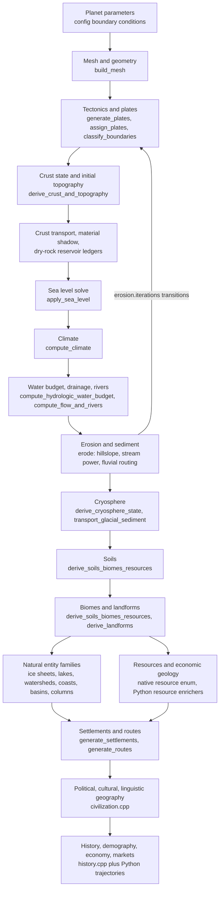

# Feature Domains

[Wiki home](../README.md) > Feature Domains

This directory is the field-level reference for every simulation domain in magic-geo. Each page documents one domain end to end: the inputs it consumes, the algorithm as implemented in the source, the exact world-document keys it emits, the configuration properties that control it, the validation and replay coverage that constrains it, and the limitations and unresolved claims it declares. The pages are deliberately ordered by causality — a domain can only read state that an earlier domain has already written — and that order is fixed by two files: the native stage sequence in `cpp/src/engine/pipeline.cpp` and the Python enricher sequence in `src/magic_geo/api.py`. Every page carries the codebase's own hedges forward verbatim in spirit; where the source emits an explicit `*_resolved: false` flag, the wiki repeats the refusal rather than paraphrasing it away.

## On this page

- [Causal order](#causal-order)
- [Feature page index](#feature-page-index)
- [Geo-only scope](#geo-only-scope)
- [Limitations and unresolved claims](#limitations-and-unresolved-claims)
- [See also](#see-also)

## Causal order

Generation is a single forward pass with one bounded inner loop. `magic_geo::detail::simulate_world_impl` (`cpp/src/engine/pipeline.cpp:6`) builds the mesh, seeds and assigns plates, derives crust and initial topography, runs the coupled maturation loop, applies the terminal cryosphere, derives soils/biomes/resources and landforms, generates the natural entity families, and — only when `include_society` is true — generates the human layers. The Python layer then runs a fixed enricher sequence over the serialized document; enrichers never write back into the native simulation.

Domain-level causal order, as implemented:

1. **Mesh and geometry.** `build_mesh` (`cpp/src/engine/mesh.cpp:1047`) is called first at `cpp/src/engine/pipeline.cpp:12`. Everything downstream is finite-volume state on those cells.
2. **Tectonics and plates.** `generate_plates` (`cpp/src/engine/tectonics.cpp:14`), `choose_plate_seeds` (`:41`), `assign_plates` (`:55`), `classify_boundaries` (`:126`) run at `pipeline.cpp:17-31`. Boundary forcing is derived from relative Euler velocities before any crust exists.
3. **Crust state and initial topography.** `derive_crust_and_topography` (`cpp/src/engine/tectonics.cpp:287`) at `pipeline.cpp:32` writes crust type, lithology, thickness, density, age and the initial isostatic + thermal-subsidence relief.
4. **Crust transport ledgers and mass shadows.** The identity transport plan (`build_identity_crust_transport_plan`, `cpp/src/engine/crust_transport.cpp:1431`) is installed at `pipeline.cpp:39`, then `initialize_crust_material_shadow` (`pipeline.cpp:90`) and `initialize_crust_dry_rock_accounting` (`pipeline.cpp:97`) open the two non-authoritative bookkeeping models.
5. **Sea level, climate, hydrology — as one coupled stabilization.** `stabilize_numeric_depressions` (`cpp/src/engine/hydrology.cpp:1122`) is first called at `pipeline.cpp:107` with stage `"initial_climate_hydrology"`. Inside one pass it runs, in this exact order: `apply_sea_level` (`hydrology.cpp:1140`), `label_marine_water_bodies` (`:1142`), `compute_climate` (`:1143`), `compute_hydrologic_water_budget` (`:1145`), `compute_flow_and_rivers` (`:1154`). Climate therefore always reads a freshly re-datumed surface, and hydrology always reads a freshly computed climate.
6. **Erosion, sediment and the maturation loop.** `erode` (`cpp/src/engine/earth_system.cpp:914`) at `pipeline.cpp:135` runs `erosion.iterations` transitions. Each transition calls `advance_plate_motion_and_crust` (`cpp/src/engine/tectonics.cpp:1050`), then `transport_hillslope_sediment` (`earth_system.cpp:289`), stream-power incision, `route_fluvial_sediment` (`earth_system.cpp:448`), and re-enters the same sea-level/climate/hydrology stabilization. This is the only cycle in the graph.
7. **Cryosphere.** `derive_cryosphere_state` (`cpp/src/engine/environment.cpp:23`) at `pipeline.cpp:151`, then `transport_glacial_sediment` (`environment.cpp:102`) at `:152`, then a further stabilization at `:157`, then `derive_cryosphere_state` a second time at `:167`. It is terminal — nothing re-enters the maturation loop after it.
8. **Soils, biomes and resources.** `derive_soils_biomes_resources` (`cpp/src/engine/environment.cpp:301`) at `pipeline.cpp:187` writes soil type/depth/fertility, the authoritative `biome` enum, and the per-cell `resource` from final-state climate, lithology, relief, water and ice. `derive_landforms` (`environment.cpp:417`) at `:188` may then overwrite biome and soil on floodplains and deltas.
9. **Natural entity families.** `generate_ice_sheets` (`environment.cpp:1027`), `generate_lake_basins` (`cpp/src/engine/water_features.cpp:53`), `generate_watersheds` (`water_features.cpp:269`), `generate_coastal_features` (`environment.cpp:613`), `generate_sedimentary_basins` (`environment.cpp:681`) and `generate_stratigraphic_columns` (`environment.cpp:847`) run at `pipeline.cpp:189-197`, after all per-cell physical state is final.
10. **Human layers.** Only inside `if (include_society)` (`pipeline.cpp:199`): settlements and routes (`cpp/src/engine/settlements.cpp:25`, `:103`), then political regions, borders, trade flows and cultural layers (`cpp/src/engine/civilization.cpp:85`, `:242`, `:323`, `:608`), then historical layers, population regions, conflicts, dynasties and territorial snapshots (`cpp/src/engine/history.cpp:70`, `:367`, `:453`, `:641`, `:773`).
11. **Calibration checks.** `generate_calibration_checks` (`cpp/src/engine/history.cpp:990`) at `pipeline.cpp:261` runs in both scopes.
12. **Python enrichment.** `generate_world` (`src/magic_geo/api.py:195`) or `generate_geo_world` (`src/magic_geo/api.py:287`) then applies the enricher sequence over the serialized document.



### Native stage order

Every call in `simulate_world_impl`, in source order.

| Line | Native call | Source of definition | Domain page |
| --- | --- | --- | --- |
| `pipeline.cpp:12` | `build_mesh` | `cpp/src/engine/mesh.cpp:1047` | [Mesh and Geometry](mesh-and-geometry.md) |
| `pipeline.cpp:17` | `generate_plates` | `cpp/src/engine/tectonics.cpp:14` | [Tectonics and Plates](tectonics-and-plates.md) |
| `pipeline.cpp:18` | `choose_plate_seeds` | `cpp/src/engine/tectonics.cpp:41` | [Tectonics and Plates](tectonics-and-plates.md) |
| `pipeline.cpp:30` | `assign_plates` | `cpp/src/engine/tectonics.cpp:55` | [Tectonics and Plates](tectonics-and-plates.md) |
| `pipeline.cpp:31` | `classify_boundaries` | `cpp/src/engine/tectonics.cpp:126` | [Tectonics and Plates](tectonics-and-plates.md) |
| `pipeline.cpp:32` | `derive_crust_and_topography` | `cpp/src/engine/tectonics.cpp:287` | [Topography, Isostasy and Thermal Subsidence](topography-and-isostasy.md) |
| `pipeline.cpp:39` | `build_identity_crust_transport_plan` | `cpp/src/engine/crust_transport.cpp:1431` | [Crust Transport and Forward Overlap](crust-transport-and-overlap.md) |
| `pipeline.cpp:69` | `summarize_plate_motion_step` (initial record) | `cpp/src/engine/tectonics.cpp` | [Tectonics and Plates](tectonics-and-plates.md), [Plate Boundary Segment Ledger](plate-boundary-ledger.md) |
| `pipeline.cpp:90` | `initialize_crust_material_shadow` | `cpp/src/engine/crust_material.cpp` | [Crust Material Shadow and Dry-Rock Reservoirs](crust-material-and-reservoirs.md) |
| `pipeline.cpp:97` | `initialize_crust_dry_rock_accounting` | `cpp/src/engine/crust_reservoir.cpp` | [Crust Material Shadow and Dry-Rock Reservoirs](crust-material-and-reservoirs.md) |
| `pipeline.cpp:107` | `stabilize_numeric_depressions` stage `"initial_climate_hydrology"` | `cpp/src/engine/hydrology.cpp:1122` | [Oceans, Currents and Coasts](oceans-and-coasts.md), [Climate and Atmosphere](climate-and-atmosphere.md), [Hydrology, Rivers and Lakes](hydrology-and-rivers.md) |
| `pipeline.cpp:117` | `summarize_feedback_step` | `cpp/src/engine/earth_system.cpp` | [Erosion, Maturation and Landscape Evolution](erosion-and-maturation.md) |
| `pipeline.cpp:135` | `erode` (runs `erosion.iterations` transitions) | `cpp/src/engine/earth_system.cpp:914` | [Erosion, Maturation and Landscape Evolution](erosion-and-maturation.md), [Sediment, Routing and Stratigraphy](sediment-and-stratigraphy.md) |
| `pipeline.cpp:151` | `derive_cryosphere_state` | `cpp/src/engine/environment.cpp:23` | [Cryosphere](cryosphere.md) |
| `pipeline.cpp:152` | `transport_glacial_sediment` | `cpp/src/engine/environment.cpp:102` | [Cryosphere](cryosphere.md), [Sediment, Routing and Stratigraphy](sediment-and-stratigraphy.md) |
| `pipeline.cpp:157` | `stabilize_numeric_depressions` stage `"cryosphere_coupling"` | `cpp/src/engine/hydrology.cpp:1122` | [Hydrology, Rivers and Lakes](hydrology-and-rivers.md) |
| `pipeline.cpp:167` | `derive_cryosphere_state` (second call) | `cpp/src/engine/environment.cpp:23` | [Cryosphere](cryosphere.md) |
| `pipeline.cpp:186` | `summarize_plates` | `cpp/src/engine/tectonics.cpp:1828` | [Tectonics and Plates](tectonics-and-plates.md) |
| `pipeline.cpp:187` | `derive_soils_biomes_resources` | `cpp/src/engine/environment.cpp:301` | [Soils and Weathering](soils.md), [Biomes, Ecosystems and Disturbance](biomes-and-ecology.md), [Resources and Economic Geology](resources-and-economic-geology.md) |
| `pipeline.cpp:188` | `derive_landforms` | `cpp/src/engine/environment.cpp:417` | [Biomes, Ecosystems and Disturbance](biomes-and-ecology.md), [Soils and Weathering](soils.md) |
| `pipeline.cpp:189` | `generate_ice_sheets` | `cpp/src/engine/environment.cpp:1027` | [Cryosphere](cryosphere.md) |
| `pipeline.cpp:190` | `generate_lake_basins` | `cpp/src/engine/water_features.cpp:53` | [Hydrology, Rivers and Lakes](hydrology-and-rivers.md) |
| `pipeline.cpp:191` | `generate_watersheds` | `cpp/src/engine/water_features.cpp:269` | [Hydrology, Rivers and Lakes](hydrology-and-rivers.md) |
| `pipeline.cpp:192` | `generate_coastal_features` | `cpp/src/engine/environment.cpp:613` | [Oceans, Currents and Coasts](oceans-and-coasts.md) |
| `pipeline.cpp:193` | `generate_sedimentary_basins` | `cpp/src/engine/environment.cpp:681` | [Sediment, Routing and Stratigraphy](sediment-and-stratigraphy.md) |
| `pipeline.cpp:194` | `generate_stratigraphic_columns` | `cpp/src/engine/environment.cpp:847` | [Sediment, Routing and Stratigraphy](sediment-and-stratigraphy.md) |
| `pipeline.cpp:200` | `generate_settlements` (society only) | `cpp/src/engine/settlements.cpp:25` | [Settlements, Routes and Corridors](settlements-and-routes.md) |
| `pipeline.cpp:201` | `generate_routes` (society only) | `cpp/src/engine/settlements.cpp:103` | [Settlements, Routes and Corridors](settlements-and-routes.md) |
| `pipeline.cpp:202` | `generate_political_regions` (society only) | `cpp/src/engine/civilization.cpp:85` | [Political, Cultural and Linguistic Geography](political-and-cultural-geography.md) |
| `pipeline.cpp:208` | `generate_border_segments` (society only) | `cpp/src/engine/civilization.cpp:242` | [Political, Cultural and Linguistic Geography](political-and-cultural-geography.md) |
| `pipeline.cpp:209` | `generate_trade_flows` (society only) | `cpp/src/engine/civilization.cpp:323` | [Political, Cultural and Linguistic Geography](political-and-cultural-geography.md) |
| `pipeline.cpp:214` | `generate_cultural_layers` (society only) | `cpp/src/engine/civilization.cpp:608` | [Political, Cultural and Linguistic Geography](political-and-cultural-geography.md) |
| `pipeline.cpp:222` | `generate_historical_layers` (society only) | `cpp/src/engine/history.cpp:70` | [History, Demography, Economy and Markets](history-demography-and-economy.md) |
| `pipeline.cpp:230` | `generate_population_regions` (society only) | `cpp/src/engine/history.cpp:367` | [History, Demography, Economy and Markets](history-demography-and-economy.md) |
| `pipeline.cpp:235` | `generate_conflicts` (society only) | `cpp/src/engine/history.cpp:453` | [History, Demography, Economy and Markets](history-demography-and-economy.md) |
| `pipeline.cpp:243` | `generate_dynasties` (society only) | `cpp/src/engine/history.cpp:641` | [History, Demography, Economy and Markets](history-demography-and-economy.md) |
| `pipeline.cpp:250` | `generate_territorial_snapshots` (society only) | `cpp/src/engine/history.cpp:773` | [Political, Cultural and Linguistic Geography](political-and-cultural-geography.md), [History, Demography, Economy and Markets](history-demography-and-economy.md) |
| `pipeline.cpp:261` | `generate_calibration_checks` | `cpp/src/engine/history.cpp:990` | [History, Demography, Economy and Markets](history-demography-and-economy.md) |

`simulate_world` (`pipeline.cpp:268`) calls `simulate_world_impl(params, true)`; `simulate_geo_world` (`pipeline.cpp:272`) calls it with `include_society = false`.

### Python enricher order

Full-world order is `src/magic_geo/api.py:200-265`; geo-only order is `src/magic_geo/api.py:308-374`. An em dash in the geo-only column means the enricher is not called in that scope.

| Full order | Enricher | Geo-only order | Domain page |
| --- | --- | --- | --- |
| 1 | `enrich_world_with_mesh_lod` | 1 | [Mesh and Geometry](mesh-and-geometry.md) |
| 2 | `enrich_world_with_spherical_index` | 2 | [Mesh and Geometry](mesh-and-geometry.md) |
| 3 | `enrich_world_with_cell_geometry` | 3 | [Mesh and Geometry](mesh-and-geometry.md) |
| 4 | `enrich_world_with_sea_level_diagnostics` | 7 | [Oceans, Currents and Coasts](oceans-and-coasts.md), [Topography, Isostasy and Thermal Subsidence](topography-and-isostasy.md) |
| 5 | `enrich_world_with_ocean_circulation` | 8 | [Oceans, Currents and Coasts](oceans-and-coasts.md) |
| 6 | `enrich_world_with_climate_continentality` | 9 | [Climate and Atmosphere](climate-and-atmosphere.md) |
| 7 | `enrich_world_with_geology_realism` | 4 | [Tectonics and Plates](tectonics-and-plates.md) |
| 8 | `enrich_world_with_tectonic_zones` | 5 | [Tectonics and Plates](tectonics-and-plates.md) |
| 9 | `enrich_world_with_fault_systems` | 6 | [Tectonics and Plates](tectonics-and-plates.md) |
| 10 | `enrich_world_with_seasonal_climate_history` | 10 | [Climate and Atmosphere](climate-and-atmosphere.md) |
| 11 | `enrich_world_with_climate_energy_balance` | 11 | [Climate and Atmosphere](climate-and-atmosphere.md) |
| 12 | `enrich_world_with_planet_realism` | 12 | [Climate and Atmosphere](climate-and-atmosphere.md) |
| 13 | `enrich_world_with_climate_realism` | 13 | [Climate and Atmosphere](climate-and-atmosphere.md) |
| 14 | `enrich_world_with_lake_overflow_history` | 14 | [Hydrology, Rivers and Lakes](hydrology-and-rivers.md) |
| 15 | `enrich_world_with_watershed_diagnostics` | 15 | [Hydrology, Rivers and Lakes](hydrology-and-rivers.md) |
| 16 | `enrich_world_with_sediment_routing_history` | 17 | [Sediment, Routing and Stratigraphy](sediment-and-stratigraphy.md) |
| 17 | `enrich_world_with_hydrology_realism` | 16 | [Hydrology, Rivers and Lakes](hydrology-and-rivers.md) |
| 18 | `enrich_world_with_river_network_evolution` | 18 | [Hydrology, Rivers and Lakes](hydrology-and-rivers.md) |
| 19 | `enrich_world_with_sediment_transport_history` | 19 | [Sediment, Routing and Stratigraphy](sediment-and-stratigraphy.md) |
| 20 | `enrich_world_with_sequence_stratigraphy` | 20 | [Sediment, Routing and Stratigraphy](sediment-and-stratigraphy.md) |
| 21 | `enrich_world_with_ice_sheet_history` | 21 | [Cryosphere](cryosphere.md) |
| 22 | `enrich_world_with_ice_sheet_stability` | 22 | [Cryosphere](cryosphere.md) |
| 23 | `enrich_world_with_ice_flowline_history` | 23 | [Cryosphere](cryosphere.md) |
| 24 | `enrich_world_with_soil_diagnostics` | 24 | [Soils and Weathering](soils.md) |
| 25 | `enrich_world_with_biome_diagnostics` | 27 | [Biomes, Ecosystems and Disturbance](biomes-and-ecology.md) |
| 26 | `enrich_world_with_permafrost_diagnostics` | 25 | [Cryosphere](cryosphere.md) |
| 27 | `enrich_world_with_glacial_landforms` | 26 | [Cryosphere](cryosphere.md) |
| 28 | `enrich_world_with_biome_ecotones` | 28 | [Biomes, Ecosystems and Disturbance](biomes-and-ecology.md) |
| 29 | `enrich_world_with_biome_realism` | 29 | [Biomes, Ecosystems and Disturbance](biomes-and-ecology.md) |
| 30 | `enrich_world_with_aquifer_resources` | 30 | [Groundwater, Aquifers and Karst](groundwater-and-karst.md) |
| 31 | `enrich_world_with_hydrology_budget` | 31 | [Hydrology, Rivers and Lakes](hydrology-and-rivers.md), [Groundwater, Aquifers and Karst](groundwater-and-karst.md) |
| 32 | `enrich_world_with_wetland_diagnostics` | 32 | [Hydrology, Rivers and Lakes](hydrology-and-rivers.md), [Groundwater, Aquifers and Karst](groundwater-and-karst.md) |
| 33 | `enrich_world_with_groundwater_flow` | 33 | [Groundwater, Aquifers and Karst](groundwater-and-karst.md) |
| 34 | `enrich_world_with_river_channel_morphology` | 34 | [Hydrology, Rivers and Lakes](hydrology-and-rivers.md) |
| 35 | `enrich_world_with_river_hydraulics` | 35 | [Hydrology, Rivers and Lakes](hydrology-and-rivers.md) |
| 36 | `enrich_world_with_settlement_route_models` | — | [Settlements, Routes and Corridors](settlements-and-routes.md) |
| 37 | `enrich_world_with_political_geography_models` | — | [Political, Cultural and Linguistic Geography](political-and-cultural-geography.md) |
| 38 | `enrich_world_with_cultural_geography_models` | — | [Political, Cultural and Linguistic Geography](political-and-cultural-geography.md) |
| 39 | `enrich_world_with_historical_geography_model` | — | [Political, Cultural and Linguistic Geography](political-and-cultural-geography.md) |
| 40 | `enrich_world_with_civilization_geography_models` | — | [History, Demography, Economy and Markets](history-demography-and-economy.md) |
| 41 | `enrich_world_with_territorial_geography_model` | — | [Political, Cultural and Linguistic Geography](political-and-cultural-geography.md) |
| 42 | `enrich_world_with_navigability_diagnostics` | — | [Hydrology, Rivers and Lakes](hydrology-and-rivers.md), [Settlements, Routes and Corridors](settlements-and-routes.md) |
| 43 | `enrich_world_with_port_sites` | — | [Oceans, Currents and Coasts](oceans-and-coasts.md), [Settlements, Routes and Corridors](settlements-and-routes.md) |
| 44 | `enrich_world_with_route_corridors` | — | [Settlements, Routes and Corridors](settlements-and-routes.md) |
| 45 | `enrich_world_with_karst_diagnostics` | 36 | [Groundwater, Aquifers and Karst](groundwater-and-karst.md) |
| 46 | `enrich_world_with_ecosystem_dynamics` | 37 | [Biomes, Ecosystems and Disturbance](biomes-and-ecology.md) |
| 47 | `enrich_world_with_reef_diagnostics` | 38 | [Oceans, Currents and Coasts](oceans-and-coasts.md) |
| 48 | `enrich_world_with_species_ranges` | 39 | [Biomes, Ecosystems and Disturbance](biomes-and-ecology.md) |
| 49 | `enrich_world_with_wildfire_disturbance` | 40 | [Biomes, Ecosystems and Disturbance](biomes-and-ecology.md) |
| 50 | `enrich_world_with_resource_deposits` | 41 | [Resources and Economic Geology](resources-and-economic-geology.md) |
| 51 | `enrich_world_with_ore_genesis` | 42 | [Resources and Economic Geology](resources-and-economic-geology.md) |
| 52 | `enrich_world_with_sedimentary_resource_systems` | 43 | [Resources and Economic Geology](resources-and-economic-geology.md) |
| 53 | `enrich_world_with_petroleum_migration` | 44 | [Resources and Economic Geology](resources-and-economic-geology.md) |
| 54 | `enrich_world_with_commodity_occurrences` | 45 | [Resources and Economic Geology](resources-and-economic-geology.md) |
| 55 | `enrich_world_with_land_use_zones` | — | [Resources and Economic Geology](resources-and-economic-geology.md) |
| 56 | `enrich_world_with_natural_frontiers` | — | [Settlements, Routes and Corridors](settlements-and-routes.md) |
| 57 | `enrich_world_with_worldbuilding_realism` | — | [Political, Cultural and Linguistic Geography](political-and-cultural-geography.md) |
| 58 | `enrich_world_with_population_history` | — | [History, Demography, Economy and Markets](history-demography-and-economy.md) |
| 59 | `enrich_world_with_economy_history` | — | [History, Demography, Economy and Markets](history-demography-and-economy.md) |
| 60 | `enrich_world_with_dynasty_genealogy` | — | [History, Demography, Economy and Markets](history-demography-and-economy.md) |
| 61 | `enrich_world_with_logistics_history` | — | [History, Demography, Economy and Markets](history-demography-and-economy.md) |
| 62 | `enrich_world_with_demographic_agents` | — | [History, Demography, Economy and Markets](history-demography-and-economy.md) |
| 63 | `enrich_world_with_market_clearing` | — | [History, Demography, Economy and Markets](history-demography-and-economy.md) |
| 64 | `enrich_world_with_graph_diagnostics` | 46 as `enrich_world_with_physical_graph_diagnostics` | [Political, Cultural and Linguistic Geography](political-and-cultural-geography.md) |
| 65 | `enrich_world_with_boundary_geometry` | 47 as `enrich_world_with_physical_boundary_geometry` | [Political, Cultural and Linguistic Geography](political-and-cultural-geography.md), [Hydrology, Rivers and Lakes](hydrology-and-rivers.md) |
| 66 | `enrich_world_with_phonology_history` | — | [Political, Cultural and Linguistic Geography](political-and-cultural-geography.md) |
| — | `enrich_world_with_geo_evolution_provenance` | 48 (geo-only exclusive) | [Erosion, Maturation and Landscape Evolution](erosion-and-maturation.md) |

### The declared layer-phase DAG

`GEO_LAYER_CONTRACTS` (`src/magic_geo/geo_layer_contracts.py:26`) declares the natural-system dependency graph independently of the call order above, with a `phase` integer and an explicit `dependencies` tuple per layer. This is the codebase's own statement of causal order for the geo layers, and it is what the geo validation suite checks against. Note that `temporal_class` and `evidence_class` are declarations about *what kind of evidence exists*, not claims of empirical realism (`src/magic_geo/geo_layer_contracts.py:11`).

| Phase | Layer id | Dependencies | `temporal_class` | `evidence_class` |
| --- | --- | --- | --- | --- |
| 0 | `planet_parameters` | none | `configuration_boundary_condition` | `internal_contract_and_broad_regime_checks` |
| 1 | `spherical_mesh` | `planet_parameters` | `static_simulation_domain` | `independent_geometry_replay` |
| 2 | `plate_tectonics` | `spherical_mesh` | `native_nominal_maturation_intervals` | (multi-line string, see `geo_layer_contracts.py:53`) |
| 3 | `crust_lithology` | `plate_tectonics` | `native_nominal_maturation_intervals` | `initial_age_graph_witness_state_sparse_overlap_membership_shadow_and_finite_counter_accounting_replay` |
| 4 | `relief_bathymetry` | `crust_lithology` | `native_evolved_then_diagnostic` | `partial_external_relief_calibration` |
| 5 | `sea_level_ocean` | `relief_bathymetry` | `native_equilibrium_recomputed_per_coupled_stage` | `volume_replay_with_diagnostic_circulation` |
| 6 | `climate_atmosphere` | `sea_level_ocean`, `relief_bathymetry` | `equilibrium_climatology_not_transient_weather` | `formula_replay_and_partial_external_climatology` |
| 7 | `hydrology` | `climate_atmosphere`, `relief_bathymetry` | `annual_diagnostic_budget_recomputed_per_coupled_stage` | `mass_balance_replay_and_partial_external_network_fit` |
| 8 | `erosion_sediment` | `hydrology`, `plate_tectonics` | `native_nominal_transport_intervals_plus_diagnostic_reconstructions` | `canonical_bedrock_mobile_interface_and_bulk_volume_source_partition_replay_without_dry_rock_mass_or_physical_calibration` |
| 9 | `cryosphere` | `climate_atmosphere`, `erosion_sediment` | `single_native_bulk_coupling_plus_diagnostic_histories` | `mass_replay_without_dynamic_ice_solver` |
| 10 | `soils_pedogenesis` | `erosion_sediment`, `climate_atmosphere`, `cryosphere` | `posthoc_diagnostic_history` | `causal_source_links_without_pedogenic_process_calibration` |
| 11 | `biomes_ecosystems` | `soils_pedogenesis`, `climate_atmosphere`, `hydrology` | `posthoc_diagnostic_trajectories` | `rule_replay_without_population_evolution` |
| 12 | `natural_resources` | `crust_lithology`, `erosion_sediment`, `hydrology`, `biomes_ecosystems` | `posthoc_causal_diagnostic` | `source_link_replay_without_geochemical_solver` |
| 13 | `coupled_maturation` | `plate_tectonics`, `sea_level_ocean`, `climate_atmosphere`, `hydrology`, `erosion_sediment`, `cryosphere` | `reference_scaled_nominal_maturation_intervals_without_physical_time` | `cross_layer_replay_with_unproven_timestep_convergence_and_no_physical_calibration` |

There is no declared contract phase for the human layers; `GEO_LAYER_CONTRACTS` covers natural systems only.

## Feature page index

| Domain | Page | Produced by (native stage / Python enricher) | Key world-document outputs |
| --- | --- | --- | --- |
| Mesh and geometry | [mesh-and-geometry.md](mesh-and-geometry.md) | Native `build_mesh` (`cpp/src/engine/mesh.cpp:1047`). Python `enrich_world_with_mesh_lod`, `enrich_world_with_spherical_index`, `enrich_world_with_cell_geometry` | `cells`, `mesh_backend`, `cell_area_model` (`cpp/src/engine/world_serialization.cpp:52-53`, `:289`); `mesh_lod` (`src/magic_geo/mesh_lod.py:166`), `spherical_spatial_index` (`src/magic_geo/spherical_index.py:204`), `cell_adjacency_edges` (`src/magic_geo/cell_geometry.py:505`) |
| Tectonics and plates | [tectonics-and-plates.md](tectonics-and-plates.md) | Native `generate_plates`, `choose_plate_seeds`, `assign_plates`, `classify_boundaries`, `derive_crust_and_topography`, `advance_plate_motion_and_crust` (`cpp/src/engine/tectonics.cpp:14`, `:41`, `:55`, `:126`, `:287`, `:1050`), `summarize_plates` (`:1828`). Python `enrich_world_with_geology_realism`, `enrich_world_with_tectonic_zones`, `enrich_world_with_fault_systems` | `plates`, `plate_motion_history`, `plate_kinematic_model`, `initial_oceanic_crust_age_model`, `initial_oceanic_crust_age_ledger` (`world_serialization.cpp:160-204`); `geology_realism_checks` (`src/magic_geo/geology_realism.py:312`), `collision_zones`, `subduction_zones`, `rift_zones`, `tectonic_zones` (`src/magic_geo/tectonic_zones.py:297-300`), `fault_systems` (`src/magic_geo/fault_systems.py:248`) |
| Plate boundary segment ledger | [plate-boundary-ledger.md](plate-boundary-ledger.md) | Native `cpp/src/engine/plate_boundary_segments.cpp`, serialized at `cpp/src/engine/process_serialization.cpp:4320`. No Python enricher; strict replay in `src/magic_geo/plate_boundary_edge_validation.py` | `plate_motion_history[].boundary_segments`, `plate_boundary_segment_model` (`world_serialization.cpp:166`) |
| Crust transport and forward overlap | [crust-transport-and-overlap.md](crust-transport-and-overlap.md) | Native `cpp/src/engine/crust_transport.cpp` (`build_identity_crust_transport_plan:1431`, `build_forward_overlap_crust_transport_plan:1490`), `cpp/src/engine/crust_overlap_candidate_fate.cpp`. No Python enricher; replay validators `src/magic_geo/crust_transport_validation.py`, `src/magic_geo/crust_coverage_geometry_replay.py`, `src/magic_geo/crust_overlap_candidate_fate_validation.py` | `plate_motion_history[].crust_overlap_ledger` (`process_serialization.cpp:4013`), `plate_motion_history[].crust_overlap_candidate_fate_ledger` (`:4114`), `crust_overlap_candidate_fate_model` (`world_serialization.cpp:179`), the `crust_transport_*` declarations inside `plate_kinematic_model` (`process_serialization.cpp:2772-2828`) |
| Crust material shadow and dry-rock reservoirs | [crust-material-and-reservoirs.md](crust-material-and-reservoirs.md) | Native `cpp/src/engine/crust_material.cpp`, `cpp/src/engine/crust_reservoir.cpp`, `cpp/src/engine/crust_reservoir_serialization.cpp`. No Python enricher; replay validators `src/magic_geo/crust_material_shadow_validation.py`, `src/magic_geo/crust_dry_rock_accounting_validation.py` | `crust_material_shadow_model`, `crust_material_shadow_history`, `crust_dry_rock_accounting_model`, `crust_dry_rock_accounting_history` (`world_serialization.cpp:183-202`) |
| Topography, isostasy and thermal subsidence | [topography-and-isostasy.md](topography-and-isostasy.md) | Native `derive_crust_and_topography` (`cpp/src/engine/tectonics.cpp:287`), `crust_equilibrium_elevation_m` (called at `pipeline.cpp:55`), `cpp/src/engine/oceanic_age_depth.cpp`, `apply_sea_level` (`cpp/src/engine/ocean.cpp:5`). Python `enrich_world_with_sea_level_diagnostics` | `oceanic_age_depth_model`, `sea_level_model` (`world_serialization.cpp:181`, `:187`); per-cell `elevation_m`, `bedrock_surface_elevation_m` (`cpp/src/engine/types/core.hpp:96`), `thermal_subsidence_target_m`; isostatic and thermal-subsidence arrays inside `plate_motion_history` |
| Erosion, maturation and landscape evolution | [erosion-and-maturation.md](erosion-and-maturation.md) | Native `erode` (`cpp/src/engine/earth_system.cpp:914`), `summarize_feedback_step`, `stabilize_numeric_depressions` (`cpp/src/engine/hydrology.cpp:1122`). Python `enrich_world_with_geo_evolution_provenance` (geo-only) | `earth_system_feedback_history`, `simulation_clock`, `numeric_depression_correction_history` (`world_serialization.cpp:98-126`), `plate_motion_history` (`:189`); `geo_evolution_provenance` (`src/magic_geo/geo_evolution_provenance.py:127`) |
| Climate and atmosphere | [climate-and-atmosphere.md](climate-and-atmosphere.md) | Native `compute_climate` (`cpp/src/engine/climate.cpp:251`), invoked from `stabilize_numeric_depressions` (`cpp/src/engine/hydrology.cpp:1143`). Python `enrich_world_with_climate_continentality`, `enrich_world_with_seasonal_climate_history`, `enrich_world_with_climate_energy_balance`, `enrich_world_with_planet_realism`, `enrich_world_with_climate_realism` | `climate_model` (`world_serialization.cpp:86`); `climate_continentality_regions` (`src/magic_geo/climate_continentality.py:240`), `climate_seasonal_histories`, `climate_classification` (`src/magic_geo/climate_dynamics.py:360-361`), `climate_energy_balance_records` (`src/magic_geo/climate_energy.py:245`), `planet_realism_checks` (`src/magic_geo/planet_realism.py:210`), `climate_realism_checks` (`src/magic_geo/climate_realism.py:269`) |
| Oceans, currents and coasts | [oceans-and-coasts.md](oceans-and-coasts.md) | Native `apply_sea_level` (`cpp/src/engine/ocean.cpp:5`), `label_marine_water_bodies` (`:277`), `ocean_distance` (`:323`), `generate_coastal_features` (`cpp/src/engine/environment.cpp:613`). Python `enrich_world_with_sea_level_diagnostics`, `enrich_world_with_ocean_circulation`, `enrich_world_with_reef_diagnostics`, `enrich_world_with_port_sites` | `sea_level_model` (`world_serialization.cpp:187`), `coastal_features` (`:209`); `landmasses`, `marine_regions`, `continental_shelves`, `marine_chokepoints` (`src/magic_geo/sea_level_diagnostics.py:388-391`), `ocean_current_systems`, `ocean_current_transport_edges` (`src/magic_geo/ocean_circulation.py:380-381`), `reef_systems` (`src/magic_geo/reef_diagnostics.py:431`), `port_site_model`, `port_sites` (`src/magic_geo/port_sites.py:294`, `:340`) |
| Hydrology, rivers and lakes | [hydrology-and-rivers.md](hydrology-and-rivers.md) | Native `stabilize_numeric_depressions` (`cpp/src/engine/hydrology.cpp:1122`), `compute_hydrologic_water_budget` (`:18`), `compute_flow_and_rivers` (`:369`), `generate_lake_basins` (`cpp/src/engine/water_features.cpp:53`), `generate_watersheds` (`:269`). Python `enrich_world_with_lake_overflow_history`, `enrich_world_with_watershed_diagnostics`, `enrich_world_with_hydrology_realism`, `enrich_world_with_river_network_evolution`, `enrich_world_with_hydrology_budget`, `enrich_world_with_wetland_diagnostics`, `enrich_world_with_river_channel_morphology`, `enrich_world_with_river_hydraulics`, `enrich_world_with_navigability_diagnostics`, `enrich_world_with_physical_boundary_geometry` | `hydrologic_water_budget_model`, `hydrologic_water_budget_history`, `numeric_depression_correction_history`, `watersheds`, `lake_basins` (`world_serialization.cpp:87-126`, `:205-208`); `lake_overflow_channel_histories`, `lake_overflow_histories` (`src/magic_geo/hydrology_dynamics.py:277`, `:404`), `hydrology_realism_checks` (`src/magic_geo/hydrology_realism.py:381`), `river_network_evolution_events`, `river_reorganization_histories` (`src/magic_geo/river_network_evolution.py:390`, `:392`), `hydrologic_budget_regions` (`src/magic_geo/hydrology_budget.py:232`), `wetland_systems` (`src/magic_geo/wetland_diagnostics.py:335`), `river_channel_morphology_model`, `river_channel_systems` (`src/magic_geo/river_channel_morphology.py:307`, `:342`), `river_hydraulics_model`, `river_hydraulic_reaches` (`src/magic_geo/river_hydraulics.py:200`, `:238`), `navigability_model`, `navigable_waterways` (`src/magic_geo/navigability_diagnostics.py:309`, `:344`), `watershed_boundary_segments` (`src/magic_geo/boundary_geometry.py:98`) |
| Sediment, routing and stratigraphy | [sediment-and-stratigraphy.md](sediment-and-stratigraphy.md) | Native `cpp/src/engine/sediment_partition.cpp` (`initialize_sediment_interface:91`, `shift_sediment_interface_datum:123`, `apply_sediment_interface_material_change:155`, `validate_sediment_source_partition:262`), `transport_hillslope_sediment` (`cpp/src/engine/earth_system.cpp:289`), `route_fluvial_sediment` (`:448`), `transport_glacial_sediment` (`cpp/src/engine/environment.cpp:102`), `generate_sedimentary_basins` (`:681`), `generate_stratigraphic_columns` (`:847`). Python `enrich_world_with_sediment_routing_history`, `enrich_world_with_sediment_transport_history`, `enrich_world_with_sequence_stratigraphy` | `sediment_interface_model`, `sediment_inventory_model`, `hillslope_sediment_transport_model`, `hillslope_sediment_transport_history`, `glacial_sediment_transport_model`, `glacial_sediment_transport_history`, `fluvial_sediment_routing_model`, `fluvial_sediment_routing_history`, `sedimentary_basins`, `stratigraphic_columns` (`world_serialization.cpp:106-159`, `:211-220`); `sediment_routing_histories` (`src/magic_geo/sediment_routing.py:222`), `sediment_transport_histories` (`src/magic_geo/sediment_dynamics.py:170`), `sequence_stratigraphy_histories` (`src/magic_geo/sequence_stratigraphy.py:226`) |
| Groundwater, aquifers and karst | [groundwater-and-karst.md](groundwater-and-karst.md) | No dedicated native stage; consumes native infiltration from the hydrologic water budget. Python `enrich_world_with_aquifer_resources`, `enrich_world_with_hydrology_budget`, `enrich_world_with_wetland_diagnostics`, `enrich_world_with_groundwater_flow`, `enrich_world_with_karst_diagnostics` | `aquifer_resource_model`, `groundwater_recharge_model`, `aquifer_systems` (`src/magic_geo/aquifer_resources.py:264`, `:286`, `:313`), `groundwater_flow_model`, `groundwater_flow_systems` (`src/magic_geo/groundwater_flow.py:394`, `:431`), `karst_systems` (`src/magic_geo/karst_diagnostics.py:201`), `hydrologic_budget_regions` (`src/magic_geo/hydrology_budget.py:232`), `wetland_systems` (`src/magic_geo/wetland_diagnostics.py:335`) |
| Cryosphere | [cryosphere.md](cryosphere.md) | Native `derive_cryosphere_state` (`cpp/src/engine/environment.cpp:23`, called twice at `pipeline.cpp:151` and `:167`), `transport_glacial_sediment` (`environment.cpp:102`), `generate_ice_sheets` (`environment.cpp:1027`). Python `enrich_world_with_ice_sheet_history`, `enrich_world_with_ice_sheet_stability`, `enrich_world_with_ice_flowline_history`, `enrich_world_with_permafrost_diagnostics`, `enrich_world_with_glacial_landforms` | `ice_sheets` (`world_serialization.cpp:221`), `glacial_sediment_transport_model`, `glacial_sediment_transport_history` (`:138-148`); `ice_sheet_histories` (`src/magic_geo/cryosphere_dynamics.py:141`), `ice_sheet_stability_histories` (`src/magic_geo/cryosphere_stability.py:223`), `ice_flowline_histories` (`src/magic_geo/cryosphere_flow.py:235`), `permafrost_regions` (`src/magic_geo/permafrost_diagnostics.py:198`), `glacial_landform_systems` (`src/magic_geo/glacial_landforms.py:339`) |
| Soils and weathering | [soils.md](soils.md) | Native `derive_soils_biomes_resources` (`cpp/src/engine/environment.cpp:301`), with post-adjustment by `derive_landforms` (`:417`). Python `enrich_world_with_soil_diagnostics` | Per-cell `soil_type`, `soil_depth_m`, `fertility`; `soil_profiles`, `soil_horizons`, `soil_profile_histories`, `soil_pedogenesis_model` (`src/magic_geo/soil_dynamics.py:800-806`) |
| Biomes, ecosystems and disturbance | [biomes-and-ecology.md](biomes-and-ecology.md) | Native `derive_soils_biomes_resources` (`cpp/src/engine/environment.cpp:301`) writes the authoritative `biome` enum; `derive_landforms` (`:417`) may overwrite it. Python `enrich_world_with_biome_diagnostics`, `enrich_world_with_biome_ecotones`, `enrich_world_with_biome_realism`, `enrich_world_with_ecosystem_dynamics`, `enrich_world_with_species_ranges`, `enrich_world_with_wildfire_disturbance` | Per-cell `biome`; `biome_diagnostics` (`src/magic_geo/biome_dynamics.py:201`), `biome_ecotone_regions` (`src/magic_geo/biome_ecotones.py:264`), `biome_realism_checks` (`src/magic_geo/biome_realism.py:286`), `vegetation_succession_histories`, `renewable_resource_records` (`src/magic_geo/ecosystem_dynamics.py:244-245`), `species_range_records` (`src/magic_geo/species_ranges.py:452`), `wildfire_spread_histories` (`src/magic_geo/wildfire_disturbance.py:355`) |
| Resources and economic geology | [resources-and-economic-geology.md](resources-and-economic-geology.md) | Native `derive_soils_biomes_resources` (`cpp/src/engine/environment.cpp:301`) writes the per-cell `resource` enum. Python `enrich_world_with_resource_deposits`, `enrich_world_with_ore_genesis`, `enrich_world_with_sedimentary_resource_systems`, `enrich_world_with_petroleum_migration`, `enrich_world_with_commodity_occurrences`, `enrich_world_with_land_use_zones` | Per-cell `resource`; `resource_deposits`, `resource_deposit_model` (`src/magic_geo/resource_dynamics.py:208-209`), `ore_genesis_model`, `ore_genesis_systems` (`src/magic_geo/ore_genesis.py:444`, `:484`), `sedimentary_resource_systems` (`src/magic_geo/sedimentary_resource_systems.py:354`), `petroleum_migration_systems` (`src/magic_geo/petroleum_migration.py:536`), `commodity_occurrences` (`src/magic_geo/commodity_resources.py:263`), `land_use_zone_model`, `agricultural_zones`, `mining_zones` (`src/magic_geo/land_use_zones.py:270`, `:330-331`) |
| Settlements, routes and corridors | [settlements-and-routes.md](settlements-and-routes.md) | Native `generate_settlements` (`cpp/src/engine/settlements.cpp:25`), `generate_routes` (`:103`) — society branch only. Python `enrich_world_with_settlement_route_models`, `enrich_world_with_navigability_diagnostics`, `enrich_world_with_port_sites`, `enrich_world_with_route_corridors`, `enrich_world_with_natural_frontiers` | `settlements`, `routes` (`world_serialization.cpp:279`, `:285`), per-cell `settlement_score`; `settlement_selection_model`, `route_network_model` (`src/magic_geo/settlement_routes.py:62`, `:107`), `navigability_model`, `navigable_waterways` (`src/magic_geo/navigability_diagnostics.py:309`, `:344`), `port_site_model`, `port_sites` (`src/magic_geo/port_sites.py:294`, `:340`), `route_corridor_model`, `route_corridors` (`src/magic_geo/route_corridors.py:470`, `:517`), `natural_frontier_model`, `natural_frontiers` (`src/magic_geo/natural_frontiers.py:290`, `:326`) |
| Political, cultural and linguistic geography | [political-and-cultural-geography.md](political-and-cultural-geography.md) | Native `generate_political_regions` (`cpp/src/engine/civilization.cpp:85`), `generate_border_segments` (`:242`), `generate_trade_flows` (`:323`), `generate_cultural_layers` (`:608`), `generate_territorial_snapshots` (`cpp/src/engine/history.cpp:773`) — society branch only. Python `enrich_world_with_political_geography_models`, `enrich_world_with_cultural_geography_models`, `enrich_world_with_historical_geography_model`, `enrich_world_with_territorial_geography_model`, `enrich_world_with_phonology_history`, `enrich_world_with_graph_diagnostics`, `enrich_world_with_boundary_geometry`, `enrich_world_with_worldbuilding_realism` | `political_regions`, `cultures`, `language_regions`, `sacred_areas`, `ruins`, `borders`, `trade_flows`, `territorial_snapshots` (`world_serialization.cpp:223-288`); `political_region_model`, `political_border_model`, `trade_flow_model` (`src/magic_geo/political_geography.py:36`, `:69`, `:96`), `culture_region_model`, `language_region_model`, `cultural_site_model` (`src/magic_geo/cultural_geography.py:19`, `:67`, `:91`), `historical_event_model` (`src/magic_geo/historical_geography.py:15`), `territorial_snapshot_model` (`src/magic_geo/territorial_geography.py:13`), `phonology_history_model`, `phonological_rules`, `phonological_histories`, `lexical_correspondences`, `lexical_diffusion_histories`, `speaker_population_histories` (`src/magic_geo/phonology_history.py:81`, `:876-880`), `plate_graph`, `river_graph`, `watershed_graph`, `trade_route_graph`, `political_region_graph` (`src/magic_geo/graph_diagnostics.py:525-527`, `:556-557`), `watershed_boundary_segments`, `territorial_boundary_segments` (`src/magic_geo/boundary_geometry.py:98`, `:195`), `worldbuilding_realism_checks`, `worldbuilding_realism_model` (`src/magic_geo/worldbuilding_realism.py:334`, `:344`) |
| History, demography, economy and markets | [history-demography-and-economy.md](history-demography-and-economy.md) | Native `generate_historical_layers` (`cpp/src/engine/history.cpp:70`), `generate_population_regions` (`:367`), `generate_conflicts` (`:453`), `generate_dynasties` (`:641`), `generate_territorial_snapshots` (`:773`), `generate_calibration_checks` (`:990`). Python `enrich_world_with_civilization_geography_models`, `enrich_world_with_population_history`, `enrich_world_with_economy_history`, `enrich_world_with_dynasty_genealogy`, `enrich_world_with_logistics_history`, `enrich_world_with_demographic_agents`, `enrich_world_with_market_clearing` | `historical_eras`, `historical_events`, `population_regions`, `conflicts`, `dynasties`, `territorial_snapshots`, `calibration_checks` (`world_serialization.cpp:238-266`); `population_region_model`, `conflict_model`, `dynasty_model` (`src/magic_geo/civilization_geography.py:17`, `:38`, `:57`), `population_history_model`, `population_histories` (`src/magic_geo/history_dynamics.py:26`, `:227`), `economy_history_model`, `economy_histories` (`src/magic_geo/economy_dynamics.py:26`, `:305`), `ruler_genealogy_model`, `rulers`, `marriage_alliances`, `cadet_branches` (`src/magic_geo/dynasty_genealogy.py:55`, `:285-287`), `logistics_exchange_model`, `campaign_operations_model`, `logistics_networks`, `market_exchanges`, `campaign_movements`, `campaign_path_segments`, `campaign_front_histories`, `tactical_engagements`, `strategic_campaign_plans` (`src/magic_geo/logistics_history.py:45-46`, `:1288-1294`), `demographic_agent_model`, `individual_life_event_model`, `household_cohorts`, `firm_agents`, `demographic_agent_histories`, `individual_agents`, `individual_life_events` (`src/magic_geo/demographic_agents.py:45-46`, `:569-573`), `market_clearing_model`, `route_capacity_constraints`, `market_clearing_records`, `market_agent_orders`, `market_price_iterations`, `market_inventory_histories` (`src/magic_geo/market_clearing.py:43`, `:581-585`) |

## Geo-only scope

`--geo-only` selects the native `simulate_geo_world` entry point (`cpp/src/engine/pipeline.cpp:272`), which calls `simulate_world_impl(params, false)`, skipping the entire `if (include_society)` block at `pipeline.cpp:199-260`. On the Python side it selects `generate_geo_world` (`src/magic_geo/api.py:287`), which additionally strips the stable empty/default civilization schema fields before any enricher can observe them (`_strip_native_civilization_outputs`, `src/magic_geo/api.py:269`) and sets `world["generation_scope"] = "geo_only"` (`src/magic_geo/api.py:305`).

```bash
# CLI
magic-geo generate --config magic-geo.yaml --output runs/geo.json --geo-only
```

```python
# Python API
from pathlib import Path
from magic_geo.api import generate_geo_world, generate_geo_from_file
from magic_geo.config import load_config

world = generate_geo_world(load_config(Path("magic-geo.yaml")))
# or, equivalently:
world = generate_geo_from_file(Path("magic-geo.yaml"))
assert world["generation_scope"] == "geo_only"
```

`generate_geo_world` raises `ValueError` if `output.include_cells` is false, because natural enrichers and layer validation consume per-cell state (`src/magic_geo/api.py:296-300`).

### Domain presence under `--geo-only`

| Domain | Present with `--geo-only` | What changes |
| --- | --- | --- |
| [Mesh and Geometry](mesh-and-geometry.md) | Yes, unchanged | All three geometry enrichers run first, in the same relative order |
| [Tectonics and Plates](tectonics-and-plates.md) | Yes, unchanged | `geology_realism`, `tectonic_zones`, `fault_systems` move ahead of the marine enrichers (`api.py:313-315`) |
| [Plate Boundary Segment Ledger](plate-boundary-ledger.md) | Yes, unchanged | Native-only domain; no enricher involved |
| [Crust Transport and Forward Overlap](crust-transport-and-overlap.md) | Yes, unchanged | Native-only domain; no enricher involved |
| [Crust Material Shadow and Dry-Rock Reservoirs](crust-material-and-reservoirs.md) | Yes, unchanged | Native-only domain; no enricher involved |
| [Topography, Isostasy and Thermal Subsidence](topography-and-isostasy.md) | Yes, unchanged | `sea_level_diagnostics` still runs, after the tectonic block instead of before it |
| [Erosion, Maturation and Landscape Evolution](erosion-and-maturation.md) | Yes, extended | `enrich_world_with_geo_evolution_provenance` runs only in this scope (`api.py:374`), adding `geo_evolution_provenance` |
| [Climate and Atmosphere](climate-and-atmosphere.md) | Yes, unchanged | Same five enrichers, same relative order |
| [Oceans, Currents and Coasts](oceans-and-coasts.md) | Partially | `sea_level_diagnostics`, `ocean_circulation`, `reef_diagnostics` and native `generate_coastal_features` all run; `enrich_world_with_port_sites` does not, so `port_site_model` and `port_sites` are absent |
| [Hydrology, Rivers and Lakes](hydrology-and-rivers.md) | Partially | All native hydrology and all hydrologic enrichers run; `enrich_world_with_navigability_diagnostics` does not, so `navigability_model` and `navigable_waterways` are absent. `enrich_world_with_physical_boundary_geometry` still emits `watershed_boundary_segments` |
| [Sediment, Routing and Stratigraphy](sediment-and-stratigraphy.md) | Yes, unchanged | `sediment_routing_history` runs after `hydrology_realism` rather than before it (`api.py:331-332`) |
| [Groundwater, Aquifers and Karst](groundwater-and-karst.md) | Yes, unchanged | `karst_diagnostics` moves up to run with the other subsurface enrichers (`api.py:355`) |
| [Cryosphere](cryosphere.md) | Yes, unchanged | `permafrost_diagnostics` and `glacial_landforms` run before `biome_diagnostics` instead of after (`api.py:342-344`) |
| [Soils and Weathering](soils.md) | Yes, unchanged | Same native stage, same single enricher |
| [Biomes, Ecosystems and Disturbance](biomes-and-ecology.md) | Yes, unchanged | All six enrichers run; `api.py:357-358` notes that settlement/port inputs are deliberately absent so mixed models follow their natural baseline branches |
| [Resources and Economic Geology](resources-and-economic-geology.md) | Partially | The five formation/occurrence enrichers run; `enrich_world_with_land_use_zones` does not, so `land_use_zone_model`, `agricultural_zones` and `mining_zones` are absent |
| [Settlements, Routes and Corridors](settlements-and-routes.md) | No | Native `generate_settlements` and `generate_routes` are skipped; `settlement_route_models`, `navigability_diagnostics`, `port_sites`, `route_corridors` and `natural_frontiers` are all skipped |
| [Political, Cultural and Linguistic Geography](political-and-cultural-geography.md) | No | Native `civilization.cpp` stages are skipped; the four declaration-only enrichers, `phonology_history` and `worldbuilding_realism` are skipped. `enrich_world_with_physical_graph_diagnostics` and `enrich_world_with_physical_boundary_geometry` substitute for the full variants |
| [History, Demography, Economy and Markets](history-demography-and-economy.md) | No | Native `history.cpp` society stages are skipped; all six Python trajectory enrichers are skipped. `generate_calibration_checks` still runs in both scopes (`pipeline.cpp:261`) |

### Fields removed before enrichment

`_strip_native_civilization_outputs` (`src/magic_geo/api.py:269`) removes three groups of stable placeholder fields so that natural models take their documented no-human defaults rather than observing empty civilization arrays.

| Group | Constant | Source | Members |
| --- | --- | --- | --- |
| Top-level document keys | `NATIVE_CIVILIZATION_TOP_LEVEL_FIELDS` | `src/magic_geo/api.py:86` | `borders`, `conflicts`, `cultures`, `dynasties`, `historical_eras`, `historical_events`, `language_regions`, `political_regions`, `population_regions`, `routes`, `ruins`, `sacred_areas`, `settlements`, `territorial_snapshots`, `trade_flows` |
| Per-cell fields | `NATIVE_CIVILIZATION_CELL_FIELDS` | `src/magic_geo/api.py:106` | `culture_region_id`, `language_region_id`, `political_region_id`, `settlement_score` |
| Summary keys | `NATIVE_CIVILIZATION_SUMMARY_FIELDS` | `src/magic_geo/api.py:115` | 58 keys, from `border_segment_count` through `trade_total_volume_index` |

### Graph and boundary products by scope

| Product | Full world | Geo-only | Source |
| --- | --- | --- | --- |
| `plate_graph` | Present | Present | `src/magic_geo/graph_diagnostics.py:525` |
| `river_graph` | Present | Present | `src/magic_geo/graph_diagnostics.py:526` |
| `watershed_graph` | Present | Present | `src/magic_geo/graph_diagnostics.py:527` |
| `trade_route_graph` | Present | Absent | `src/magic_geo/graph_diagnostics.py:556` |
| `political_region_graph` | Present | Absent | `src/magic_geo/graph_diagnostics.py:557` |
| `watershed_boundary_segments` | Present | Present | `src/magic_geo/boundary_geometry.py:98` |
| `territorial_boundary_segments` | Present | Absent | `src/magic_geo/boundary_geometry.py:195` |
| `geo_evolution_provenance` | Absent | Present | `src/magic_geo/geo_evolution_provenance.py:127` |

## Limitations and unresolved claims

These are the cross-cutting refusals the codebase makes in its own serialized output. Each feature page repeats the ones that apply to it, in more detail. None of them should be softened when reading or citing this wiki.

| Claim the reader might assume | What the source actually says | Where |
| --- | --- | --- |
| Physical time is resolved | `physical_time_resolved` is emitted as `false` in at least nine separate serialized model blocks | `cpp/src/engine/process_serialization.cpp:159`, `:511`, `:879`, `:1188`, `:1488`, `:1988`, `:2083`, `:2686`, `:3136` |
| Subduction polarity is physical | `physical_subduction_polarity_resolved: false`, `polarity_candidate_is_physical_decision: false`, `physical_polarity_unknown_state_explicit: true`, and the candidate rule is `"oceanic_side_heuristic_is_subducting_candidate_and_opposite_side_is_overriding_candidate_not_physical_polarity"` | `cpp/src/engine/process_serialization.cpp:3138-3140`, `:3112` |
| Crust mass provenance is tracked | The dry-rock reservoir model emits `authoritative_for_cell_state: false`, `physical_source_sink_resolved: false`, `material_provenance_resolved: false`, `solid_volume_resolved: false`, `mass_weighted_age_resolved: false` | `cpp/src/engine/crust_reservoir_serialization.cpp:181-189` |
| Overlap membership classes carry physical fate | `crust_transport_coverage_membership_area_class_physical_fate_resolved: false`, `..._slab_selection_resolved: false`, `..._connected_fragment_topology_resolved: false`, `..._local_kinematics_resolved: false` | `cpp/src/engine/process_serialization.cpp:2802-2815` |
| Accelerators produce the transport plan | `crust_transport_execution_backend` is the literal string `"cpu"`; the transport geometry is CPU-authoritative by declared contract | `cpp/src/engine/process_serialization.cpp:2828` |
| Crust transport is a complete process model | `crust_transport_limitation: "first_order_overlap_is_diffusive_and_boundary_creation_subduction_remain_rule_based_process_inventory_changes"` | `cpp/src/engine/process_serialization.cpp:2937` |
| The tectonic model is dynamically calibrated | `model_limitation: "kinematic_domains_with_conservative_first_order_crust_transport_rule_based_boundary_processes_partial_reference_timestep_scaling_and_uncalibrated_physical_time"` | `cpp/src/engine/process_serialization.cpp:2939` |
| Climate is a transient atmospheric solver | `mass_conserving_atmosphere: false`, `transient_climate_resolved: false`, `model_limitation: "equilibrium_diagnostic_climate_without_mass_conserving_three_dimensional_atmosphere"` | `cpp/src/engine/process_serialization.cpp:443-446` |
| Timestep convergence has been demonstrated | The `coupled_maturation` contract declares `evidence_class = "cross_layer_replay_with_unproven_timestep_convergence_and_no_physical_calibration"` | `src/magic_geo/geo_layer_contracts.py:312` |
| Post-hoc trajectories are simulations | Layer contracts label them `posthoc_diagnostic_history`, `posthoc_diagnostic_trajectories` and `posthoc_causal_diagnostic`, with evidence classes such as `rule_replay_without_population_evolution` and `source_link_replay_without_geochemical_solver` | `src/magic_geo/geo_layer_contracts.py:233-234`, `:256-257`, `:280-281` |
| A passing contract means the model is realistic | The module docstring states that `evidence_class` and related fields do not assert that the model is empirically realistic | `src/magic_geo/geo_layer_contracts.py:11` |

Two further structural limits apply to how this index itself should be read. First, several enrichers are documented on more than one page because they genuinely straddle domains (for example `enrich_world_with_port_sites` appears under both oceans and settlements); the tables above list every page that documents a given enricher rather than picking one owner. Second, `GEO_LAYER_CONTRACTS` declares phases only for natural systems, so the human-layer ordering in the causal list is grounded in `cpp/src/engine/pipeline.cpp` and `src/magic_geo/api.py` call order alone, not in a declared dependency contract.

## See also

- [Overview](../01-overview.md)
- [Architecture](../04-architecture.md)
- [Configuration reference](../05-configuration-reference.md)
- [CLI reference](../06-cli-reference.md)
- [Python API](../07-python-api.md)
- [Native engine](../08-native-engine.md)
- [Compute backends](../09-compute-backends.md)
- [World schema](../10-world-schema.md)
- [Validation](../12-validation.md)
- [Geo validation suite](../13-geo-validation-suite.md)
- [Glossary](../21-glossary.md)
